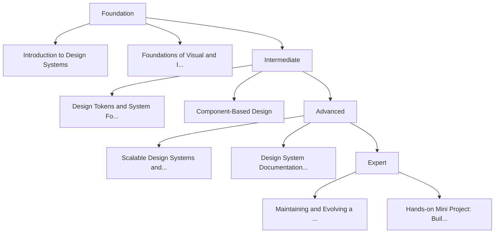

# Deep Dive into Design Systems for UI/UX Designers

This course provides a comprehensive and practical exploration of design systems for UI/UX Designers. Starting from zero prior knowledge, learners will progressively build a strong theoretical foundation and hands-on skills to design, document, and maintain scalable design systems. The course is designed to reach an advanced understanding within a limited timeframe, focusing on real-world application, collaboration with developers, and best practices used in modern product teams.

## 📋 Course Overview

**Estimated Duration:** 10 hours

**Level:** advanced level with sufficient experience

**Learning Focus:** Combination of theory and practice

**Learning Objectives:**

- Understand the core concepts, purpose, and value of design systems in modern digital products
- Design and document a complete and scalable design system with reusable components
- Apply best practices for maintaining, evolving, and collaborating on design systems in real-world teams

## 🎯 Learning Path

The following diagram shows the learning path of this course:

## 🗺️ Learning Roadmap

This roadmap shows the learning path from basics to advanced level.

### Foundation

This phase builds a strong conceptual foundation by introducing what design systems are, why they matter, and how they differ from related concepts. Learners will gain essential vocabulary and mental models required for deeper exploration in later phases.

| Module | Deskripsi | Time |
|------|------------|-------|
| Introduction to Design Systems | An overview of design systems, their history, and their role in digital product development. Lear... | 1.5 hours |
| Foundations of Visual and Interaction Design | Covers the fundamental design principles that form the base of any design system, ensuring learne... | 1 hour |

### Intermediate

This phase focuses on applying foundational knowledge to create structured and reusable elements. Learners will start building parts of a design system and understand how components are organized and documented.

| Module | Deskripsi | Time |
|------|------------|-------|
| Design Tokens and System Foundations | Learners will explore design tokens as the single source of truth and understand how design decis... | 1.5 hours |
| Component-Based Design | Introduces the concept of atomic and component-based design, focusing on creating reusable UI com... | 2 hours |

### Advanced

This phase deepens understanding by addressing scalability, collaboration, and real-world implementation challenges. Learners will work with complex components and system governance concepts.

| Module | Deskripsi | Time |
|------|------------|-------|
| Scalable Design Systems and Patterns | Focuses on building design systems that can grow with products and teams while remaining consiste... | 1.5 hours |
| Design System Documentation and Collaboration | Covers best practices for documenting design systems and collaborating effectively with developer... | 1.5 hours |

### Expert

The final phase emphasizes real-world application, optimization, and long-term maintenance. Learners will synthesize all knowledge into a practical mini project and explore advanced considerations.

| Module | Deskripsi | Time |
|------|------------|-------|
| Maintaining and Evolving a Design System | Explores how to keep design systems relevant and effective over time through governance, feedback... | 1 hour |
| Hands-on Mini Project: Build a Design System | A practical capstone module where learners design a small but complete design system, applying th... | 1 hour |

## 📚 Complete Course Structure

Complete course structure with all modules and chapters.

### Introduction to Design Systems

This module establishes a foundational understanding of what design systems are, why they exist, and how they are used in modern digital product development. Learners will build shared vocabulary, mental models, and contextual awareness before diving into practical creation.

#### [1. What Is a Design System and Why It Matters](module-1-introduction-to-design-systems/chapter-1)

This chapter introduces the core concept of design systems, tracing their evolution and explaining their role in ensuring consistency, scalability, and efficiency in digital products. It sets the conceptual groundwork for all subsequent modules.

**Learning Objectives:**
- Clearly define a design system and list its core components
- Explain at least three historical drivers behind the rise of design systems
- Identify key product and team problems solved by design systems
- Describe how design systems support consistency and scalability
- Differentiate between tactical UI work and system-level thinking

#### [2. Design Systems vs UI Kits vs Style Guides](module-1-introduction-to-design-systems/chapter-2)

This chapter clarifies closely related concepts that are often confused. Learners will understand the scope, limitations, and appropriate use cases of UI kits, style guides, and full design systems through comparison and examples.

**Learning Objectives:**
- Differentiate UI kits, style guides, and design systems by scope and purpose
- Identify scenarios where each approach is appropriate
- Explain limitations of UI kits and style guides in scaling products
- Analyze real-world examples to classify system maturity
- Apply a decision framework to choose the correct design asset type

#### [3. Real-World Design Systems in Practice](module-1-introduction-to-design-systems/chapter-3)

This chapter examines established design systems to help learners understand how theory translates into real-world implementation. Learners will analyze structure, strengths, and trade-offs in well-known systems.

**Learning Objectives:**
- Identify key characteristics of major public design systems
- Compare design philosophies across different systems
- Extract best practices from real-world implementations
- Recognize trade-offs in system design decisions
- Translate observed patterns into actionable insights

### Foundations of Visual and Interaction Design

This module covers the essential visual and interaction design principles that underpin any successful design system. Learners will understand the building blocks before formalizing them into tokens and components.

#### [1. Color and Typography Foundations](module-2-foundations-visual-interaction/chapter-1)

This chapter introduces color theory and typography as systematic design decisions rather than isolated choices, with a strong emphasis on accessibility and consistency.

**Learning Objectives:**
- Apply basic color theory principles to UI design
- Evaluate color contrast using accessibility standards
- Define a typography hierarchy for digital interfaces
- Explain how typography supports usability and brand
- Identify accessibility risks in visual design choices

#### [2. Layout, Spacing, and Interaction Principles](module-2-foundations-visual-interaction/chapter-2)

This chapter focuses on spatial systems and interaction fundamentals that ensure clarity, usability, and consistency across interfaces.

**Learning Objectives:**
- Construct a spacing system based on consistent units
- Apply grid systems to organize UI layouts
- Explain core interaction design principles
- Identify common interaction patterns and their purposes
- Evaluate interface layouts for clarity and usability

### Design Tokens and System Foundations

This module introduces design tokens as the technical and conceptual foundation of scalable design systems, bridging design decisions and implementation.

#### [1. Understanding Design Tokens](module-3-design-tokens/chapter-1)

This chapter explains what design tokens are, why they matter, and how they act as a single source of truth across platforms.

**Learning Objectives:**
- Define design tokens and their role in design systems
- List and describe common token categories
- Explain how tokens support consistency across platforms
- Differentiate tokens from static design styles
- Identify scenarios where tokens add the most value

#### [2. Token Structure, Naming, and Multi-Platform Use](module-3-design-tokens/chapter-2)

This chapter dives into practical token creation, focusing on naming conventions, structure, and adapting tokens for multiple platforms.

**Learning Objectives:**
- Create a structured hierarchy for design tokens
- Apply consistent and scalable naming conventions
- Define tokens for multiple visual properties
- Adapt tokens for web and mobile platforms
- Evaluate token structures for maintainability

### Component-Based Design

This module focuses on building reusable UI components using systematic approaches, ensuring consistency in appearance and behavior.

#### [1. Atomic Design and Component Thinking](module-4-component-based-design/chapter-1)

This chapter introduces atomic design methodology and helps learners think in components rather than screens.

**Learning Objectives:**
- Explain the atomic design methodology
- Classify UI elements into atomic levels
- Evaluate when atomic design is appropriate
- Apply component thinking to interface breakdowns
- Decide appropriate component granularity

#### [2. Core Components, States, and Documentation](module-4-component-based-design/chapter-2)

This chapter covers designing core UI components, defining states and variants, and documenting them for reuse.

**Learning Objectives:**
- Design reusable core UI components
- Define and document component states and variants
- Apply accessibility principles to components
- Document components for design system use
- Evaluate components for consistency and reuse

### Scalable Design Systems and Collaboration

This module addresses challenges of scaling design systems and collaborating with developers and stakeholders in real-world environments.

#### [1. Scalability, Patterns, and Theming](module-5-scalability-collaboration/chapter-1)

This chapter explores advanced patterns, responsive behavior, and theming strategies to support product growth.

**Learning Objectives:**
- Identify and design complex UI patterns
- Apply responsive principles at the system level
- Design and manage themes including dark mode
- Maintain consistency across large systems
- Evaluate scalability risks in design systems

#### [2. Documentation, Tools, and Collaboration](module-5-scalability-collaboration/chapter-2)

This chapter focuses on documenting design systems and collaborating effectively with developers using modern tools and workflows.

**Learning Objectives:**
- Structure clear and usable design system documentation
- Use Figma features to manage design systems
- Explain the role of Storybook in development
- Collaborate effectively with developers
- Manage and communicate system changes

### Maintaining, Evolving, and Applying Design Systems

The final module focuses on long-term success and real-world application through governance, measurement, and a hands-on mini project.

#### [1. Governance and Continuous Evolution](module-6-maintenance-and-project/chapter-1)

This chapter explores how design systems are maintained, adopted, and improved over time in real organizations.

**Learning Objectives:**
- Describe different governance models for design systems
- Develop strategies to drive system adoption
- Define metrics to measure system impact
- Handle exceptions without breaking consistency
- Implement feedback-driven improvements

#### [2. Hands-on Mini Project: Building a Design System](module-6-maintenance-and-project/chapter-2)

In this capstone chapter, learners apply all acquired knowledge to design a small but complete design system, reinforcing practical skills and critical thinking.

**Learning Objectives:**
- Define a clear scope and principles for a design system
- Create and apply design tokens consistently
- Design and document core UI components
- Evaluate the quality and completeness of a system
- Identify areas for future enhancement

