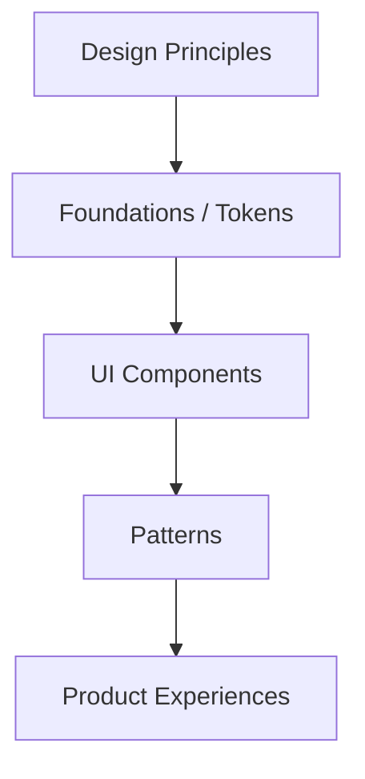
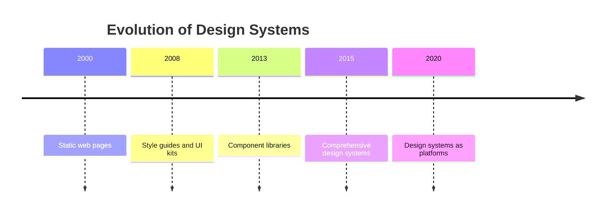
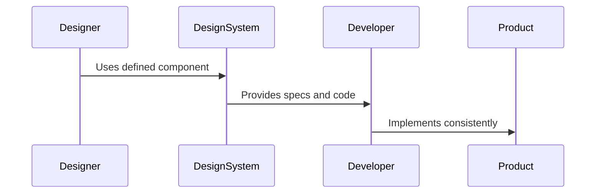
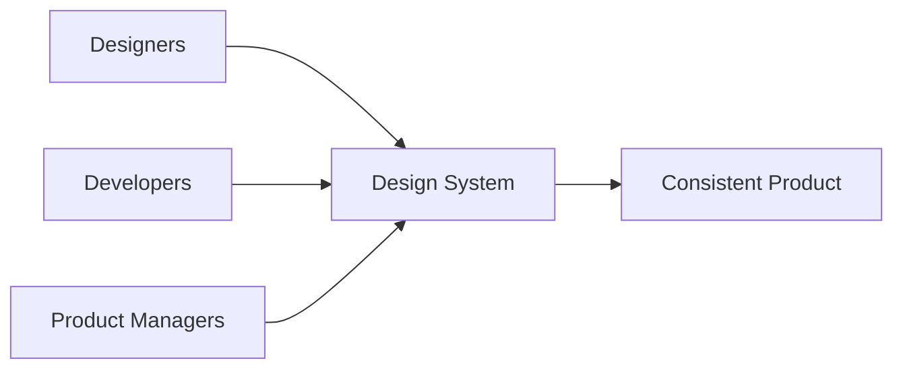

# What Is a Design System and Why It Matters

As digital products grow more complex, teams face an increasingly difficult challenge: how to build interfaces that are **consistent**, **scalable**, and **efficient** across many screens, platforms, and contributors. What once started as a single website or app often evolves into an ecosystem—multiple products, multiple teams, multiple devices, and years of ongoing iteration. Without a shared foundation, this growth quickly leads to fragmentation, duplicated work, visual inconsistency, and rising costs.

This is where **design systems** come in.

A design system is not just a trendy deliverable or a design team artifact. It represents a fundamental shift in how teams think about design and development—from crafting individual screens to building **systems of reusable parts governed by shared principles**. Design systems help teams move faster without sacrificing quality, enable collaboration across disciplines, and ensure that products feel coherent no matter how large they become.

This chapter lays the conceptual groundwork for everything that follows. We will explore what design systems are, how they evolved, the problems they aim to solve, and why they are increasingly seen as a **strategic asset** rather than a purely tactical tool. By the end of this chapter, you should understand not only *what* a design system is, but *why it matters deeply* to modern product teams.

By the end of this chapter, you will be able to:

- Clearly define what a design system is and identify its core components  
- Explain at least three historical drivers behind the rise of design systems  
- Identify key product, design, and engineering problems that design systems aim to solve  
- Describe how design systems support consistency, scalability, and efficiency  
- Differentiate between tactical UI work and system-level thinking  

---

## Defining Design Systems and Their Core Components

A **design system** is a structured collection of reusable components, shared principles, and documented standards that guide how digital products are designed and built. Unlike a static style guide or a one-off UI kit, a design system is **living**, **evolving**, and **operational**—it is meant to be used continuously by designers, developers, and product teams as they create and maintain products over time.

At its core, a design system exists to answer a deceptively simple question: *“How do we design and build things consistently, efficiently, and at scale?”* The answer involves aligning not just visual styles, but also interaction patterns, accessibility rules, code implementations, and shared language across teams.

### What a Design System Is — and Is Not

To understand design systems clearly, it helps to contrast them with related but distinct artifacts:

- A **style guide** focuses primarily on visual rules such as colors, typography, and spacing.
- A **UI kit** provides a collection of pre-designed components, often without deep documentation or code parity.
- A **pattern library** documents recurring interface patterns and their usage.

A **design system**, by contrast, brings all of these together and adds governance, documentation, and alignment between design and code. It is not just a set of assets—it is a **system of decisions**.

### Core Components of a Design System

Although every design system is unique, most mature systems share a common set of components. These elements work together to ensure consistency and scalability.

| Component | Description | Why It Matters |
|---------|------------|----------------|
| Design Principles | High-level values that guide decisions | Ensure coherence and decision-making alignment |
| Foundations (Tokens) | Colors, typography, spacing, motion | Create visual and functional consistency |
| UI Components | Buttons, inputs, modals, navigation | Enable reuse and faster product development |
| Patterns | Common solutions to recurring problems | Reduce cognitive load and design debt |
| Documentation | Guidelines for usage and behavior | Enable adoption and correct implementation |
| Code Implementations | Front-end components and libraries | Bridge design and engineering |

Design principles act as the **north star**, helping teams make trade-offs. Foundations—often implemented as **design tokens**—translate abstract ideas into concrete values that can be shared across platforms. Components and patterns provide building blocks, while documentation ensures that these blocks are used correctly and consistently.

### How the Pieces Fit Together

A design system is not a flat collection of parts—it is hierarchical and interconnected. Foundations support components, components combine into patterns, and patterns serve product experiences.

This structure allows teams to make changes at the right level. For example, updating a color token can propagate across hundreds of components without redesigning each one individually.

### Why Definitions Matter

Misunderstanding what a design system is often leads to disappointment. Teams may expect immediate speed gains without investing in documentation, or treat a UI kit as a system without governance. A clear definition sets realistic expectations and clarifies that a design system is:

- A **product**, not a project  
- A **collaborative asset**, not a design-only artifact  
- A **long-term investment**, not a one-time deliverable  

Understanding these fundamentals is essential before exploring how design systems came to be.

---

## Historical Evolution of Design Systems in Digital Products

Design systems did not appear overnight. They emerged gradually in response to growing complexity in digital products, teams, and technologies. To appreciate their role today, it is important to understand **why they became necessary** in the first place.

### Early Days: Handcrafted Interfaces

In the early days of the web and software development, most products were small and built by tightly knit teams. Designers (if present at all) created mockups for a limited number of screens, and developers implemented them directly. Consistency was largely maintained through manual effort and personal familiarity with the product.

At this stage, the cost of inconsistency was low. If a button looked slightly different on another page, it was inconvenient but manageable. The scale simply did not justify formal systems.

### Growth of Platforms and Product Families

As companies began offering multiple products—web apps, mobile apps, dashboards, marketing sites—the cracks started to show. Teams found themselves redesigning the same components repeatedly, often with slight variations. Knowledge lived in people’s heads rather than in shared documentation.

Three major historical drivers pushed teams toward design systems:

1. **Scale of Products** – More screens, more features, more platforms  
2. **Scale of Teams** – More designers and developers working in parallel  
3. **Speed of Change** – Faster release cycles and continuous delivery  

These forces made informal consistency impossible to maintain.

### Influence of Industrial and Graphic Design

The concept of systems thinking in design is not new. Industrial design, architecture, and print design have long relied on modular systems—think of grid systems in Swiss typography or standardized parts in manufacturing. Digital design borrowed these ideas but needed to adapt them to interactive, dynamic environments.

### Rise of Component-Based Development

The emergence of component-based frameworks (such as React, Angular, and Vue) played a crucial role. Engineers began thinking in reusable components, while designers were still often working screen by screen. Design systems became the bridge between these two worlds.

| Era | Design Approach | Key Limitation |
|----|----------------|----------------|
| Early Web | Page-based design | Low scalability |
| Multi-Product Era | Ad hoc reuse | Inconsistent experiences |
| Component Era | Modular development | Need for shared design logic |
| Design Systems Era | System-level thinking | Requires governance |

### Pioneering Design Systems

Some of the earliest and most influential design systems—such as Google’s Material Design or IBM’s Carbon—demonstrated that systems could work at massive scale. These examples showed that design systems could be:

- Cross-platform  
- Openly documented  
- Continuously evolving  

They shifted industry expectations and normalized the idea that a design system is a core part of product infrastructure.

Understanding this evolution helps explain why modern design systems emphasize not just visuals, but also governance, tooling, and collaboration.

---

## Problems Design Systems Aim to Solve

Design systems exist because teams face recurring, systemic problems that cannot be solved by individual effort alone. These problems are often invisible at first but become painfully obvious as products and teams grow.

### Inconsistency Across Interfaces

One of the most common problems is visual and behavioral inconsistency. Buttons look different across pages, interactions behave unpredictably, and users are forced to relearn basic patterns.

Inconsistency arises when:
- Multiple designers interpret guidelines differently  
- Developers reimplement components under time pressure  
- Design decisions are made locally without global oversight  

Design systems address this by providing **single sources of truth** for design decisions.

### Duplication of Work

Without a system, teams repeatedly solve the same problems. Designers redesign inputs, tables, or modals. Developers re-code them. This duplication wastes time and introduces variation.

A design system reduces duplication by:
- Encouraging reuse of approved components  
- Making existing solutions easy to discover  
- Aligning design and code from the start  

### Slower Development and Higher Costs

Ironically, the absence of a design system often slows teams down over time. While skipping documentation may feel faster initially, the long-term cost includes:

- Increased QA cycles  
- More bugs and regressions  
- Longer onboarding for new team members  

### Communication Breakdown Between Design and Engineering

Designers and developers often speak different languages. A design system creates shared vocabulary—what a “primary button” means, how a “card” behaves, what “disabled” looks like.

### Accessibility and Quality Gaps

Accessibility is frequently overlooked when handled ad hoc. A design system allows teams to bake accessibility into components once, rather than relying on individual vigilance.

| Problem | Without Design System | With Design System |
|-------|----------------------|-------------------|
| Consistency | Manual, error-prone | Built-in |
| Speed | Decreases over time | Increases over time |
| Accessibility | Inconsistent | Standardized |
| Team Alignment | Fragmented | Shared understanding |

Design systems do not eliminate all problems, but they dramatically reduce friction and cognitive load across teams.

---

## The Role of Design Systems in Product Teams

Design systems are not owned by a single discipline—they are **collaborative infrastructure** that supports designers, developers, product managers, and stakeholders alike.

### Designers: From Screens to Systems

For designers, design systems shift the focus from crafting individual screens to defining **rules and relationships**. This allows designers to:

- Spend less time on repetitive UI work  
- Focus more on user problems and flows  
- Ensure visual and interaction consistency  

Designers also gain leverage: a well-designed component can impact dozens of screens.

### Developers: Predictability and Reuse

For developers, design systems provide stable, reusable components that reduce uncertainty. Instead of interpreting designs repeatedly, developers can rely on documented behavior and code.

Benefits include:
- Faster implementation  
- Fewer bugs  
- Easier maintenance  

### Product Managers: Speed and Alignment

Product managers benefit indirectly but significantly. Design systems enable:

- More accurate scoping  
- Faster iteration  
- Consistent user experiences across features  

### Collaboration and Governance

A key role of design systems is enabling **cross-functional collaboration**. This requires clear ownership, contribution models, and decision-making processes.

When done well, design systems become a shared language rather than a constraint.

---

## Design Systems as a Strategic Asset

Beyond efficiency, mature organizations recognize design systems as **strategic assets**—tools that shape brand perception, enable scale, and support long-term growth.

### From Cost Center to Value Driver

Initially, design systems may appear costly to build and maintain. However, over time they:

- Reduce long-term development costs  
- Improve time-to-market  
- Strengthen brand consistency  

This reframes design systems as investments rather than overhead.

## Case Study: From Fragmentation to Scale at Atlas CRM

### Context

Atlas CRM was a rapidly growing SaaS company serving mid-sized enterprises across North America and Europe. Founded in 2014, the company initially focused on a single web-based CRM product. By 2019, Atlas had expanded into mobile apps, analytics dashboards, and industry-specific extensions. Each new product was developed by a semi-autonomous team with its own designers and engineers.

As growth accelerated, leadership began to notice cracks forming in the product experience. Customers complained that different parts of the platform felt like “different tools stitched together.” Internally, teams struggled to ship features quickly without breaking existing UI patterns. Despite having talented designers and engineers, Atlas was slowing down.

### Problem

The core problem was not talent or effort—it was fragmentation. Each team maintained its own UI patterns, color interpretations, and interaction behaviors. Buttons varied in size and color. Forms behaved differently across products. Even basic terminology differed between interfaces.

This fragmentation created several cascading issues. Designers spent large portions of their time recreating existing components. Developers reimplemented similar logic with subtle differences. QA teams faced an explosion of edge cases. New hires took months to become productive because nothing was standardized.

Leadership realized that incremental fixes—updating a style guide or sharing a UI kit—were not enough. The problem was systemic.

### Solution

Atlas decided to invest in a company-wide design system. The initiative began with a small, cross-functional core team: two designers, two front-end engineers, and a product manager. Their first step was not to design components, but to define **principles**—clarity, efficiency, and trust—that would guide decisions.

Next, the team audited existing products, identifying common patterns and pain points. They created a foundational layer of design tokens for color, typography, spacing, and motion. These tokens were implemented in both design tools and code to ensure parity.

UI components were built incrementally, starting with the most frequently used elements such as buttons, inputs, and tables. Each component was documented with usage guidelines, accessibility considerations, and code examples. A contribution model allowed product teams to propose improvements.

### Results

Within six months, Atlas began to see measurable improvements. Feature teams reported faster implementation times and fewer design-related bugs. User feedback indicated improved clarity and consistency across products. New designers and developers onboarded more quickly, using the design system as a learning tool.

Importantly, the design system did not eliminate creativity—it redirected it. Designers focused more on solving complex workflow problems, while developers spent less time reinventing UI logic.

### Lessons Learned

Atlas learned that a design system is not a one-time project. Ongoing governance, communication, and iteration were essential. The company also learned that executive support was critical—without it, adoption would have stalled.

Most importantly, Atlas realized that their design system had become part of their competitive advantage. It enabled them to scale confidently without sacrificing quality.

---

## Common Misconceptions About Design Systems

Despite their benefits, design systems are often misunderstood. These misconceptions can derail initiatives or lead to unrealistic expectations.

### “A Design System Is Just a UI Kit”

This is one of the most common misunderstandings. A UI kit is a subset of a design system, but without principles, documentation, and governance, it cannot scale.

### “Design Systems Kill Creativity”

In reality, design systems **constrain the trivial to free the meaningful**. By standardizing basics, they give teams more room to innovate where it matters.

### “Once Built, It’s Done”

Design systems are living systems. Products evolve, technologies change, and user needs shift. A static system quickly becomes obsolete.

| Misconception | Reality |
|--------------|---------|
| Only for designers | Used by entire product teams |
| Slows teams down | Speeds teams up over time |
| One-size-fits-all | Adaptable and extensible |

Recognizing these misconceptions early helps teams approach design systems with the right mindset.

---

## Summary

Design systems are foundational to building modern digital products at scale. They provide shared structure, language, and components that enable consistency, efficiency, and collaboration across teams. Far from being mere style guides, design systems represent a shift toward **system-level thinking**—from crafting individual screens to designing resilient, reusable solutions.

By understanding their components, history, purpose, and strategic value, you are now equipped with the conceptual framework needed to explore design systems in depth in the chapters ahead.

---

## Reflection Questions

1. How does thinking in systems change the way you approach interface design compared to designing individual screens?  
2. What problems have you observed in products that could be traced back to the absence of a design system?  
3. In what ways could a design system act as a strategic asset rather than just a design tool?  
4. How might misconceptions about design systems affect adoption within an organization?