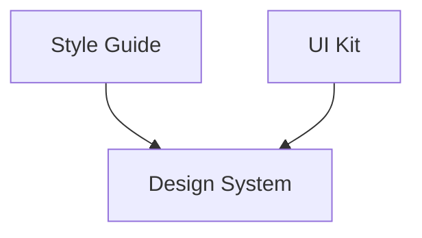
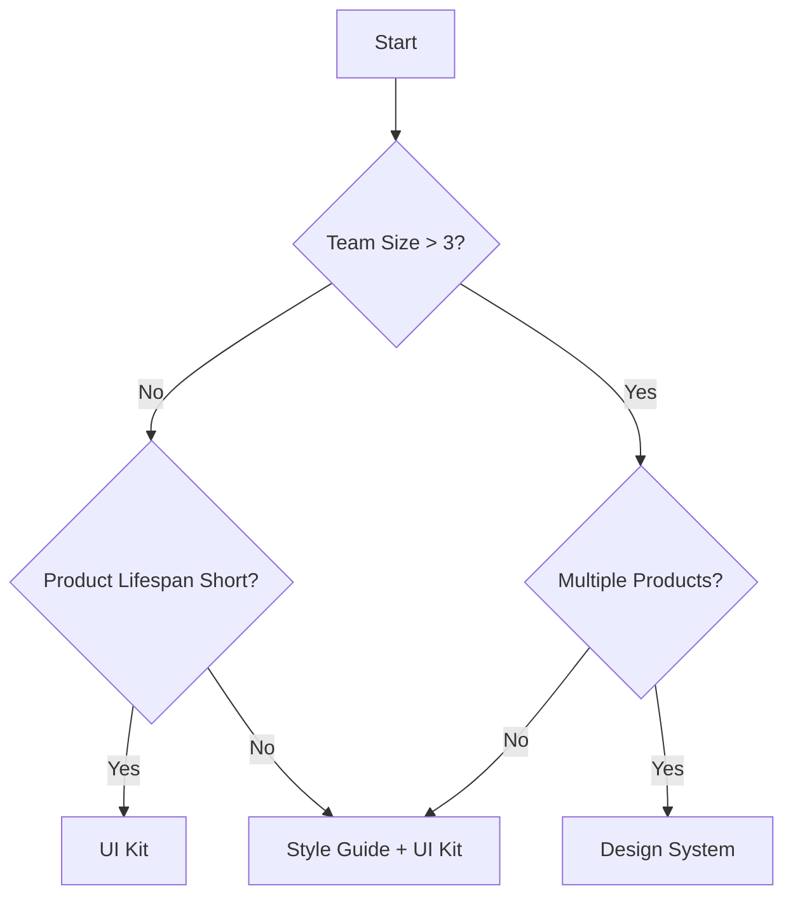

# Design Systems vs UI Kits vs Style Guides

As digital products grow in complexity, teams increasingly struggle with consistency, scalability, and efficiency in design and development. Buttons look slightly different across screens, colors drift from brand guidelines, and new features take longer to design because teams repeatedly reinvent the same components. To solve these problems, the design industry has introduced several closely related—but often misunderstood—tools and approaches: **UI kits**, **style guides**, and **design systems**.

At first glance, these concepts appear interchangeable. Many teams say they “have a design system” when they actually mean a shared Figma file with components. Others invest heavily in brand guidelines but still face inconsistent interfaces across products. This confusion leads to mismatched expectations, wasted effort, and tools that fail to scale with the organization’s needs.

This chapter clarifies these concepts in depth. You will learn not only *what* UI kits, style guides, and design systems are, but *why* they exist, *how* they differ, *when* each is appropriate, and *what happens* when they are misapplied. By the end, you will be able to confidently choose the right approach for a product, team, or organization—and explain that choice clearly to others.

By the end of this chapter, you will be able to:

- Differentiate UI kits, style guides, and design systems by scope, purpose, and maturity  
- Identify scenarios where each approach is most appropriate  
- Explain why UI kits and style guides often fail to scale for complex products  
- Analyze real-world examples to classify design maturity  
- Apply a practical decision framework to choose the right design asset type  

---

## Understanding UI Kits and Their Use Cases

A **UI kit** is the most lightweight and tangible of the three concepts. At its core, a UI kit is a **collection of reusable visual components**—such as buttons, inputs, modals, icons, and layout patterns—designed to speed up interface creation and ensure basic visual consistency.

Historically, UI kits emerged alongside the rise of digital design tools like Sketch and Figma. As designers began working on larger products with many screens, they quickly realized that repeatedly redrawing the same button or form was inefficient and error-prone. UI kits solved this problem by acting as a shared “parts drawer” for interfaces. Much like LEGO bricks, they provide predefined pieces that can be assembled into screens quickly.

From a practical standpoint, UI kits usually live inside a design tool. They are often implemented as:
- Component libraries in Figma or Sketch  
- Downloadable asset packs  
- Starter templates for dashboards, mobile apps, or websites  

However, it is important to understand what UI kits **do not** include. They typically lack:
- Design principles or rationale  
- Usage guidelines (when *not* to use a component)  
- Accessibility standards  
- Governance or versioning rules  
- Tight integration with development code  

This limitation means UI kits are excellent for **speed**, but weak at **scale**.

### How UI Kits Work in Practice

When a team uses a UI kit, the workflow usually looks like this:

1. A designer selects components (buttons, cards, forms) from the kit  
2. Components are visually customized (text, icons, colors)  
3. Screens are assembled quickly using predefined layouts  
4. Developers recreate or approximate the components in code  

This process is efficient in small teams or early-stage products. However, as more designers and developers join, subtle inconsistencies emerge. One designer slightly resizes a button. Another changes spacing. Over time, the “kit” fragments into variations.

### Advantages and Limitations of UI Kits

**Advantages**
- Fast to create and adopt  
- Low upfront cost  
- Ideal for MVPs, prototypes, and short-term projects  
- Easy for new designers to understand  

**Limitations**
- No shared design logic or principles  
- Weak consistency across teams  
- Poor support for accessibility and internationalization  
- Difficult to maintain over time  

### Everyday Analogy

Think of a UI kit like a **furniture catalog**. It shows you what chairs, tables, and lamps look like, and you can pick pieces to furnish a room. But it doesn’t explain *why* a chair is ergonomic, *where* it should be used, or *how* to maintain consistency across multiple buildings. For one apartment, it works well. For a city of offices, it quickly falls short.

---

## Exploring Style Guides and Brand Guidelines

A **style guide** shifts the focus from components to **rules and standards**. Instead of asking, “What UI elements do we have?”, style guides ask, “How should our product look and feel?”

Style guides originated long before digital products, in fields like print design, journalism, and advertising. Newspapers, for example, used style guides to define typography, tone, spacing, and layout rules so that thousands of pages could be produced consistently by different people. Digital teams later adapted this concept to UI design.

A typical digital style guide defines:
- Color palettes and usage rules  
- Typography scales and font choices  
- Spacing systems and grids  
- Iconography styles  
- Brand voice and tone  

Unlike UI kits, style guides are **prescriptive rather than tangible**. They tell you *what rules to follow*, but not necessarily *how to build something*.

### Brand Guidelines vs UI Style Guides

It is useful to distinguish between two related but different artifacts:

| Type | Focus | Audience |
|---|---|---|
| Brand Guidelines | Brand identity across all media | Marketing, design, agencies |
| UI Style Guides | Visual rules for interfaces | Product designers, developers |

Brand guidelines might define logo usage on billboards and business cards, while UI style guides define how headings, buttons, and spacing work inside an app.

### Why Style Guides Matter

Style guides are especially valuable when:
- Multiple teams work on the same brand  
- Work spans platforms (web, mobile, marketing)  
- Brand consistency is critical to trust  

They answer questions like:
- “Which blue is our primary brand color?”  
- “How do we use typography hierarchically?”  
- “What tone should error messages use?”  

However, style guides still stop short of solving implementation problems. Designers must interpret rules, and developers must translate them into code—often leading to inconsistency.

### Limitations of Style Guides

While style guides provide clarity, they have notable gaps:
- They rarely include interactive behavior  
- They do not define reusable components  
- They rely heavily on interpretation  
- They are often static documents  

A style guide without components is like a **grammar book without example sentences**—correct, but hard to apply consistently.

---

## Key Differences Between UI Kits, Style Guides, and Design Systems

A **design system** encompasses and extends both UI kits and style guides. It is not just a collection of assets or rules, but a **living ecosystem** that includes:

- Reusable components  
- Design principles  
- Usage guidelines  
- Accessibility standards  
- Code implementations  
- Governance and contribution models  

### Conceptual Comparison

| Aspect | UI Kit | Style Guide | Design System |
|---|---|---|---|
| Scope | Visual components | Visual rules | End-to-end system |
| Includes Code | ❌ | ❌ | ✅ |
| Usage Guidelines | Minimal | Moderate | Extensive |
| Scalability | Low | Medium | High |
| Governance | None | Minimal | Formal |

### Structural Relationship

This diagram highlights an important idea: **UI kits and style guides are inputs to a design system**, not alternatives at the same level.

### Why Design Systems Exist

Design systems emerged when companies like Google, IBM, and Salesforce faced massive scale:
- Hundreds of designers  
- Thousands of developers  
- Multiple products and platforms  

They realized that consistency required not just assets, but **shared understanding and shared infrastructure**.

### Common Misconceptions

- “We have a design system because we have components” → That’s a UI kit  
- “Our brand guidelines are our design system” → That’s a style guide  
- “Design systems are only for big companies” → They scale *with* you  

---

## When a UI Kit Is Enough vs When a Design System Is Needed

Not every team needs a full design system. Over-engineering can waste time and slow progress. The key is understanding **context and maturity**.

### When a UI Kit Is Enough

A UI kit is usually sufficient when:
- You are building an MVP or prototype  
- The team is small (1–3 designers)  
- The product has a short lifespan  
- Speed matters more than consistency  

Example: A startup testing a new idea may benefit more from moving fast than from defining governance rules.

### When a Design System Becomes Necessary

A design system becomes essential when:
- Multiple teams work in parallel  
- Products span platforms or regions  
- Accessibility and compliance matter  
- Inconsistencies create real costs  

Example: A fintech app expanding globally must ensure consistent, accessible UI across dozens of features and teams.

### Cost of Waiting Too Long

Teams that delay adopting a design system often face:
- Design debt  
- Slower feature delivery  
- Increased bugs and UX issues  
- Frustration between design and engineering  

---

## Real-World Comparison Scenarios

### Scenario 1: Startup Dashboard Tool

A small SaaS startup created a dashboard using a UI kit. Initially, this worked well. But as features grew, each designer modified components slightly. Six months later, the product had five different button styles. Refactoring cost more than early systemization would have.

### Scenario 2: Global E-Commerce Brand

A global retailer relied on brand guidelines alone. Each regional team interpreted rules differently, resulting in inconsistent checkout flows. Conversion rates varied wildly. Introducing a design system standardized components and improved metrics.

### Scenario 3: Government Service Platform

A government agency needed accessibility compliance. UI kits lacked documentation and behavior rules. A full design system ensured WCAG compliance and reduced legal risk.

---

## Decision Framework for Choosing the Right Approach

### Decision Flow

### Key Evaluation Dimensions

| Dimension | Low Need | High Need |
|---|---|---|
| Team Size | 1–2 | 10+ |
| Product Complexity | Simple | Complex |
| Longevity | Temporary | Long-term |
| Compliance | None | High |

### Practical Advice

- Start small, but plan for growth  
- Treat UI kits as stepping stones  
- Invest in documentation early  
- Align design and engineering from day one  

---

## Summary

UI kits, style guides, and design systems are not competing tools—they are **different levels of maturity**. UI kits optimize speed, style guides optimize consistency, and design systems optimize scale. Understanding their differences allows teams to choose wisely, avoid unnecessary complexity, and grow sustainably.

---

## Reflection Questions

1. Which of these assets does your current team truly have—and which do you *think* you have?  
2. What risks might arise if your product scales without a design system?  
3. How could a UI kit evolve into a design system over time?  
4. What organizational challenges matter more than visual consistency when choosing an approach?