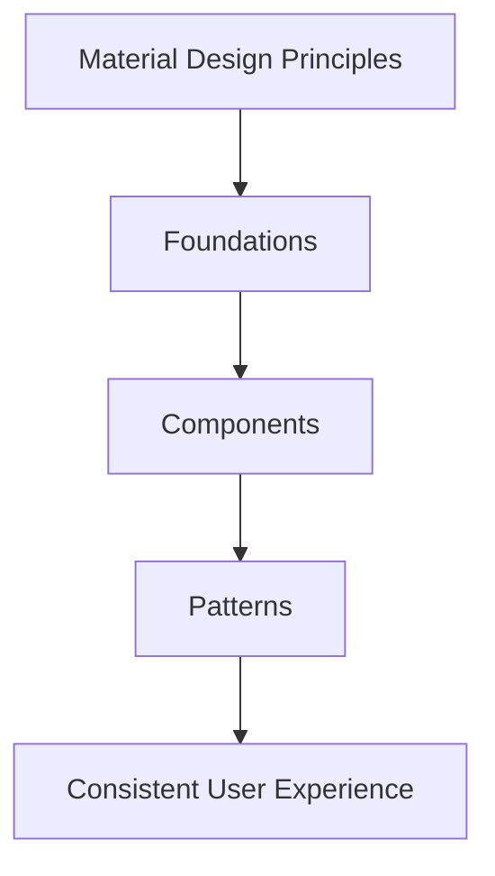
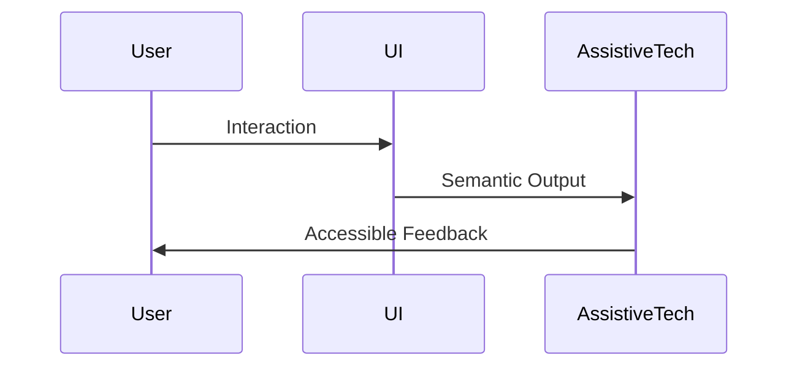
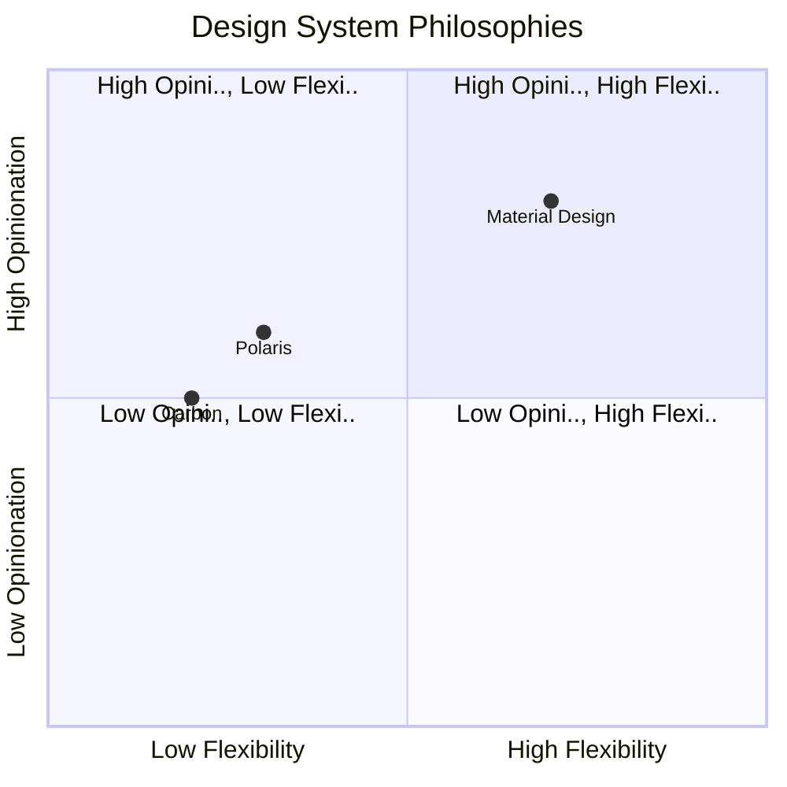

# Real-World Design Systems in Practice

Design systems often begin as abstract concepts: collections of principles, reusable components, and shared guidelines intended to bring consistency and efficiency to product design. For many learners, however, the real challenge is not understanding *what* a design system is, but understanding *how it actually works in the real world*. How do large organizations maintain consistency across hundreds of teams? How do design systems evolve over time? And what trade-offs are made when theory meets the messy realities of business, technology, and human collaboration?

This chapter bridges that gap between theory and practice by examining **established, real-world design systems** that are widely used and publicly documented. Instead of treating design systems as idealized frameworks, we will explore them as *living systems*: shaped by organizational goals, technical constraints, cultural values, and long-term maintenance decisions.

By studying Material Design, Shopify Polaris, and IBM’s Carbon Design System, learners will see how different organizations solve similar problems in different ways. More importantly, you will learn how to *extract lessons* from these systems—so you can apply their insights thoughtfully in your own context, rather than copying them blindly.

By the end of this chapter, you will be able to:

- Identify key characteristics of major public design systems and explain their purpose  
- Compare and contrast design philosophies across different real-world systems  
- Extract best practices from mature, production-ready design systems  
- Recognize trade-offs and constraints in real-world system design decisions  
- Translate observed patterns and lessons into actionable insights for your own organization  

---

## Material Design: A Global, Opinionated System at Scale

Material Design is one of the most influential design systems ever created, largely because of its **scale, visibility, and ambition**. Introduced by Google in 2014, Material Design was not merely a component library—it was a comprehensive attempt to define a universal visual language for digital interfaces across platforms, devices, and form factors. To understand Material Design in practice, it is important to look beyond its surface-level aesthetics and examine the philosophy, structure, and trade-offs that shaped it.

At its core, Material Design is built on the metaphor of **physical materials**. Google wanted digital interfaces to feel intuitive by borrowing cues from the real world: surfaces have depth, elements cast shadows, and objects move in predictable ways. This metaphor helped designers and developers reason about interface behavior consistently. For example, a floating action button appears elevated because it is meant to be a primary, actionable element, much like a raised button on a physical device.

Historically, Material Design emerged during a period when Android interfaces were highly fragmented. Different apps followed different patterns, leading to user confusion and inconsistent experiences. Material Design was Google’s response to this fragmentation. By providing a unified system of colors, typography, spacing, motion, and components, Google aimed to create consistency not only across Android apps, but also across web, iOS, and emerging platforms such as wearables and TVs.

What makes Material Design particularly notable in real-world practice is how **opinionated** it is. Google made strong decisions about how interfaces *should* look and behave. This opinionation offers clear benefits: teams can move faster, decisions are easier, and consistency is easier to achieve. However, it also introduces trade-offs. Organizations adopting Material Design must decide how closely to follow it versus where to customize or diverge, especially when brand differentiation is important.

### How Material Design Is Structured

Material Design is structured around several tightly connected layers that work together as a system:

- **Foundations**: Color systems, typography scales, elevation, shape, and motion principles  
- **Components**: Buttons, cards, navigation elements, inputs, dialogs, and more  
- **Patterns**: Recommended ways components are combined to solve common UX problems  
- **Guidelines and principles**: The rationale behind design decisions and intended usage  

These layers are intentionally interconnected. Changing a foundational element—such as typography or color—has cascading effects across components and patterns. This tight coupling reinforces consistency but can make customization more complex.

| Layer | Purpose | Real-World Impact |
|------|--------|------------------|
| Foundations | Define visual and behavioral rules | Ensures consistency across products |
| Components | Reusable UI building blocks | Speeds up development and design |
| Patterns | Solve common UX problems | Reduces decision fatigue |
| Guidelines | Explain intent and rationale | Helps teams align on decisions |

### Material Design in Practice: Strengths and Trade-offs

In practice, Material Design excels in environments where **speed, scalability, and cross-team alignment** are critical. Startups and large organizations alike benefit from its ready-made solutions and extensive documentation. Developers appreciate the availability of implementation libraries such as Material UI, while designers benefit from clear guidance and tooling support.

However, Material Design’s strengths can also become limitations:

- Its visual language can feel “Google-like,” making brand differentiation harder  
- Strict adherence may limit creative exploration  
- Customization requires careful effort to avoid breaking consistency  

A useful analogy is a well-designed public transportation system. It gets millions of people where they need to go efficiently, but it may not offer the personal comfort or uniqueness of a private vehicle. Material Design is optimized for scale and reliability, not bespoke expression.

---

## Polaris and Enterprise Design Systems: Designing for Complexity and Commerce

While Material Design aims for universality, **Shopify’s Polaris** design system is deeply contextual. Polaris was created to support a specific audience: merchants running online businesses and internal teams building tools for them. This context shapes every aspect of the system, from its language to its component decisions.

Polaris emerged as Shopify grew rapidly and faced increasing inconsistency across its admin interfaces. Different teams built features independently, resulting in fragmented experiences that confused merchants and slowed development. Polaris was introduced not just as a design solution, but as an **organizational alignment tool**.

One of Polaris’s defining characteristics is its **focus on clarity over creativity**. Shopify’s merchants are often busy, non-technical users who need to complete tasks efficiently. As a result, Polaris prioritizes:

- Clear hierarchy and predictable layouts  
- Conservative visual design that reduces cognitive load  
- Components optimized for data-heavy interfaces  

Unlike Material Design’s physical metaphor, Polaris uses a **language-first approach**. Content design, tone, and messaging are treated as first-class citizens. This reflects a key insight: in enterprise and administrative tools, *words often matter more than visuals*.

### Enterprise Constraints and System Design

Enterprise design systems like Polaris operate under constraints that consumer-facing systems often avoid. These include:

- Long-lived products with backward compatibility concerns  
- Diverse user roles with different permissions and needs  
- Complex workflows that evolve over time  

Polaris addresses these challenges by emphasizing **stability and predictability**. Changes are introduced cautiously, with extensive documentation and migration guidance. This makes the system slower to evolve visually, but far more reliable for teams building mission-critical tools.

| Aspect | Polaris | Typical Consumer System |
|------|--------|-------------------------|
| Primary Users | Merchants, admins | End consumers |
| Design Goal | Clarity and efficiency | Engagement and delight |
| Change Frequency | Conservative | More experimental |
| Content Strategy | Central to the system | Often secondary |

### Real-World Impact of Polaris

In practice, Polaris has enabled Shopify to scale its product organization without sacrificing coherence. Teams can onboard faster, designers share a common vocabulary, and merchants experience a consistent interface even as new features are added.

The trade-off is that Polaris is less visually flexible and less appealing for products outside Shopify’s domain. This highlights a critical lesson: **a great design system is deeply tied to its organizational context**.

---

## Carbon Design System: Accessibility as a Core Principle

IBM’s Carbon Design System stands out for its **explicit and rigorous focus on accessibility**. While many design systems include accessibility guidelines, Carbon treats accessibility as a foundational requirement rather than an optional enhancement.

Carbon was developed to support IBM’s vast ecosystem of enterprise software products, many of which are used by governments, financial institutions, and large corporations. These environments often have strict legal and ethical accessibility requirements. As a result, Carbon integrates accessibility considerations at every level of the system.

From the outset, Carbon components are designed to meet WCAG standards. This includes color contrast ratios, keyboard navigation, screen reader compatibility, and focus management. Importantly, these considerations are not left to individual teams—they are baked into the system itself.

### How Accessibility Shapes Carbon’s Design Decisions

Designing for accessibility has profound implications:

- Visual design choices are constrained by contrast requirements  
- Interaction patterns must support multiple input methods  
- Components require extensive documentation and testing  

Carbon embraces these constraints as **design drivers**, not limitations. The system provides clear guidance on why certain decisions are made, helping teams understand the broader impact of their choices.

| Accessibility Aspect | Carbon Approach | Benefit |
|---------------------|----------------|--------|
| Color Contrast | Enforced by tokens | Inclusive visuals |
| Keyboard Support | Built into components | Non-mouse usability |
| Screen Readers | Semantic markup | Better comprehension |
| Documentation | Detailed usage guidance | Fewer implementation errors |

### Carbon in Practice

In real-world usage, Carbon enables IBM teams to build compliant, inclusive products more efficiently. However, the system can feel heavy and complex, especially for smaller teams or simpler products. This illustrates a key trade-off: **the more responsibility a system takes on, the more complex it becomes**.

---

## Comparing Philosophies and Structures Across Systems

When we step back and compare Material Design, Polaris, and Carbon, clear philosophical differences emerge. These differences are not accidental—they reflect organizational goals, user needs, and historical context.

Material Design emphasizes **universality and visual coherence**. Polaris prioritizes **clarity and business efficiency**. Carbon focuses on **accessibility and enterprise reliability**. None of these approaches is inherently better; each is optimized for a different problem space.

| Dimension | Material Design | Polaris | Carbon |
|---------|----------------|---------|--------|
| Philosophy | Universal design language | Commerce-focused clarity | Accessibility-first |
| Flexibility | Moderate | Low | Low |
| Visual Expression | Strong and opinionated | Conservative | Functional |
| Primary Context | Consumer apps | Admin & enterprise | Regulated enterprise |

Understanding these differences helps designers avoid a common mistake: copying a system wholesale without considering context. A design system is not a neutral toolkit—it encodes values and priorities.

---

## Lessons Learned from Mature Design Systems

Mature design systems reveal patterns that go beyond specific components or styles. One of the most important lessons is that **design systems are socio-technical systems**. They succeed or fail not just because of design quality, but because of governance, communication, and adoption strategies.

Another key lesson is the importance of **clear ownership and evolution paths**. All three systems invest heavily in documentation, versioning, and feedback loops. They treat the system as a product in its own right, with users, roadmaps, and maintenance costs.

Common lessons include:

- Start with real problems, not abstract ideals  
- Invest in documentation as much as components  
- Accept trade-offs consciously and explicitly  
- Design for change, not perfection  

These systems also demonstrate that maturity brings complexity. As systems grow, they require more governance, tooling, and coordination. This is not a failure—it is the natural cost of scale.

---

## Applying Insights to Your Own Context

The ultimate goal of studying real-world design systems is not imitation, but **translation**. Your organization likely has different constraints, users, and goals. The challenge is to extract principles that make sense for your situation.

Start by asking foundational questions:

- Who are our primary users, and what do they value most?  
- What level of consistency versus flexibility do we need?  
- What constraints (technical, legal, organizational) shape our decisions?  

From there, apply lessons incrementally. You might adopt Material Design’s token structure, Polaris’s content-first mindset, or Carbon’s accessibility rigor—without adopting their entire systems.

A helpful analogy is cooking. Studying master chefs teaches techniques and principles, not recipes to copy exactly. The same is true for design systems: **learn the methods, not just the outcomes**.

---

## Summary

In this chapter, we explored how design systems operate in real-world contexts by examining Material Design, Polaris, and Carbon. Each system reflects distinct philosophies shaped by organizational goals, user needs, and constraints. By comparing their structures, strengths, and trade-offs, we learned that successful design systems are not universal solutions, but contextual responses to complex problems.

Most importantly, we learned how to extract actionable insights from mature systems—insights that can inform thoughtful, context-aware design system decisions in our own work.

---

## Reflection Questions

1. Which design system philosophy aligns most closely with your current or future work, and why?  
2. What trade-offs are you most willing to accept when building or adopting a design system?  
3. How might accessibility or content strategy play a larger role in your own design system?  
4. What lessons from mature systems could you apply immediately, even at a small scale?