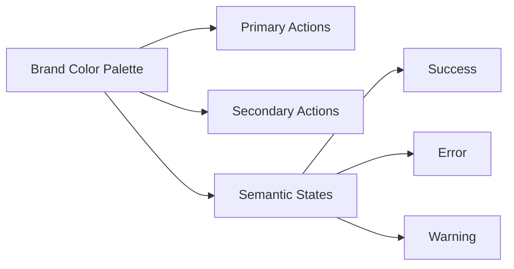
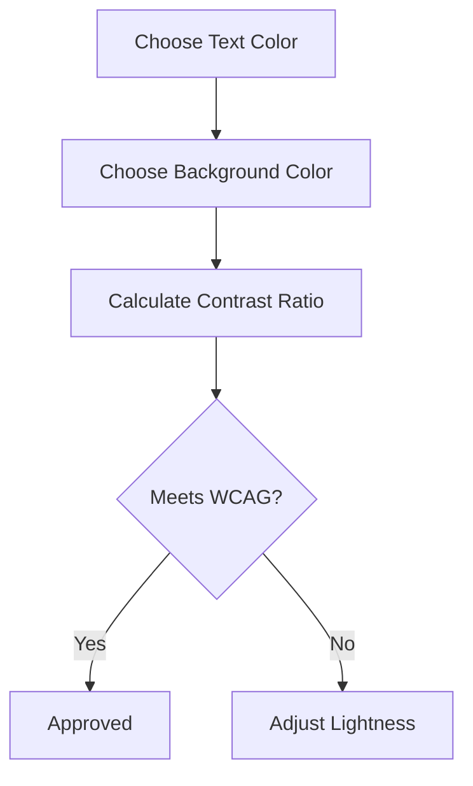
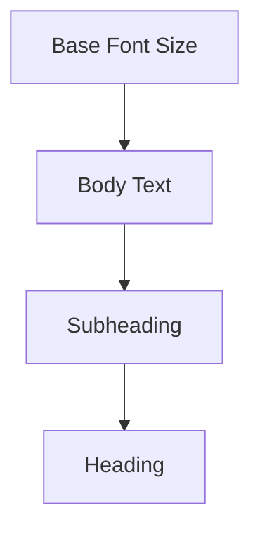
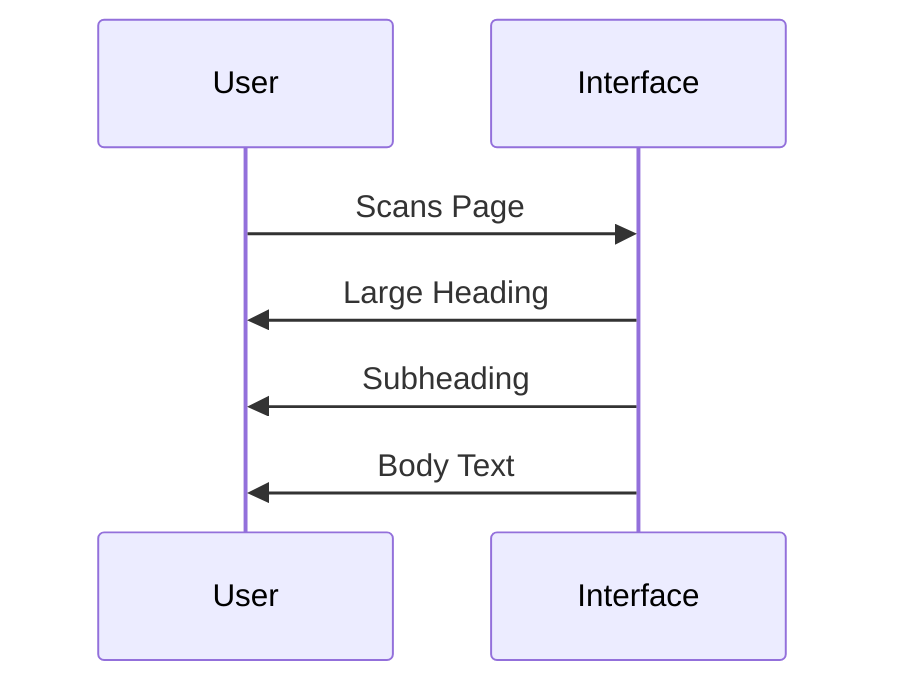
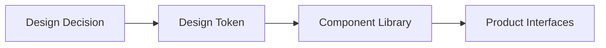

# Color and Typography Foundations

When people first approach visual design for digital products, color and typography often feel like *artistic choices*—something subjective, intuitive, or based on personal taste. Designers may say, “This blue feels right,” or “That font looks modern.” While intuition does play a role, professional UI and interaction design treat color and typography very differently: as **systematic, intentional, and testable design decisions**.

In modern digital products, color and typography are not decoration. They are **functional tools** that shape usability, accessibility, brand perception, and emotional response. Color guides attention, communicates status, and creates visual structure. Typography controls readability, establishes hierarchy, and directly affects how easily users can understand and navigate information. Poor decisions in either area can make a product confusing, inaccessible, or even unusable—no matter how powerful the underlying functionality may be.

This chapter reframes color and typography as **foundational systems** rather than isolated choices. You will learn how designers use color theory and typographic principles to create consistent, accessible, and scalable interfaces. Just as importantly, you will learn *why* accessibility standards exist, how visual choices affect real users, and how to translate abstract design decisions into concrete rules that teams can apply consistently across an entire product ecosystem.

By the end of this chapter, you will be able to:

- Apply basic color theory principles to user interface (UI) design  
- Evaluate color contrast using accessibility standards  
- Define a typography hierarchy for digital interfaces  
- Explain how typography supports usability and brand identity  
- Identify accessibility risks in visual design choices and mitigate them through system rules  

---

## Fundamentals of Color Theory for UI Design

Color theory is the structured study of how colors interact, how they are perceived by humans, and how they can be combined to create meaning. In UI design, color theory moves beyond artistic expression and becomes a **communication system**. Every color choice sends signals to users—about importance, interactivity, emotion, and status.

Historically, color theory emerged from art and physics. Early thinkers like Isaac Newton explored how light splits into wavelengths, while artists developed color wheels to understand harmony and contrast. In digital design, these foundations evolved into practical systems such as RGB and HSL, which allow designers to precisely control color behavior on screens. Understanding this history matters because it explains *why* certain color relationships feel intuitive and others feel jarring.

From a usability perspective, color helps users answer critical questions almost instantly:  
- What can I click?  
- What is important right now?  
- What state is the system in (success, error, warning)?  

Without a solid color foundation, interfaces become visually noisy or misleading.

### Core Color Models Used in UI Design

Digital interfaces rely on structured color models that define how colors are created and manipulated.

| Color Model | Description | Common Use |
|------------|-------------|------------|
| RGB | Red, Green, Blue additive light model | Screens and digital displays |
| HEX | Hexadecimal notation of RGB values | CSS and design tools |
| HSL | Hue, Saturation, Lightness | Designing consistent palettes |
| CMYK | Cyan, Magenta, Yellow, Black | Print (rarely used in UI) |

HSL is particularly valuable for UI designers because it mirrors human perception. Adjusting *lightness* or *saturation* is often more intuitive than adjusting raw RGB values.

### Color Relationships and Harmony

Color harmony refers to combinations that feel visually balanced and intentional. Common schemes include:

- **Monochromatic**: Variations of a single hue  
- **Analogous**: Neighboring hues on the color wheel  
- **Complementary**: Opposite hues for strong contrast  
- **Triadic**: Three evenly spaced hues  

In UI design, harmony is not about beauty alone—it is about **clarity and predictability**. A monochromatic palette often improves focus and consistency, while complementary colors are used sparingly for calls to action.

| Scheme | Strengths | Risks |
|------|----------|------|
| Monochromatic | Calm, consistent | Low contrast if misused |
| Complementary | High emphasis | Visual fatigue |
| Analogous | Natural flow | Weak hierarchy |

### Functional Use of Color in Interfaces

Color in UI design typically serves functional roles rather than decorative ones:

- **Primary colors** for core actions  
- **Secondary colors** for supporting actions  
- **Semantic colors** for status (success, error, warning)  
- **Neutral colors** for backgrounds and text  

This functional mindset prevents arbitrary color usage and prepares designs for scalability.

### Common Mistakes in UI Color Usage

Designers often misuse color by:

- Using too many hues, creating visual chaos  
- Relying on color alone to convey meaning  
- Ignoring contrast and legibility  
- Designing without considering color blindness  

These mistakes usually stem from treating color as decoration rather than as a system.

---

## Color Accessibility and Contrast Standards

Accessibility in color design ensures that users with visual impairments—including low vision and color vision deficiency—can still perceive and use an interface. Accessibility is not a niche concern; it affects millions of users worldwide and is increasingly a legal and ethical requirement.

Color accessibility standards are formalized in the **Web Content Accessibility Guidelines (WCAG)**. These guidelines emerged from years of research into how people perceive color and contrast under real-world conditions, including glare, aging eyesight, and cognitive load.

### Understanding Contrast Ratios

Contrast ratio measures the difference in luminance between two colors, typically text and background.

| Text Type | Minimum Contrast Ratio |
|---------|------------------------|
| Normal text | 4.5:1 |
| Large text | 3:1 |
| UI components | 3:1 |

Contrast is not about hue difference alone. A bright red on a dark green may look distinct but still fail contrast requirements due to similar luminance values.

### Color Vision Deficiency and Design Implications

Approximately 8% of men and 0.5% of women experience some form of color blindness. The most common types affect red-green differentiation.

Design implications include:

- Avoiding color-only indicators (e.g., red = error)  
- Using icons, text, or patterns alongside color  
- Testing designs with color blindness simulators  

| Issue | Poor Design | Accessible Alternative |
|-----|-------------|------------------------|
| Error state | Red text only | Red + icon + message |
| Status | Color dots | Color + label |

## Case Study: Making Financial Data Accessible Through Color

### Context

In 2021, a mid-sized digital bank launched a new analytics dashboard for personal finance management. The product team included designers, engineers, and compliance specialists working under tight regulatory deadlines. The dashboard displayed spending categories, alerts, and savings goals using a vibrant color palette designed to feel “energetic and modern.”

Initial user testing focused on aesthetics and performance. Early feedback praised the visual style, and leadership approved the rollout. However, accessibility testing was scheduled late in the process—a common but costly mistake.

### Problem

Shortly after launch, customer support received complaints from users who struggled to read transaction data and alerts. Users with low vision reported eye strain, while others with color blindness could not distinguish between spending categories. Critical alerts, such as overdraft warnings, were missed because they relied solely on color changes.

The problem was not one single color choice but the absence of **contrast rules and semantic color definitions**. Designers had used similar lightness values across multiple hues, assuming color difference alone was enough.

### Solution

The team paused feature development and conducted a full color audit. They mapped every color usage to a functional role: background, text, action, or status. Contrast ratios were measured using automated tools and manual checks.

Designers rebuilt the palette in HSL, adjusting lightness values systematically. Semantic colors were redefined with minimum contrast thresholds, and all alerts were paired with icons and text labels. Engineers implemented automated contrast checks in the design system.

### Results

After relaunch, accessibility scores improved significantly. Customer complaints related to readability dropped by over 60%. Users reported feeling more confident interpreting financial data, and compliance reviews passed without issues.

### Lessons Learned

The team learned that accessibility cannot be retrofitted cheaply. Color systems must be designed with contrast and semantics from the beginning. Most importantly, they realized that accessible design improved usability for *all* users, not just those with disabilities.

---

## Building a Typography System

Typography in UI design is the disciplined arrangement of text to make content readable, scannable, and meaningful. A typography system defines how text behaves across an interface—not just which font is used.

Historically, typography originated in print, where constraints like paper size and ink dictated many rules. Digital typography inherited these principles but introduced new variables: screen sizes, resolutions, and user-controlled settings.

### Components of a Typography System

A complete typography system includes:

- Typeface selection  
- Font weights and styles  
- Text sizes and scale  
- Line height and spacing  
- Usage rules  

| Element | Purpose |
|-------|---------|
| Typeface | Brand tone and legibility |
| Scale | Hierarchy and rhythm |
| Line height | Readability |
| Spacing | Visual comfort |

### Modular Scales and Consistency

Typography scales often use mathematical ratios (e.g., 1.25 or 1.333) to ensure harmony.

This approach prevents arbitrary sizing and supports responsive design.

### Common Typography Mistakes

- Using too many font sizes  
- Inconsistent line heights  
- Ignoring reading context (long-form vs UI labels)  

---

## Font Pairing and Hierarchy

Font pairing is the practice of combining typefaces to create contrast and hierarchy without confusion. Effective hierarchy helps users scan content and understand structure instantly.

### Principles of Hierarchy

Hierarchy is created through:

- Size  
- Weight  
- Color  
- Spacing  

| Level | Example |
|------|--------|
| H1 | Page title |
| H2 | Section heading |
| Body | Content text |

### Pairing Strategies

- Serif + Sans-serif  
- Same family, different weights  
- Neutral body, expressive heading  

---

## Accessibility Considerations in Typography

Typography accessibility focuses on readability for users with visual, cognitive, or motor impairments.

Key considerations include:

- Minimum font size (typically 16px body)  
- Sufficient line height (1.4–1.6)  
- Avoiding all-caps for long text  
- Supporting zoom and user preferences  

| Risk | Impact |
|----|--------|
| Small text | Eye strain |
| Tight spacing | Reading difficulty |

---

## Translating Visual Choices into System Rules

Design systems turn visual decisions into reusable rules. Without rules, consistency collapses as products scale.

### From Design to System

Rules define:

- When a color is used  
- Which text style applies  
- Minimum contrast requirements  

This translation ensures that accessibility and consistency are preserved across teams and platforms.

---

## Summary

Color and typography are not aesthetic afterthoughts—they are foundational systems that shape usability, accessibility, and trust. By understanding color theory, contrast standards, typography systems, and accessibility principles, designers can make intentional decisions that scale across products. Most importantly, systematic visual design creates inclusive experiences that work for everyone.

---

## Reflection Questions

1. How does treating color as a system change the way you approach UI design?
2. What risks arise when accessibility is considered too late in the design process?
3. How can typography hierarchy improve usability beyond visual appeal?
4. Which visual design decisions in your current projects could be formalized into system rules?
5. How might accessible design choices benefit users without disabilities?

---