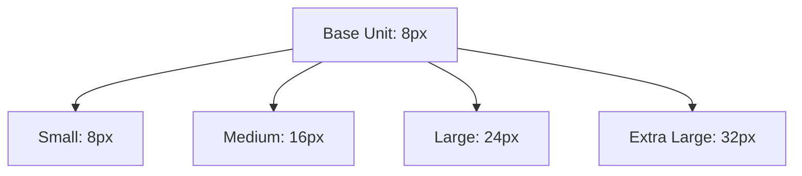
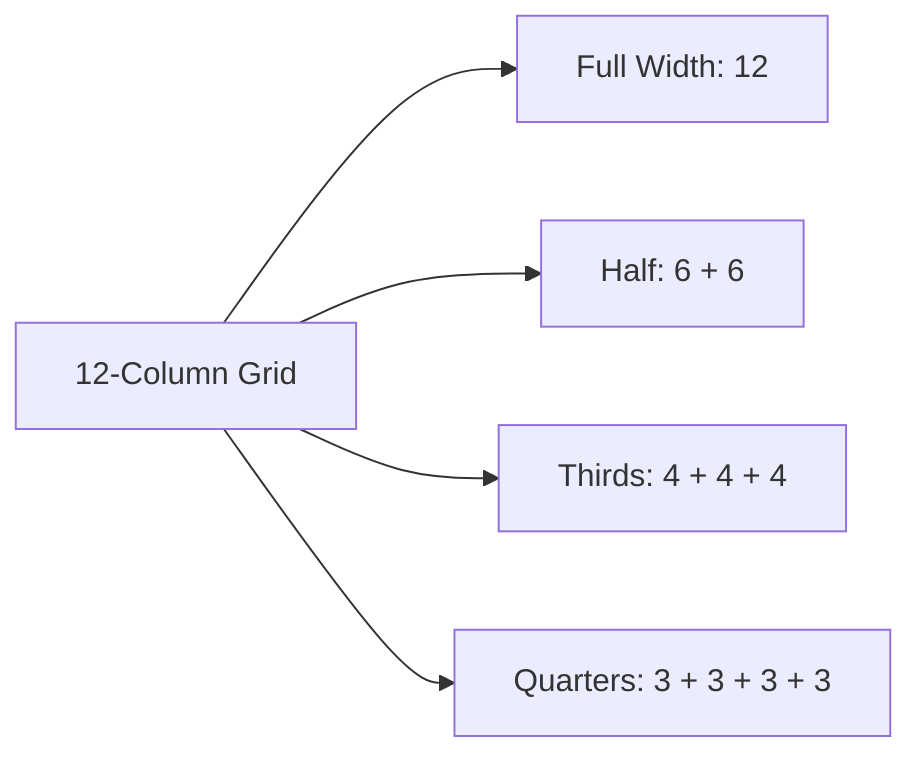
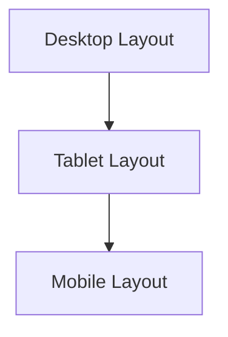
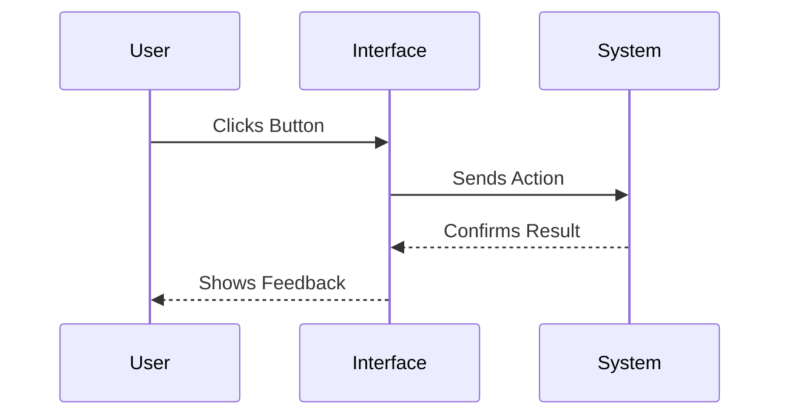
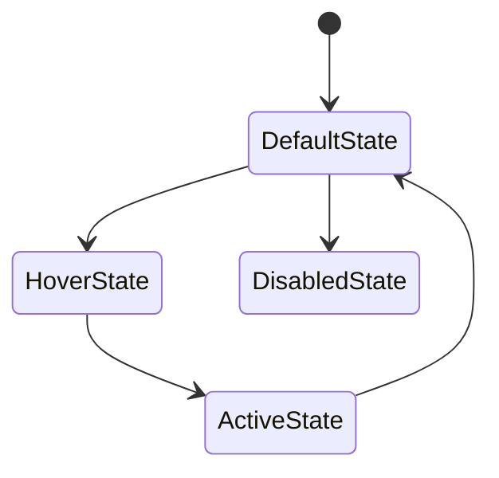

# Layout, Spacing, and Interaction Principles

When people describe a digital product as “clean,” “intuitive,” or “easy to use,” they are often responding to invisible decisions about layout, spacing, and interaction. These decisions shape how information is perceived, how easily actions are discovered, and how confidently users move through an interface. Visual and interaction design foundations are not about decoration; they are about structure, logic, and human behavior.

This chapter focuses on the spatial systems and interaction fundamentals that ensure clarity, usability, and consistency across interfaces. You will learn how spacing creates visual rhythm, how grids bring order to complex layouts, how layouts adapt to different screen sizes, and how interaction principles guide user behavior. Together, these foundations form the backbone of effective interface design, whether you are designing a mobile app, a web platform, or a complex enterprise system.

Rather than treating design as a set of subjective preferences, this chapter frames layout and interaction as systems—repeatable, explainable, and evaluable. By the end, you should be able to look at any interface and understand *why* it feels clear or confusing, and *how* to improve it using proven principles.

By the end of this chapter, you will be able to:

- Construct a spacing system based on consistent units  
- Apply grid systems to organize and structure UI layouts  
- Explain core interaction design principles and their purpose  
- Identify common interaction patterns and explain when to use them  
- Evaluate interface layouts for clarity, consistency, and usability  

---

## Spacing Systems and Visual Rhythm

Spacing is one of the most powerful yet underappreciated tools in visual design. While colors and typography often draw more attention, spacing is what determines whether an interface feels calm or chaotic, readable or overwhelming. At its core, a spacing system defines how much empty space exists between elements and how that space is used consistently across an interface.

Historically, spacing principles emerged from print design and typography. Early book designers understood that margins, line spacing, and paragraph separation directly affected readability. These ideas carried over into digital design as screens became more text-heavy and information-dense. Today, spacing systems are formalized into design tokens and layout rules that scale across products and teams.

### What Is a Spacing System?

A spacing system is a set of predefined spacing values used consistently throughout a design. Instead of arbitrary margins like 17px here and 23px there, designers choose a base unit (for example, 4px or 8px) and build all spacing as multiples of that unit.

This approach matters because human perception is highly sensitive to inconsistency. When spacing values feel random, users may not consciously notice the problem, but they experience the interface as “messy” or “hard to scan.”

Common characteristics of effective spacing systems include:

- A **base unit** (such as 4px or 8px)
- A **scale** (e.g., 4, 8, 16, 24, 32)
- Clear rules for:
  - Spacing between related elements
  - Spacing between groups of elements
  - Spacing between major sections

### Visual Rhythm and Cognitive Flow

Visual rhythm refers to the predictable pattern of spacing that guides the eye through an interface. Just as rhythm in music helps listeners anticipate beats, visual rhythm helps users anticipate structure.

Consider reading a well-designed article:
- Headings are separated more than paragraphs
- Paragraphs are separated more than lines
- Related items are closer together than unrelated ones

This hierarchy of spacing creates meaning without requiring labels or borders.

**Why rhythm matters:**
- Reduces cognitive load by signaling relationships
- Helps users scan content quickly
- Reinforces hierarchy and importance

### Example: Spacing in a Settings Screen

Imagine a mobile settings screen with toggles:
- If every toggle has identical spacing between them, users struggle to understand grouping
- If related toggles are closer together and separated from other groups by larger gaps, structure becomes obvious

This is an example of the **law of proximity**, a Gestalt principle stating that objects placed near each other are perceived as related.

### Common Spacing Mistakes

Designers new to spacing systems often make predictable errors:

- Using arbitrary spacing values
- Overcrowding interfaces to “fit more content”
- Relying on lines or boxes instead of whitespace
- Inconsistent spacing across screens

### Practical Spacing Scale Example

| Spacing Level | Value (8px base) | Typical Use |
|--------------|------------------|-------------|
| XS           | 4px              | Icon padding |
| S            | 8px              | Label-to-input spacing |
| M            | 16px             | Between related elements |
| L            | 24px             | Between sections |
| XL           | 32px             | Major layout separation |

### Visualizing a Spacing System

### Key Takeaways for Spacing

- Spacing is a system, not decoration
- Consistency matters more than exact values
- Spacing communicates relationships and hierarchy
- Good spacing reduces the need for visual clutter

---

## Grid Systems and Layout Structures

While spacing controls distance, grids control alignment. A grid system is an underlying structure that organizes content into columns and rows, ensuring visual consistency and predictability. Grids are the invisible scaffolding that holds layouts together.

Grids have their roots in print design, particularly Swiss typography in the mid-20th century. Designers sought clarity and objectivity, leading to modular grids that emphasized alignment and proportion. Digital interfaces inherited these ideas, adapting them for screens of varying sizes.

### What Is a Grid System?

A grid system divides a layout into columns, gutters (space between columns), and margins. Content aligns to these columns, creating order even when the content itself varies.

Core components include:
- **Columns**: Vertical divisions
- **Gutters**: Space between columns
- **Margins**: Space at the edges of the layout
- **Modules**: Repeating units formed by rows and columns

### Why Grids Matter in UI Design

Grids solve several fundamental problems:

- They reduce design decisions by providing constraints
- They improve scanability and alignment
- They allow multiple designers to work consistently
- They support responsive behavior

Without grids, layouts often rely on visual guesswork, leading to misalignment and inconsistency.

### Common Types of Grids

| Grid Type | Description | Typical Use |
|---------|-------------|-------------|
| Column Grid | Vertical columns | Web pages, dashboards |
| Modular Grid | Rows + columns | Complex data layouts |
| Baseline Grid | Vertical rhythm based on text | Content-heavy designs |

### Example: Dashboard Layout

A dashboard with cards of varying sizes feels cohesive when:
- All cards align to the same column grid
- Vertical spacing follows a baseline rhythm
- Content edges line up across sections

### Grid in Practice: 12-Column Layout

The 12-column grid is popular because it divides evenly into halves, thirds, and quarters. This flexibility allows layouts to adapt while maintaining structure.

### Common Grid Mistakes

- Ignoring the grid for “special cases”
- Mixing multiple grids on one screen
- Over-constraining designs so they feel rigid
- Forgetting vertical alignment

### Relationship Between Grids and Spacing

Grids and spacing systems must work together:
- Spacing defines *distance*
- Grids define *alignment*

When combined, they create predictable, readable layouts.

---

## Responsive Layout Fundamentals

Responsive design addresses a fundamental reality: interfaces must work across a wide range of screen sizes and contexts. A layout that looks perfect on a desktop monitor may be unusable on a phone if it does not adapt.

Responsive layout is not about designing separate screens for every device. It is about defining flexible rules that allow layouts to reflow intelligently.

### Core Principles of Responsive Layout

Responsive layouts rely on a few key ideas:

- Fluid grids instead of fixed widths
- Flexible images and components
- Breakpoints that adapt layout structure
- Content prioritization

### Why Responsiveness Is a Design Problem

While often associated with development, responsiveness starts in design. Designers must decide:
- What content is essential at small sizes
- How hierarchy changes across breakpoints
- When components stack, resize, or hide

### Example: Card Layout Across Devices

- Desktop: 4 cards per row
- Tablet: 2 cards per row
- Mobile: 1 card per row

The content stays the same, but the layout adapts.

### Breakpoints as Behavioral Changes

Breakpoints should reflect meaningful changes in layout behavior, not specific devices. Instead of “iPhone breakpoint,” think:
- “When columns no longer fit comfortably”
- “When text becomes too compressed”

### Common Responsive Pitfalls

- Designing desktop-first only
- Hiding critical content on mobile
- Overloading small screens
- Treating responsiveness as an afterthought

---

## Basic Interaction Design Principles

Interaction design focuses on how users act and how systems respond. While layout determines where things are, interaction design determines what happens when users engage.

These principles are grounded in psychology and human-computer interaction research, dating back to early computing interfaces.

### Core Interaction Principles

Some foundational principles include:

- **Consistency**: Similar actions behave similarly
- **Feedback**: Users see results of actions
- **Visibility**: Available actions are obvious
- **Predictability**: Outcomes match expectations
- **Error tolerance**: Systems prevent and recover from mistakes

### Example: Button Interactions

A well-designed button:
- Looks clickable
- Changes state on hover or tap
- Provides feedback when pressed
- Confirms the action occurred

### Why Interaction Principles Matter

Without clear interaction rules:
- Users hesitate
- Errors increase
- Trust decreases

Good interaction design builds confidence and flow.

---

## Feedback, Affordances, and States

Three concepts sit at the heart of interaction clarity: feedback, affordances, and states. Together, they answer three user questions:
- What can I do?
- What is happening?
- What just happened?

### Affordances: What Actions Are Possible?

Affordances are visual clues that suggest how an element can be used.
- Buttons look pressable
- Sliders look draggable
- Links look clickable

### Feedback: What Happened?

Feedback confirms actions:
- Loading indicators
- Success messages
- Error alerts

### States: What Is the Current Condition?

States represent different conditions of an element:
- Default
- Hover
- Active
- Disabled
- Error

| State | Purpose | Example |
|-----|--------|---------|
| Default | Normal appearance | Enabled button |
| Hover | Indicates interactivity | Color change |
| Disabled | Prevents action | Grayed-out button |

---

## Applying Layout and Interaction Rules Consistently

Consistency is what turns individual design decisions into a coherent system. Without consistency, even well-designed components feel disjointed.

### Why Consistency Matters

Consistency:
- Reduces learning time
- Builds user trust
- Improves accessibility
- Supports scalability

### Design Systems as a Solution

Design systems formalize:
- Spacing scales
- Grid rules
- Component behaviors
- Interaction patterns

## Case Study: Creating Consistency in a Growing Product

**Context**  
A mid-sized SaaS company offering analytics tools experienced rapid growth. Over five years, multiple teams added features independently. The interface became inconsistent: different spacing, mismatched grids, and unpredictable interactions. Users complained that the product felt “confusing” despite powerful functionality.

**Problem**  
The core issue was not lack of features but lack of systemization. Buttons behaved differently across screens. Layouts used different column widths. Spacing varied wildly. New users struggled to learn the interface, and support tickets increased.

**Solution**  
The company introduced a design system. Designers audited existing screens, identified common patterns, and defined:
- An 8px spacing system
- A 12-column responsive grid
- Standard interaction states for components

They rebuilt key screens incrementally, starting with the dashboard.

**Results**  
Usability testing showed faster task completion and fewer errors. Support tickets related to navigation dropped by 30%. Internally, designers worked faster and with fewer debates.

**Lessons Learned**  
Consistency is not restrictive—it is liberating. By defining rules, teams gained clarity and focus. The system also made onboarding new designers easier and ensured long-term scalability.

---

## Summary

Layout, spacing, and interaction design form the foundation of usable interfaces. Spacing systems create rhythm and clarity. Grid systems bring alignment and structure. Responsive layouts ensure adaptability. Interaction principles guide behavior, while feedback, affordances, and states ensure understanding. When applied consistently, these principles transform isolated screens into cohesive, intuitive experiences.

---

## Reflection Questions

1. How does spacing influence your perception of hierarchy in an interface?
2. What problems can arise when grids are ignored or inconsistently applied?
3. How do interaction principles reduce user errors?
4. Think of an app you use daily—where does it apply feedback effectively?
5. How would a design system improve consistency in a growing product?

---