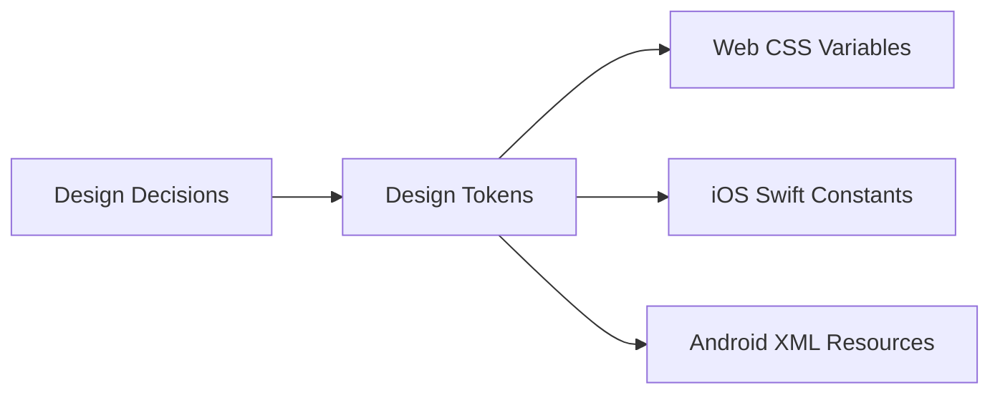
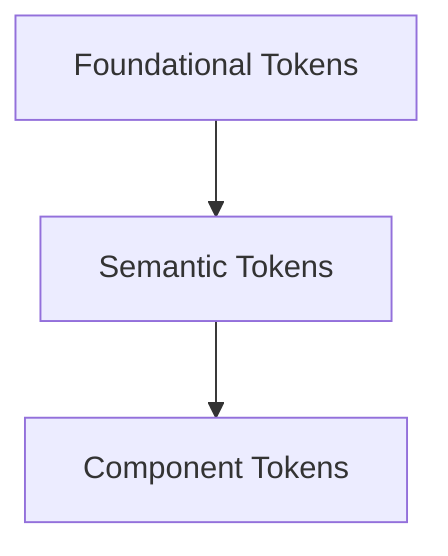
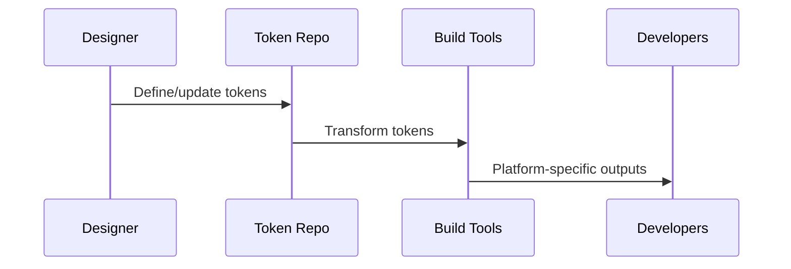

# Design Tokens and System Foundations: Understanding Design Tokens

## Learning Objectives

- Define design tokens and their role in design systems
- List and describe common token categories
- Explain how tokens support consistency across platforms
- Differentiate tokens from static design styles
- Identify scenarios where tokens add the most value

---

## Introduction

This chapter explains what design tokens are, why they matter, and how they act as a single source of truth across platforms.

---


---


As digital products grow in complexity, teams face a persistent challenge: **how to maintain consistency, scalability, and alignment across design and development, platforms and devices, teams and time**. Colors drift slightly between platforms, spacing feels inconsistent, typography rules get reinterpreted, and design intent is lost somewhere between Figma files and production code. What begins as a small inconsistency often snowballs into technical debt, brand erosion, and slower delivery.

This is the context in which **design tokens** emerged.

Design tokens are not just another design-system buzzword. They represent a **fundamental shift in how we define, store, and share design decisions**. Instead of hardcoding values like `#0055FF`, `16px`, or `Roboto Bold` in dozens of places, teams define these decisions once, give them semantic meaning, and reuse them everywhere. In doing so, design tokens become the **single source of truth** that connects design tools, codebases, and platforms.

This chapter lays the foundation for understanding design tokens deeply. We will explore **what design tokens are**, **why they matter**, **how they differ from traditional styles**, and **how they bridge the gap between design and engineering**. By the end, you should not only understand tokens conceptually, but also recognize when and where they provide the most value—and where they might introduce complexity.

---


By the end of this chapter, you will be able to:

- Define design tokens and explain their role in modern design systems  
- Identify and describe common categories of design tokens  
- Explain how design tokens enable consistency across platforms and technologies  
- Clearly differentiate design tokens from traditional, static design styles  
- Recognize scenarios where tokenization provides high value—and where it may not  

---

## Definition and Purpose of Design Tokens

Design tokens are **named, reusable variables that store design decisions** such as colors, spacing, typography, motion, and more, in a technology-agnostic format. Instead of embedding raw values directly into designs or code, tokens provide a **layer of abstraction** that represents the intent behind those values.

At its simplest, a design token looks like this:

```json
{
  "color.primary.background": "#0055FF"
}
```

But that simplicity hides a powerful idea: this value is no longer “just blue.” It is **the primary background color of the product**, a semantic decision that can be shared, transformed, and reused across platforms.

### Where Design Tokens Came From

Historically, designers and developers worked with **static style definitions**. Designers defined colors and fonts in tools like Sketch or Figma, while developers redefined those same values in CSS, Android XML, or iOS Swift. This duplication created several problems:

- Values drifted over time as updates were applied inconsistently  
- Designers and developers used different naming conventions  
- Changes required manual coordination across teams and platforms  

As products expanded to web, mobile, desktop, and embedded systems, these issues became more severe. Large organizations like Salesforce, IBM, and Google began formalizing a new approach: **centralizing design decisions in a format that both humans and machines could understand**. This approach evolved into what we now call design tokens.

### Why Design Tokens Exist

The core purpose of design tokens is to solve three interconnected problems:

1. **Consistency**  
   Tokens ensure that the same design decisions are applied everywhere, without reinterpretation.

2. **Scalability**  
   When a value changes, it changes once—in the token—and propagates everywhere automatically.

3. **Alignment**  
   Designers and developers reference the same source of truth, reducing ambiguity and friction.

An effective analogy is a **restaurant recipe**. Instead of each chef guessing how much salt to add, the recipe defines it precisely. The dish tastes the same regardless of who cooks it or where it’s prepared.

### Tokens as Design Decisions, Not Values

A critical mental shift is understanding that **tokens represent decisions, not raw numbers**. Consider the difference between:

- `16px`
- `spacing.small`

The first is a measurement. The second is a decision about spacing in the product. If tomorrow the design team decides that “small spacing” should be `14px` instead of `16px`, that change can happen without rewriting every layout.

This abstraction is what gives tokens their long-term power.

### Core Characteristics of Design Tokens

Design tokens share several defining characteristics:

- **Named**: Tokens have meaningful, human-readable names  
- **Reusable**: They can be referenced in many places  
- **Platform-agnostic**: Defined once, transformed per platform  
- **Semantic**: Names describe intent, not implementation  

The table below contrasts raw values with design tokens:

| Aspect | Raw Values | Design Tokens |
|------|-----------|---------------|
| Meaning | Implicit | Explicit and semantic |
| Reuse | Copy-paste | Centralized reference |
| Change impact | Manual, risky | Automated, controlled |
| Cross-platform | Difficult | Built-in |

### Design Tokens in Practice

In real-world systems, tokens typically live in a **central repository**, often as JSON or YAML. Build tools then transform them into platform-specific formats:

- CSS variables for web  
- XML resources for Android  
- Swift constants for iOS  

This flow is illustrated below:



This architecture ensures that **every platform speaks the same design language**, even if the syntax differs.

---

## Types of Design Tokens

Not all design tokens are the same. To manage complexity, tokens are typically organized into **categories** that reflect different aspects of the user interface. Understanding these categories is essential for building scalable and maintainable systems.

### Foundational Tokens (Primitive Tokens)

Foundational tokens—sometimes called *primitive* or *base* tokens—store **raw, context-free values**. These are the building blocks of the entire system.

Examples include:

- Color values (`#FFFFFF`, `#0A2540`)
- Font families (`Inter`, `Roboto`)
- Base spacing units (`4px`, `8px`)
- Border radii (`2px`, `8px`)

These tokens are intentionally **non-semantic**. They answer the question: *What raw materials do we have?*

Think of them like ingredients in a pantry. Flour is flour—it doesn’t yet know whether it will become bread or cake.

### Semantic Tokens

Semantic tokens build on foundational tokens by assigning **meaning and usage context**. They describe *why* a value exists, not just *what* it is.

For example:

- `color.text.primary`
- `color.background.surface`
- `spacing.component.padding`

Semantic tokens often reference foundational tokens internally. This indirection allows teams to change the underlying value without changing the meaning.

### Component Tokens

Component tokens are even more specific. They define how individual UI components use design values.

Examples include:

- `button.primary.background.default`
- `input.border.focused`
- `card.shadow.elevation`

These tokens allow components to evolve independently while still respecting system-wide rules.

### Global vs Contextual Tokens

Another important distinction is between **global** and **contextual** tokens:

- **Global tokens** apply everywhere (e.g., brand colors)
- **Contextual tokens** apply in specific modes or themes (e.g., dark mode)

This becomes critical when supporting:

- Light and dark themes  
- High-contrast accessibility modes  
- Regional or brand variants  

### Token Hierarchy Overview

The hierarchy can be visualized as follows:



Each layer builds on the previous one, increasing specificity while maintaining flexibility.

### Common Token Categories

The table below summarizes common token types and examples:

| Category | Purpose | Example |
|--------|---------|---------|
| Color | Visual identity and hierarchy | `color.text.secondary` |
| Typography | Readability and tone | `font.size.body` |
| Spacing | Layout rhythm | `spacing.layout.medium` |
| Sizing | Component dimensions | `size.button.height` |
| Motion | Transitions and feedback | `motion.duration.fast` |
| Elevation | Depth and hierarchy | `elevation.card` |

### Practical Example

Consider a button component:

- Foundational token: `blue-500`
- Semantic token: `color.action.primary`
- Component token: `button.primary.background`

If the brand color changes, only the foundational mapping changes—everything else updates automatically.

---

## Tokens vs Traditional Style Definitions

To fully appreciate the value of design tokens, it helps to contrast them with **traditional style definitions**, which most teams are already familiar with.

### Traditional Styles: How They Work

Traditional styles are typically:

- Defined directly in design tools (color styles, text styles)
- Implemented separately in each codebase
- Copied and adapted manually over time  

While this approach works for small projects, it struggles at scale.

### Key Differences in Philosophy

The biggest difference is **where meaning lives**:

- Traditional styles embed meaning implicitly in tools  
- Tokens make meaning explicit and portable  

In traditional workflows, “Primary Blue” might exist in Figma, but its equivalent in code might be `#0055FF` with no semantic name.

### Comparison Table

| Aspect | Traditional Styles | Design Tokens |
|------|-------------------|---------------|
| Source of truth | Tool-specific | Centralized |
| Cross-platform | Manual sync | Automated |
| Semantics | Implicit | Explicit |
| Scalability | Limited | High |

### Change Management

With traditional styles, changing a color requires:

1. Updating the design file  
2. Informing developers  
3. Updating each platform manually  

With tokens, the change happens once.

### When Traditional Styles Still Make Sense

Tokens are powerful, but not always necessary. For:

- Small marketing sites  
- One-off prototypes  
- Short-lived projects  

Traditional styles may be simpler and faster.

---

## Tokens as a Bridge Between Design and Code

One of the most transformative aspects of design tokens is their role as a **shared language between designers and developers**.

### The Communication Gap

Historically, design-to-development handoff relied on:

- Screenshots  
- Style guides  
- Verbal explanations  

This often led to misunderstandings and rework.

### Tokens as Contracts

Design tokens act like **contracts**:

- Designers define intent  
- Developers implement intent  
- Both reference the same artifact  

This reduces interpretation and increases trust.

### End-to-End Flow



### Tooling Ecosystem

Modern tooling supports this workflow:

- Design tools (Figma Tokens, Variables)
- Token management tools (Style Dictionary)
- CI/CD pipelines

### Case Study: Scaling a Multi-Platform Product with Design Tokens

## Case Study: Scaling Consistency at NovaPay

### Context

NovaPay is a fast-growing fintech company operating across web, iOS, and Android platforms. Founded in 2018, the company initially focused on rapid feature delivery to capture market share. By 2021, their user base had grown into the millions, and their product ecosystem expanded to include dashboards, consumer apps, and partner portals.

Each platform team worked largely independently. Designers maintained a shared Figma library, but developers implemented styles locally. Over time, inconsistencies emerged: colors looked slightly different on iOS, spacing felt tighter on Android, and dark mode behaved unpredictably across products.

### Problem

As NovaPay prepared for international expansion, brand consistency became a strategic priority. The marketing team noticed discrepancies in screenshots used for campaigns. Support tickets increased as users complained about accessibility issues in dark mode.

Attempts to fix the problem through documentation failed. Style guides quickly became outdated, and manual audits were expensive and error-prone. The company needed a scalable, systematic solution.

### Solution

NovaPay introduced design tokens as a core system foundation. The design team began by auditing existing styles and defining foundational tokens for color, spacing, and typography. These were stored in a centralized JSON repository.

Next, semantic tokens were introduced to capture intent—such as `color.text.error` and `spacing.layout.standard`. Component tokens followed, allowing teams to refine behavior without breaking global consistency.

Style Dictionary was integrated into the build pipeline, generating platform-specific outputs automatically. Designers and developers held weekly syncs to refine naming and governance rules.

### Results

Within three months, NovaPay achieved measurable improvements:

- Visual inconsistencies dropped by over 80%  
- Dark mode bugs were reduced significantly  
- Feature teams reported faster implementation times  

More importantly, design and engineering collaboration improved. Tokens became a shared language, reducing friction and rework.

### Lessons Learned

NovaPay learned that tokens are as much about **process as technology**. Early investment in naming conventions and governance paid long-term dividends. They also learned to avoid over-tokenization, focusing first on high-impact areas.

---

## Benefits and Limitations of Tokenization

Design tokens offer significant advantages, but they are not a silver bullet.

### Key Benefits

- **Consistency at scale**
- **Faster global changes**
- **Improved collaboration**
- **Cross-platform alignment**

### Limitations and Trade-offs

- Initial setup cost  
- Naming complexity  
- Tooling maturity varies  
- Over-tokenization risk  

### When Tokens Add the Most Value

Tokens shine in:

- Multi-platform products  
- Large teams  
- Long-lived systems  
- Products with theming or branding needs  

### When to Be Cautious

Avoid heavy tokenization for:

- Small, static projects  
- Short timelines  
- Teams without governance capacity  

---

## Summary

Design tokens represent a foundational shift in how teams manage design decisions. By abstracting values into semantic, reusable tokens, organizations gain consistency, scalability, and alignment across platforms. Tokens are not just technical artifacts—they are **shared decisions** that connect design intent to implementation reality.

Understanding what tokens are, how they are categorized, and when to use them is essential for building resilient design systems.

---

## Reflection Questions

1. Which design decisions in your current product would benefit most from tokenization?  
2. Where might tokens introduce unnecessary complexity?  
3. How could design tokens improve collaboration between designers and developers on your team?  
4. What governance rules would you need to maintain a healthy token system?