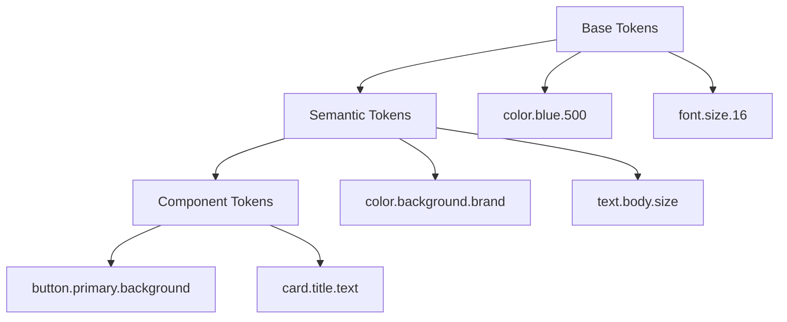
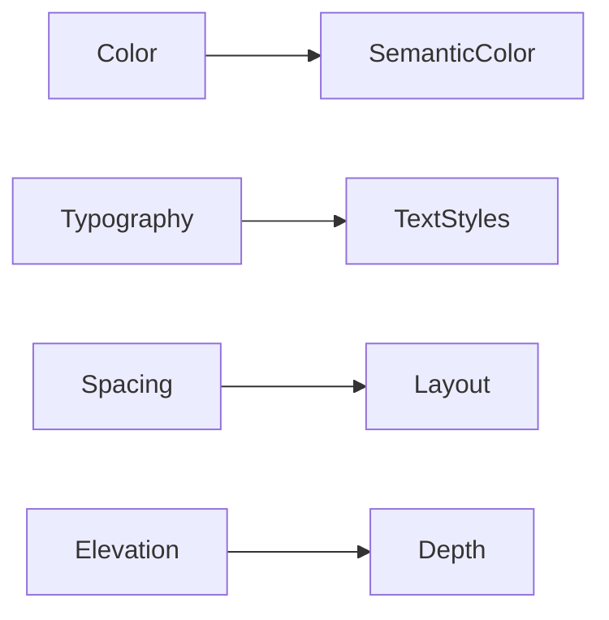
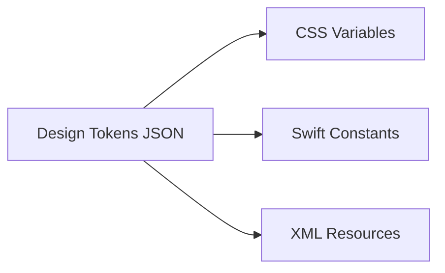

# Design Tokens and System Foundations: Token Structure, Naming, and Multi-Platform Use

## Learning Objectives

- Create a structured hierarchy for design tokens
- Apply consistent and scalable naming conventions
- Define tokens for multiple visual properties
- Adapt tokens for web and mobile platforms
- Evaluate token structures for maintainability

---

## Introduction

This chapter dives into practical token creation, focusing on naming conventions, structure, and adapting tokens for multiple platforms.

---


---


As digital products grow in scale and complexity, design consistency becomes harder to maintain. Teams work across multiple platforms—web, iOS, Android, sometimes even wearables or embedded systems—while products evolve rapidly through frequent updates. In this environment, traditional approaches to managing colors, typography, spacing, and other visual decisions quickly break down. Hard-coded values in CSS files, scattered style definitions in design tools, and undocumented conventions lead to inconsistency, slow development, and costly redesigns.

Design tokens emerged as a response to this challenge. They provide a systematic, technology-agnostic way to define and manage design decisions as structured data. Instead of saying “the primary blue is #0057FF in CSS and UIColor(red: …) in iOS,” we say “the primary color token is `color.brand.primary`,” and let each platform consume that token in its own way. This chapter dives into the *practical foundations* of working with design tokens: how to structure them, how to name them, how to define them for common visual properties, and how to adapt them across platforms while keeping systems maintainable over time.

Rather than focusing on abstract theory alone, this chapter emphasizes real-world usage. You will see how token hierarchies reflect design intent, why naming conventions matter as much as the values themselves, and how teams successfully manage token evolution in production systems. By the end, you should be able to design a token system that scales with both your product and your organization.

---


By the end of this chapter, you will be able to:

- Create a clear and scalable hierarchy for design tokens  
- Apply consistent, meaningful naming conventions that communicate intent  
- Define tokens for core visual properties such as color, typography, spacing, and elevation  
- Adapt a single token system for multiple platforms (web, iOS, Android)  
- Evaluate token structures for long-term maintainability and team collaboration  

---

## Structuring Token Hierarchies

A design token hierarchy is the backbone of any token system. It determines how tokens are grouped, how they relate to one another, and how easily people can understand and use them. At its core, a hierarchy answers a simple question: *How do we organize design decisions so they are both flexible and meaningful?*

Historically, many teams started with flat token structures—lists of colors, font sizes, or spacing values with minimal organization. While this works for small projects, it quickly becomes unmanageable as products grow. Developers struggle to choose the right token, designers duplicate values unintentionally, and refactoring becomes risky. Hierarchies emerged as a way to reflect design intent, not just raw values.

A common and effective approach is a **three-layer hierarchy**:

- **Base (or primitive) tokens**: Raw values such as hex colors, pixel sizes, or font families  
- **Semantic tokens**: Tokens that describe *meaning* or *role*, such as “primary background” or “error text”  
- **Component or alias tokens**: Tokens scoped to specific components, such as “button.primary.background”  

This structure mirrors how designers think: first about raw materials, then about meaning, and finally about usage in specific contexts.

### Why Hierarchies Matter

Hierarchies matter because they decouple *what a value is* from *why it exists*. For example, a base color token like `blue.500` says nothing about how it should be used. A semantic token like `color.background.brand` tells us its purpose. If the brand color changes, we update the base value once, and all dependent semantic and component tokens update automatically.

Hierarchies also support scalability. As new themes, brands, or platforms are added, teams can reuse existing base tokens while redefining semantic mappings. Without hierarchy, every new variation leads to duplication and inconsistency.

### Example Hierarchy



This diagram shows how a change at the base level flows upward. A single base token adjustment can propagate across dozens of components safely.

### Common Structural Patterns

| Pattern | Description | When to Use |
|------|------------|-------------|
| Flat structure | All tokens at one level | Very small projects or prototypes |
| Layered hierarchy | Base → Semantic → Component | Most production design systems |
| Theme-based branches | Separate trees per theme | White-label or multi-brand products |

A layered hierarchy is the most widely adopted because it balances clarity and flexibility. However, it requires discipline: teams must resist the temptation to skip semantic layers and reference base tokens directly in components.

---

## Naming Conventions and Best Practices

If hierarchy is the skeleton of a token system, naming is its language. Good token names communicate intent clearly, reduce cognitive load, and prevent misuse. Poor names, on the other hand, lead to confusion, duplication, and brittle systems that only a few people understand.

Naming conventions for design tokens evolved from both programming practices and design semantics. Early systems often mirrored CSS variable names or design tool labels, but as tokens became shared across platforms, more abstract and standardized naming patterns emerged.

### Principles of Effective Token Naming

Effective token names share several key characteristics:

- **Clarity over brevity**: Names should be readable and self-explanatory  
- **Consistency**: Similar concepts should follow the same pattern  
- **Technology-agnostic**: Avoid platform-specific terms like `px` or `dp`  
- **Intent-focused**: Describe *why* the token exists, not just *what* it is  

Consider the difference between these two names:

- `blue500`
- `color.background.brand`

The first describes a value. The second describes meaning. The latter is far more resilient to change.

### Common Naming Structures

Most teams adopt a dot-separated or slash-separated structure:

```
category.type.role.state
```

For example:

- `color.text.primary`
- `spacing.component.button.horizontal`
- `font.size.body.medium`

This structure creates predictable patterns, making it easier to search and autocomplete tokens.

### Naming Do’s and Don’ts

| Do | Don’t |
|----|-------|
| Use nouns and adjectives | Use arbitrary numbers without meaning |
| Reflect design intent | Reference specific components too early |
| Stay consistent | Mix naming styles (camelCase, kebab-case, snake_case) |

A common mistake is embedding current usage into base or semantic tokens, such as `color.button.blue`. This couples the token to a component and limits reuse.

### Analogy: Naming Tokens Like Street Addresses

Think of token names like street addresses. A good address tells you the city, street, and building number in a predictable order. If addresses were random (“Blue House Near Tree”), navigation would be impossible at scale. Token naming works the same way: predictable structure enables teams to “navigate” the system effortlessly.

---

## Color, Typography, Spacing, and Elevation Tokens

Design tokens shine when applied to foundational visual properties. These properties form the visual language of a product and are reused everywhere. Defining them as tokens ensures consistency and enables rapid iteration.

### Color Tokens

Color tokens typically start with a palette of base colors. These are often derived from brand guidelines or accessibility requirements. Base color tokens might look like:

- `color.blue.100`
- `color.blue.500`
- `color.red.600`

Semantic color tokens then map these values to roles:

- `color.background.default`
- `color.text.error`
- `color.border.subtle`

This separation allows teams to adjust contrast, theming, or branding without rewriting component styles.

### Typography Tokens

Typography tokens define font families, sizes, weights, line heights, and letter spacing. Rather than hard-coding `16px` everywhere, teams define tokens such as:

- `font.family.body`
- `font.size.body.medium`
- `font.weight.bold`

These tokens often work together as *typography sets*, ensuring harmonious text styles across the product.

### Spacing Tokens

Spacing tokens control margins, padding, and layout gaps. They usually follow a scale:

| Token | Value |
|------|-------|
| spacing.1 | 4 |
| spacing.2 | 8 |
| spacing.3 | 16 |
| spacing.4 | 24 |

Using a spacing scale enforces rhythm and prevents arbitrary values from creeping into layouts.

### Elevation Tokens

Elevation tokens represent depth through shadows or z-index layers. They are especially important in material-inspired or layered UIs.

- `elevation.level.1`
- `elevation.level.2`
- `elevation.overlay`

Each token encapsulates multiple properties (shadow blur, offset, opacity), which vary by platform but represent the same conceptual depth.



This diagram shows how foundational tokens feed higher-level design decisions.

---

## Platform-Specific Token Considerations

One of the most powerful aspects of design tokens is their ability to bridge platforms. However, platforms are not identical. Web, iOS, and Android differ in units, rendering models, and accessibility expectations. A successful token system respects these differences without fragmenting.

### Web Considerations

On the web, tokens often compile to CSS variables:

```css
:root {
  --color-background-brand: #0057ff;
}
```

Web platforms support relative units (`rem`, `%`) and dynamic theming via media queries. Tokens must account for responsiveness and user preferences like dark mode.

### iOS and Android Considerations

Mobile platforms use different units (`pt`, `dp`) and have platform-specific typography and elevation systems. Tokens are often exported as JSON and transformed into Swift, Kotlin, or XML resources.

### Cross-Platform Strategy

A common strategy is to maintain a **single source of truth** for tokens and use platform-specific transformers.



This ensures consistency while allowing platform-appropriate implementations.

---

## Token Management and Updates

Creating tokens is only the beginning. Managing them over time is where many systems succeed or fail. Token management includes versioning, documentation, governance, and update workflows.

### Versioning and Change Management

Tokens should be versioned like code. Breaking changes—such as renaming or removing tokens—require careful coordination. Semantic versioning (`MAJOR.MINOR.PATCH`) is commonly used.

### Governance Models

Some teams centralize token ownership within a design system team. Others adopt a federated model where product teams can propose changes. Regardless of the model, clear review processes are essential.

### Tooling and Automation

Modern token workflows often use tools like Style Dictionary or custom pipelines to validate, transform, and distribute tokens automatically. Automation reduces human error and speeds up adoption.

| Challenge | Mitigation |
|---------|------------|
| Token sprawl | Clear hierarchy and naming |
| Inconsistent usage | Documentation and linting |
| Risky updates | Versioning and changelogs |

---

## Practical Token Examples

To bring all these concepts together, let’s look at a practical, narrative case study.

## Case Study: Scaling a Token System for a Multi-Platform Fintech App

### Context

In 2021, a mid-sized fintech company was experiencing rapid growth. Its flagship product—a mobile-first banking app—had expanded from a single iOS application to include Android and a responsive web dashboard. Each platform had been developed independently, with its own design files and styling conventions. While the brand looked “mostly consistent,” subtle differences in color shades, spacing, and typography were becoming noticeable.

The design team consisted of six designers working in Figma, while development was split across three platform teams. As new features shipped faster, designers spent more time clarifying “which blue” or “which font size” was correct. Leadership began to worry about long-term maintainability and brand trust.

### Problem

The core problem was fragmentation. Colors were duplicated with slightly different values. Typography scales differed between web and mobile. There was no shared language to describe design decisions, only screenshots and ad hoc documentation.

Attempts to fix this through stricter guidelines failed. PDFs became outdated, and developers continued to hard-code values for convenience. The company needed a system that was enforceable, scalable, and shared across disciplines.

### Solution

The team decided to introduce design tokens as a single source of truth. They began by auditing all existing visual values and consolidating them into base tokens. Next, they defined semantic tokens for key roles like “primary action” and “error state.”

A cross-functional working group agreed on naming conventions and hierarchy. Tokens were stored in a central JSON repository and transformed into platform-specific outputs using an automated pipeline. Designers referenced the same tokens via Figma plugins.

### Results

Within three months, visual inconsistencies dropped dramatically. New features shipped faster because teams no longer debated styling details. When the brand refreshed its primary color, the change was implemented across all platforms in a single update.

There were challenges—especially in onboarding developers and refining naming—but the long-term benefits outweighed the initial effort.

### Lessons Learned

The biggest lesson was that tokens are as much about communication as technology. Clear hierarchy and naming reduced friction between teams. The company also learned to start small and evolve the system iteratively, rather than attempting to design a perfect structure upfront.

---

## Summary

Design tokens provide a powerful foundation for consistent, scalable design systems. By structuring tokens hierarchically, naming them with intent, and defining them for core visual properties, teams can bridge design and development across platforms. Successful token systems respect platform differences while maintaining a single source of truth. Most importantly, tokens are living assets that require thoughtful management and collaboration over time.

---

## Reflection Questions

1. How does separating base and semantic tokens reduce long-term maintenance cost?  
2. What naming challenges might arise in a large, multi-team organization?  
3. How would you adapt a token system for a platform with unique accessibility requirements?  
4. What governance model would work best in your organization, and why?