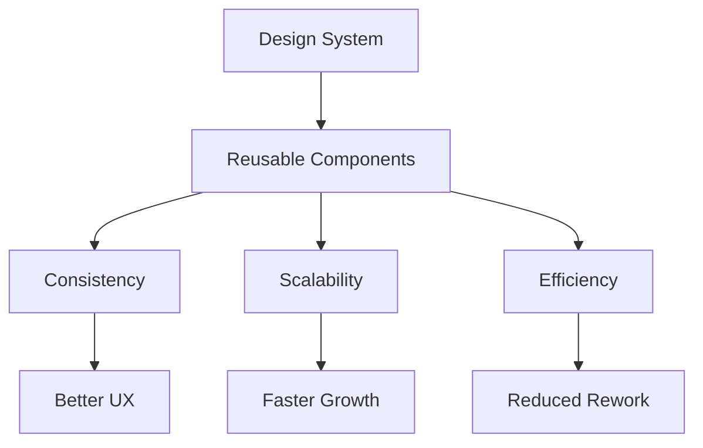
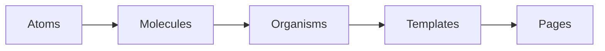
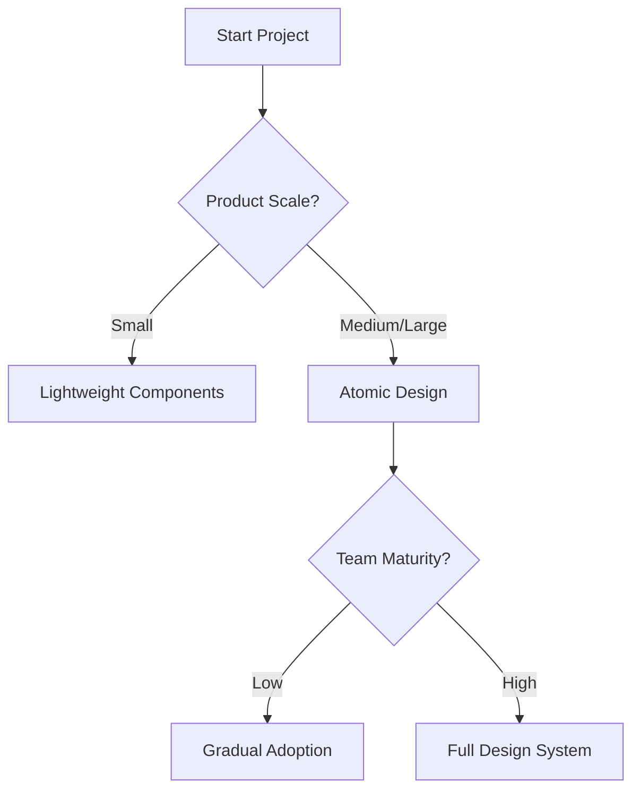
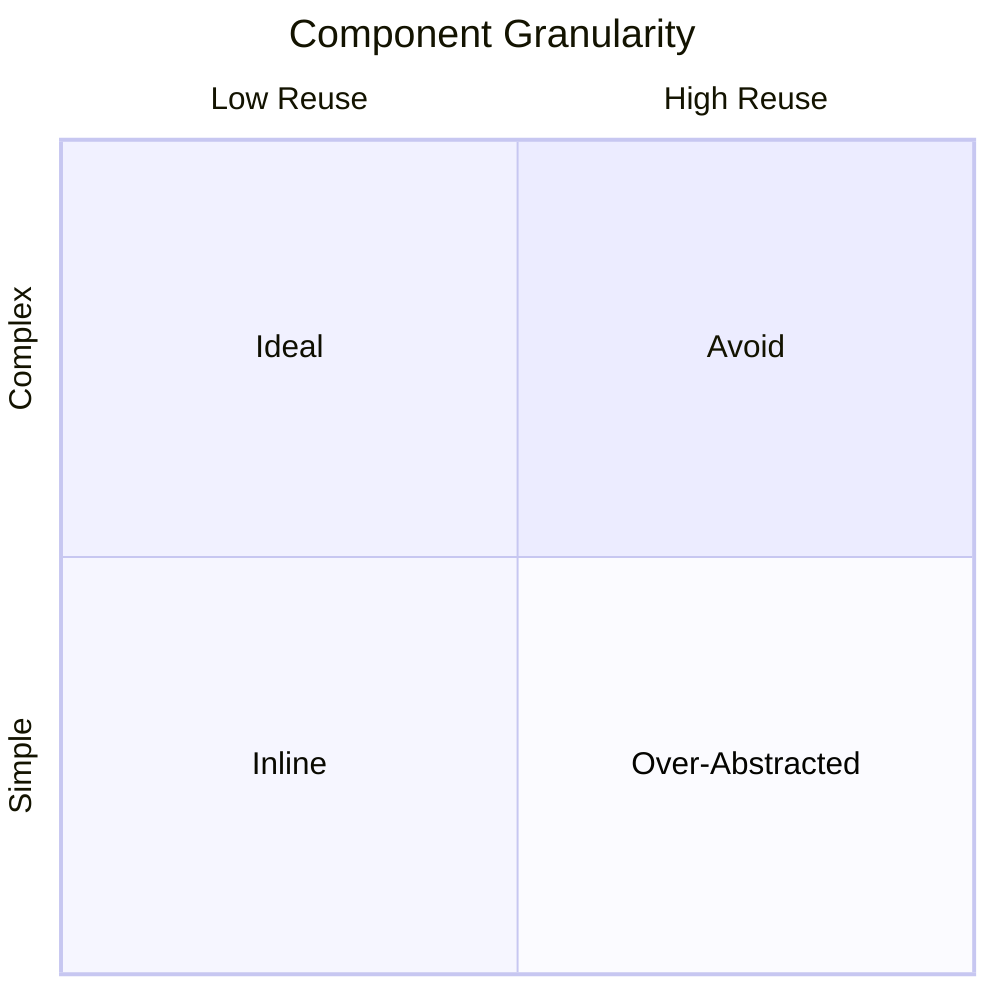

# Component-Based Design: Atomic Design and Component Thinking

## Learning Objectives

- Explain the atomic design methodology
- Classify UI elements into atomic levels
- Evaluate when atomic design is appropriate
- Apply component thinking to interface breakdowns
- Decide appropriate component granularity

---

## Introduction

This chapter introduces atomic design methodology and helps learners think in components rather than screens.

---

---

Modern digital products are no longer designed as a collection of isolated screens. Instead, they are built as systems—living, evolving ecosystems of reusable parts that must remain consistent, scalable, and maintainable over time. As products grow in complexity, teams face recurring challenges: duplicated UI elements, inconsistent behaviors, slow iteration, and fragile designs that break when requirements change. These challenges are not merely technical; they affect collaboration between designers and developers, product velocity, and even user trust.

Component-based design emerged as a response to these challenges. Rather than thinking in terms of pages or screens, designers and developers are encouraged to think in terms of components—small, reusable building blocks that can be combined in predictable ways. One of the most influential frameworks for this way of thinking is **Atomic Design**, introduced by Brad Frost. Atomic Design provides a mental model and vocabulary for breaking interfaces into hierarchical components, making design systems more understandable and scalable.

This chapter introduces Atomic Design as both a methodology and a mindset. You will learn not only what atoms, molecules, and organisms are, but *why* this way of thinking matters, *how* it maps to real-world products, and *when* it may or may not be the right approach. By the end of this chapter, you should feel confident analyzing interfaces as systems of components rather than static screens—and making informed decisions about component granularity in your own work.

---

By the end of this chapter, you will be able to:

- Explain the atomic design methodology and its conceptual foundations  
- Classify UI elements into atoms, molecules, organisms, templates, and pages  
- Evaluate when atomic design is appropriate and when it may be excessive  
- Apply component thinking to break down real user interfaces  
- Decide appropriate component granularity based on context, scale, and team needs  

---

## Principles of Atomic Design

Atomic Design is inspired by chemistry, where complex substances are built from smaller, well-defined elements. In the same way that atoms combine to form molecules and organisms, user interfaces can be composed of progressively larger and more complex components. This analogy is not merely decorative; it provides a powerful mental model for managing complexity in digital products.

Historically, Atomic Design emerged around 2013 as design systems began to mature. Teams at scale—such as those building enterprise software or multi-platform products—needed a shared language to discuss UI elements across design and development. Traditional approaches that focused on pages or wireframes failed to capture the relationships between reusable elements. Atomic Design addressed this gap by introducing a hierarchy that mirrors how interfaces are actually built.

At its core, Atomic Design rests on several foundational principles:

- **Decomposition**: Break complex interfaces into smaller, understandable parts  
- **Reusability**: Design components that can be reused across contexts  
- **Consistency**: Ensure visual and behavioral consistency across the product  
- **Scalability**: Enable systems to grow without becoming chaotic  
- **Abstraction**: Separate structure from content to support flexibility  

One of the most important ideas behind Atomic Design is that **design is a system, not a collection of artifacts**. When designers focus only on screens, they risk optimizing locally rather than globally. Atomic Design encourages designers to think about how changes ripple through the system. A small change to an atom (like a button style) can affect dozens of screens—this is both a risk and a strength.

Another key principle is **progressive complexity**. Atomic Design does not ask teams to jump directly into abstract components. Instead, it provides a gradual ladder: from simple elements to complex compositions. This makes it easier for beginners to adopt while still supporting advanced use cases.

### Atomic Design as a Mental Model

Atomic Design is as much about thinking as it is about structure. It trains teams to ask different questions:

- Instead of “What does this page look like?”, ask “What components make up this page?”
- Instead of “Can we redesign this screen?”, ask “Which components need to evolve?”
- Instead of “Why is this inconsistent?”, ask “Are we reusing the same atoms and molecules?”

This shift in questioning fundamentally changes how teams collaborate. Designers, developers, and product managers begin to speak a shared language, reducing misunderstandings and rework.

### Visual Overview of Atomic Design Principles

### Atomic Design vs Screen-Based Thinking

| Aspect | Screen-Based Design | Atomic Design |
|------|--------------------|---------------|
| Focus | Individual pages | Reusable components |
| Change impact | Local, often duplicated | System-wide |
| Consistency | Hard to maintain | Built-in |
| Scalability | Breaks at scale | Designed for growth |

---

## Atoms, Molecules, Organisms, Templates, and Pages

Atomic Design defines five distinct levels of components. These levels are not rigid rules but conceptual categories that help teams reason about complexity and reuse. Understanding each level deeply is critical, as misclassification often leads to bloated systems or overly rigid designs.

### Atoms: The Smallest Building Blocks

Atoms are the fundamental UI elements that cannot be broken down further without losing meaning. Examples include buttons, input fields, labels, icons, and color tokens. On their own, atoms are often not useful to users—but they are essential to the system.

Atoms typically represent:

- HTML elements (e.g., `<button>`, `<input>`, `<label>`)
- Design tokens (colors, typography, spacing)
- Basic interaction states (hover, focus, disabled)

From a practical perspective, atoms are where consistency begins. A single button atom used everywhere ensures uniform behavior and appearance. However, atoms must remain intentionally simple. Adding layout logic or business rules at this level is a common mistake that reduces reusability.

### Molecules: Simple Combinations

Molecules are groups of atoms bonded together to form functional units. A search field with a label and button is a classic example. Molecules begin to express intent and functionality, making them more recognizable to users.

Molecules:

- Combine atoms with a specific purpose  
- Are reusable across multiple contexts  
- Represent common interaction patterns  

For example, a “form field” molecule might include a label atom, an input atom, and an error message atom. This molecule can be reused across dozens of forms while maintaining consistent validation behavior.

### Organisms: Complex, Distinct Components

Organisms are relatively complex components composed of molecules and atoms. Examples include headers, navigation bars, product cards, or comment sections. Organisms often define clear regions of an interface and are directly recognizable as parts of a page.

Organisms introduce layout and structure, which makes them less flexible than molecules. This is acceptable—organisms are designed to solve specific problems. The key is ensuring they remain reusable across multiple pages or templates.

### Templates: Structural Blueprints

Templates define page-level structure without real content. They combine organisms into layouts that demonstrate how components fit together. Templates answer the question: *What does this page type look like structurally?*

Templates are especially useful for:

- Aligning stakeholders on layout  
- Testing component composition  
- Supporting rapid page creation  

### Pages: Real Instances with Content

Pages are specific instances of templates populated with real content. They are the most concrete level and closest to what users actually see. Pages are ideal for usability testing and stakeholder reviews.

### Hierarchical Visualization

### Comparison of Atomic Levels

| Level | Purpose | Reusability | Example |
|-----|--------|-------------|---------|
| Atom | Fundamental element | Very high | Button |
| Molecule | Simple function | High | Search field |
| Organism | Distinct UI region | Medium | Header |
| Template | Layout structure | Low | Dashboard layout |
| Page | Real content | Very low | User profile page |

---

## Benefits and Critiques of Atomic Design

Atomic Design offers significant benefits, but it is not a silver bullet. Understanding both its strengths and criticisms is essential for applying it wisely.

One of the greatest benefits is **consistency at scale**. When components are reused systematically, visual and behavioral consistency becomes a natural outcome rather than an ongoing struggle. This consistency improves user trust and reduces cognitive load.

Another major advantage is **improved collaboration**. Atomic Design provides a shared vocabulary that bridges design and development. When a designer says “this organism needs adjustment,” developers understand the scope and implications immediately.

From a productivity standpoint, Atomic Design supports **faster iteration**. Changes to atoms or molecules propagate throughout the system, reducing redundant work. This is especially valuable in agile environments where requirements evolve rapidly.

However, Atomic Design is not without criticism. One common critique is that it can feel **overly abstract**, especially for small projects. Teams may spend more time categorizing components than delivering value.

Another challenge is **rigidity**. If applied dogmatically, Atomic Design can discourage pragmatic decisions. Not every component fits neatly into a single category, and forcing it to do so can create confusion.

### Benefits vs Limitations

| Dimension | Benefits | Critiques |
|--------|----------|-----------|
| Scale | Excellent for large systems | Overkill for small apps |
| Consistency | Strong visual coherence | Requires discipline |
| Learning curve | Clear mental model | Initial complexity |
| Flexibility | Modular reuse | Risk of rigidity |

### Decision Flow: Should You Use Atomic Design?

---

## Mapping Atomic Design to Real Products

Atomic Design becomes truly meaningful when applied to real products. To illustrate this, consider a mid-sized SaaS company redesigning its analytics dashboard.

## Case Study: Redesigning a SaaS Analytics Dashboard with Atomic Design

### Context

In 2021, a SaaS company offering marketing analytics tools faced growing pains. The product had evolved over five years, adding features rapidly to meet customer demands. The design team consisted of four designers working alongside eight frontend developers across two time zones. While the product was successful commercially, its interface had become inconsistent and difficult to maintain.

Each new feature introduced new UI elements. Buttons varied slightly in color and spacing, charts used different legends, and form layouts differed from one page to another. Designers often recreated components because they were unsure whether something similar already existed. Developers, in turn, implemented these designs faithfully—leading to duplication in code.

Leadership initiated a redesign not to “refresh the look,” but to create a sustainable system. Atomic Design was chosen as the guiding methodology.

### Problem

The core problem was not visual quality but **structural chaos**. The product had over 40 screens, each designed in isolation. Changes were expensive: updating a button style required touching dozens of files. Bugs frequently appeared when components were modified for one page but not others.

Communication breakdowns exacerbated the issue. Designers talked in terms of screens, while developers thought in components. Without a shared language, misunderstandings were common. The team needed a way to align design intent with implementation reality.

### Solution

The team began by auditing the interface. Over several weeks, they cataloged every UI element and grouped them into atoms, molecules, and organisms. Colors, typography, and spacing were formalized as atoms. Common form fields and chart controls became molecules. Larger constructs like navigation bars and data tables were defined as organisms.

Next, the team created templates for key page types: dashboards, reports, and settings. These templates allowed stakeholders to focus on structure rather than content. Finally, existing pages were refactored to use the new system incrementally, avoiding a risky “big bang” rewrite.

Design and development worked in parallel. Designers documented components in a shared design system, while developers implemented them in a component library. Regular reviews ensured alignment.

### Results

Within three months, the team reported measurable improvements. Design time for new features decreased by approximately 30%. UI bugs related to inconsistency dropped significantly. Most importantly, onboarding new designers became easier—they could understand the system without memorizing dozens of screens.

Users also benefited. The interface felt more predictable, and usability testing showed reduced task completion times. While the initial investment was substantial, the long-term payoff justified the effort.

### Lessons Learned

The team learned that Atomic Design works best when adopted **progressively**. Attempting to classify everything perfectly from day one would have stalled momentum. They also discovered the importance of flexibility—some components blurred category boundaries, and that was acceptable.

Perhaps the most valuable lesson was cultural. Atomic Design was not just a framework; it was a conversation starter. It encouraged the team to think systemically, fostering collaboration and shared ownership.

---

## Component Granularity Decisions

One of the most nuanced aspects of component-based design is deciding **how granular** components should be. Granularity refers to how small or large a component is—and this decision has far-reaching implications.

Too fine-grained, and the system becomes fragmented. Designers must assemble interfaces from dozens of tiny pieces, increasing cognitive load. Developers may struggle with excessive abstraction. Too coarse-grained, and reuse suffers; components become inflexible and duplicated logic creeps back in.

Granularity decisions depend on several factors:

- **Product scale**: Larger products benefit from finer granularity  
- **Team size**: Bigger teams need clearer boundaries  
- **Change frequency**: Frequently changing areas should be more modular  
- **Domain complexity**: Complex domains require thoughtful abstraction  

A useful heuristic is to create a component when:

- It appears in multiple places  
- It has a single, clear responsibility  
- It encapsulates behavior that might change independently  

### Granularity Spectrum

### Common Mistakes and Best Practices

| Mistake | Consequence | Better Approach |
|------|------------|----------------|
| Over-abstracting | Hard to use components | Start concrete, abstract later |
| Duplicating components | Inconsistency | Refactor shared patterns |
| Premature optimization | Wasted effort | Let patterns emerge |

Granularity is not a one-time decision. Mature systems evolve, and components should be revisited regularly. The goal is not perfection, but adaptability.

---

## Summary

Atomic Design provides a powerful framework for thinking about interfaces as systems of components rather than isolated screens. By breaking UI into atoms, molecules, organisms, templates, and pages, teams gain clarity, consistency, and scalability. However, Atomic Design is most effective when applied thoughtfully—balancing structure with pragmatism.

Component thinking encourages designers and developers to collaborate using a shared language, anticipate change, and build products that can grow gracefully. While not every project requires full Atomic Design, understanding its principles equips you to make better decisions in any component-based system.

---

## Reflection Questions

1. How does thinking in components change the way you approach interface design?  
2. Which atomic level do you find most challenging to define, and why?  
3. Can you identify a product where Atomic Design might be excessive? What would you do instead?  
4. How would you explain component granularity decisions to a non-designer stakeholder?  
5. What steps would you take to introduce Atomic Design gradually into an existing product?