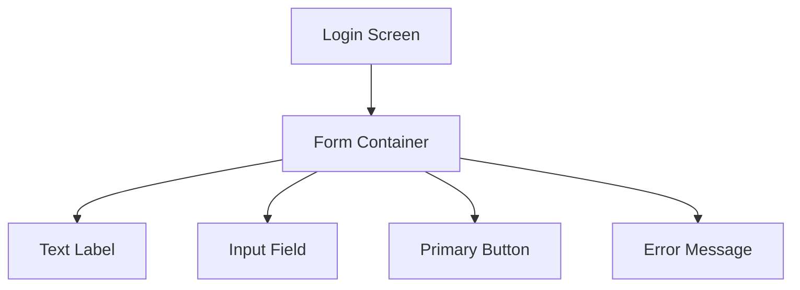
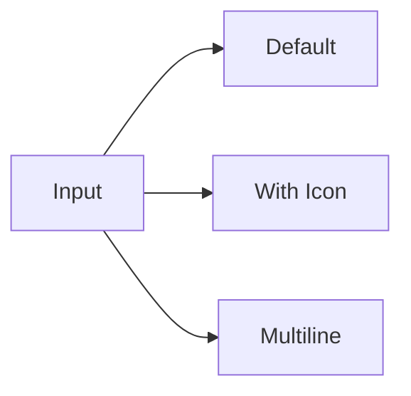
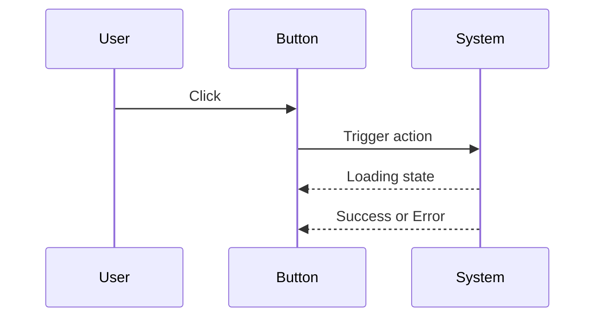
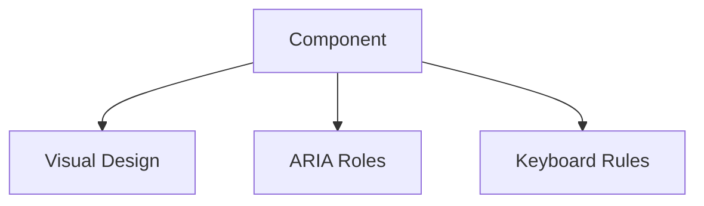
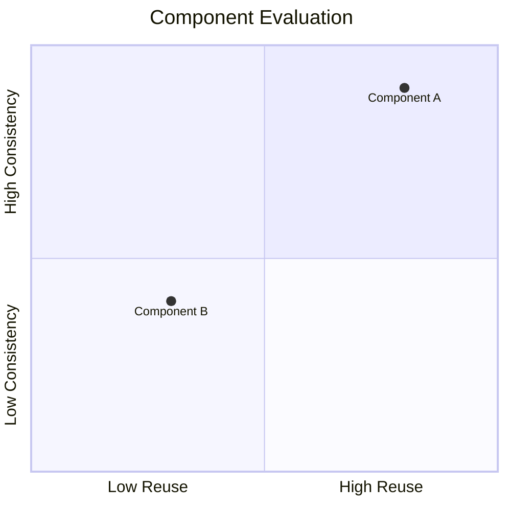

# Component-Based Design: Core Components, States, and Documentation

## Learning Objectives

- Design reusable core UI components
- Define and document component states and variants
- Apply accessibility principles to components
- Document components for design system use
- Evaluate components for consistency and reuse

---

## Introduction

This chapter covers designing core UI components, defining states and variants, and documenting them for reuse.

---


---


Modern digital products—whether websites, mobile apps, or enterprise dashboards—are no longer designed as one-off screens. Instead, they are built from **reusable building blocks called components**. Buttons, form fields, navigation bars, cards, modals, and alerts appear repeatedly across an interface. When these elements are designed inconsistently or without clear rules, products quickly become difficult to scale, hard to maintain, and confusing for users.

This chapter explores **component-based design**, a foundational concept in contemporary UI/UX design systems. Component-based design focuses on creating **core UI components**, defining their **states and variants**, establishing **interaction and accessibility rules**, and documenting everything clearly so components can be reused across teams and products. This approach bridges the gap between design and development, ensuring that what designers envision can be reliably implemented and maintained over time.

Historically, component-based thinking emerged alongside modular programming and later gained momentum with frontend frameworks like React, Angular, and Vue. Design tools such as Figma, Sketch, and Adobe XD further accelerated this shift by making it easy to define, reuse, and document components visually. Today, component-based design is not optional—it is essential for consistency, efficiency, and quality at scale.

In this chapter, you will move step by step from designing core components to evaluating them for reuse and consistency. Along the way, you will see concrete examples, detailed explanations, visual diagrams, tables, and a comprehensive case study that demonstrates how these concepts work together in real-world scenarios.

---


By the end of this chapter, you will be able to:

- Design reusable core UI components with clear structure and purpose  
- Define and document component states and variants in a systematic way  
- Apply accessibility principles directly at the component level  
- Create clear, practical component documentation for design systems  
- Evaluate components for consistency, scalability, and reuse  

---

## Designing Core UI Components

Designing core UI components is the foundation of any component-based design system. Core components are the **smallest meaningful building blocks** that can be combined to create more complex UI patterns and full interfaces. Examples include buttons, input fields, icons, labels, and containers. While these elements may appear simple, their design decisions have far-reaching consequences across the entire product.

### Understanding What Makes a “Core” Component

A core UI component is not defined by how visually impressive it is, but by how **fundamental and reusable** it is. Historically, early interfaces were designed screen by screen, leading to duplicated effort and subtle inconsistencies. As products grew, teams realized that repeating the same element with slight variations caused confusion for users and technical debt for developers.

A component qualifies as a “core” component when:
- It appears frequently across multiple screens or contexts  
- It serves a single, well-defined purpose  
- It can be reused without modification in most cases  
- Other components can be built on top of it  

For example, a **Button** component is core because it exists everywhere: forms, dialogs, toolbars, and onboarding flows. In contrast, a “Checkout Summary Card” may be important, but it is more specific and usually built from smaller core components like text, icons, and buttons.

### Breaking Interfaces into Components

Designing components requires learning to **see interfaces differently**. Instead of thinking in pages or screens, designers think in terms of parts and relationships. This mental shift often takes time, especially for beginners.

Consider a simple login screen:
- At first glance, it looks like one design  
- On closer inspection, it is composed of:
  - Text labels  
  - Input fields  
  - Buttons  
  - Error messages  
  - Layout containers  

Each of these can—and should—be considered a component. The goal is to isolate responsibility: each component should do **one thing well**.



This diagram highlights how a single screen is a composition of reusable elements rather than a unique artifact.

### Designing Components with Constraints in Mind

A common mistake is designing components only for the “happy path.” Real-world usage introduces constraints: long text, different languages, small screens, error states, and accessibility needs. Good component design anticipates these realities from the start.

When designing a core component, designers should ask:
- What is the minimum and maximum content it must support?  
- How does it behave in tight or flexible layouts?  
- Can it adapt to different themes or color schemes?  
- How will developers implement it in code?  

For example, a button should not be designed only for short labels like “Submit.” It should also handle “Submit Application for Review” without breaking the layout.

### Core Components vs. Patterns

It is important to distinguish between **components** and **patterns**:
- **Components** are single, reusable elements (e.g., Button, Input)  
- **Patterns** are combinations of components that solve a recurring problem (e.g., Login Form, Search Bar)  

This distinction helps teams avoid overloading components with too much responsibility.

| Aspect | Core Component | UI Pattern |
|------|---------------|-----------|
| Scope | Small, atomic | Composite |
| Reuse | Very high | Contextual |
| Example | Button | Modal Dialog |
| Responsibility | Single purpose | Multi-purpose |

### Practical Example: Designing a Button Component

A button seems trivial, yet it is one of the most complex components in any system. Designers must define:
- Shape (rounded vs square)  
- Typography  
- Padding and spacing  
- Color usage  
- States (normal, hover, disabled, loading)  

Each decision must align with brand identity, accessibility guidelines, and technical feasibility. A well-designed button becomes a reliable building block for the entire product.

---

## Component States and Variants

Once a core component is defined, the next challenge is describing **how it changes**. Components are not static—they respond to user actions, system feedback, and contextual differences. These changes are captured through **states** and **variants**.

### Defining Component States

A **state** represents a temporary condition of a component based on interaction or system status. The concept originates from computer science and state machines, where an object can exist in one condition at a time and transitions occur based on events.

Common UI states include:
- Default (idle)  
- Hover  
- Active/Pressed  
- Focused  
- Disabled  
- Loading  
- Error  

Each state must be visually distinct and semantically meaningful. For example, a disabled button should not only look inactive but also communicate that it cannot be interacted with.

```mermaid
stateDiagram-v2
    [*] --> Default
    Default --> Hover
    Hover --> Active
    Active --> Default
    Default --> Disabled
    Disabled --> Default
```

This state diagram shows how a simple button transitions between interaction states.

### Understanding Variants

While states are about **behavior over time**, variants are about **structural or contextual differences**. Variants answer questions like:
- Is this button primary or secondary?  
- Is it small, medium, or large?  
- Is it destructive or neutral?  

Variants help designers avoid creating entirely new components for minor differences. Instead, a single component supports multiple configurations.

| Variant Type | Example | Purpose |
|-------------|--------|---------|
| Visual | Primary, Secondary | Emphasis hierarchy |
| Size | Small, Medium, Large | Layout flexibility |
| Semantic | Success, Warning, Danger | Meaning and feedback |

### States vs. Variants: A Common Confusion

Beginners often confuse states and variants, leading to bloated component libraries. A useful rule of thumb:
- **States are temporary and interaction-driven**  
- **Variants are intentional and context-driven**  

For instance, “Disabled” is a state, not a variant. “Primary” is a variant, not a state.

### Real-World Example: Input Field

An input field might have:
- Variants: default, with icon, multiline  
- States: focused, filled, error, disabled  

Documenting these clearly prevents inconsistent implementations where developers guess how an error state should look.



### Implications of Poor State and Variant Design

When states and variants are poorly defined:
- Users receive inconsistent feedback  
- Accessibility suffers  
- Developers create ad-hoc solutions  
- Design systems become fragmented  

Clear definitions ensure predictable behavior and a smoother user experience.

---

## Interaction and Behavioral Rules

Components do not exist in isolation; they **interact** with users, systems, and other components. Interaction and behavioral rules define **how components respond** to actions, constraints, and context.

### Why Behavioral Rules Matter

Behavioral rules ensure consistency. Without them, the same component might behave differently across screens, confusing users and increasing cognitive load. Historically, inconsistent behavior has been a major source of usability issues in large software systems.

For example:
- Does pressing “Enter” submit a form?  
- Does clicking outside a modal close it?  
- Does a loading button block repeated clicks?  

Each of these decisions must be intentional and documented.

### Mapping User Interactions

Designers must consider:
- Mouse interactions (click, hover)  
- Keyboard interactions (tab, enter, escape)  
- Touch interactions (tap, long press)  



This sequence diagram shows how interaction flows between user, component, and system.

### Behavioral Constraints and Edge Cases

Real-world usage introduces edge cases:
- Rapid repeated clicks  
- Network delays  
- Partial input  

Behavioral rules should define how components protect users from errors, such as disabling a button during submission.

### Case Study Integration

Behavioral rules often emerge from observing real users. Teams that skip usability testing frequently miss critical interactions, leading to frustration and abandonment.

---

## Accessibility in Components

Accessibility is not an optional enhancement—it is a **core quality attribute** of well-designed components. Designing accessibility at the component level ensures inclusivity is built into the system rather than patched later.

### Accessibility as a Foundational Principle

Accessibility guidelines such as WCAG emerged to ensure digital products are usable by people with disabilities. Component-based design aligns naturally with accessibility because improvements at the component level scale across the product.

### Key Accessibility Considerations

Core accessibility aspects include:
- Color contrast  
- Focus indicators  
- Keyboard navigation  
- Screen reader semantics  

| Accessibility Aspect | Component Example | Best Practice |
|---------------------|------------------|--------------|
| Contrast | Button text | Minimum 4.5:1 ratio |
| Focus | Input field | Visible focus outline |
| Semantics | Button | Use proper HTML roles |

### Designing for Assistive Technologies

Components must expose meaningful information to screen readers. A button should announce its role, label, and state (e.g., disabled). This requires close collaboration between designers and developers.



### Common Accessibility Mistakes

- Relying only on color to convey meaning  
- Removing focus outlines without replacements  
- Using non-semantic elements for interactive components  

Addressing these issues early avoids costly rework later.

---

## Basic Component Documentation

Documentation is what turns components into **shared knowledge**. Without documentation, even well-designed components are misunderstood and misused.

### Why Documentation Matters

Documentation provides:
- A single source of truth  
- Guidance for designers and developers  
- Consistency across teams  

Historically, lack of documentation has been one of the biggest reasons design systems fail.

### What to Document for Each Component

A good component documentation page includes:
- Purpose and usage guidelines  
- Variants and states  
- Interaction rules  
- Accessibility notes  
- Do’s and don’ts  

| Documentation Element | Description |
|----------------------|-------------|
| Overview | What the component is |
| Usage | When to use it |
| Variants | Supported variations |
| States | Interaction feedback |

### Visual and Written Balance

Documentation should combine:
- Visual examples  
- Written explanations  
- Code snippets (when applicable)  

This ensures clarity for different learning styles.

### Example: Button Documentation Snapshot

A well-documented button clarifies when to use primary vs secondary variants and warns against overusing emphasis.

---

## Reusability and Consistency Checks

The final step in component-based design is **evaluation**. Components must be reviewed regularly to ensure they remain reusable and consistent.

### Evaluating Reusability

Ask:
- Is this component used in multiple places?  
- Does it solve a generic problem?  
- Can it adapt without modification?  

If the answer is no, it may be too specific.

### Consistency Audits

Consistency checks involve reviewing:
- Visual alignment  
- Interaction behavior  
- Naming conventions  



### Governance and Continuous Improvement

Strong design systems evolve. Regular audits, feedback loops, and versioning keep components healthy over time.

---

## Case Study: Building a Scalable Component Library for a SaaS Dashboard

### Context

In 2022, a mid-sized SaaS company providing analytics tools for marketing teams faced rapid growth. The product had expanded from a simple reporting dashboard into a complex platform with dozens of features. Multiple design teams worked in parallel, each responsible for different parts of the product.

Initially, speed was prioritized over consistency. Designers created screens independently, often duplicating similar UI elements with slight variations. Developers implemented these designs faithfully, resulting in a fragmented interface. Buttons looked similar but behaved differently, forms had inconsistent validation feedback, and accessibility issues began to surface.

As the user base grew, customer feedback highlighted confusion and frustration. New users struggled to understand interactions, and support tickets increased. Leadership realized that the problem was not individual screens, but the lack of a cohesive component-based design approach.

### Problem

The core problem was the absence of standardized core components. Each team had its own version of buttons, inputs, and modals. There was no shared definition of states, variants, or interaction rules. Documentation was minimal, often limited to design files that only designers could interpret.

This fragmentation caused several issues. Designers wasted time recreating components. Developers introduced bugs when translating inconsistent designs into code. Accessibility compliance became nearly impossible to audit because there was no single source of truth.

Traditional fixes, such as creating more detailed mockups, did not solve the underlying issue. What the organization needed was a systematic, component-based design system that could scale with the product.

### Solution

The company formed a cross-functional task force consisting of designers, frontend developers, and accessibility specialists. Their first step was to audit existing UI elements and identify common patterns. They grouped similar elements and distilled them into a set of core components.

Each component was redesigned from the ground up. Teams defined clear purposes, supported variants, and complete state models. Accessibility considerations were embedded from the beginning, ensuring keyboard support and screen reader compatibility.

Next, the team created comprehensive documentation. Each component had a dedicated page with visual examples, usage guidelines, interaction rules, and accessibility notes. This documentation was hosted in a shared design system portal accessible to the entire organization.

Finally, governance rules were established. New components required review, and existing ones were periodically evaluated for reuse and consistency.

### Results

Within six months, the impact was measurable. Design time for new features dropped significantly because designers reused existing components instead of starting from scratch. Developers reported fewer UI-related bugs and faster implementation times.

User feedback improved as interactions became predictable and consistent. Accessibility audits showed substantial compliance improvements, reducing legal and ethical risks. The design system became a shared language between teams, fostering collaboration and trust.

### Lessons Learned

The case demonstrated that component-based design is not just a design exercise—it is an organizational practice. Success required buy-in from multiple disciplines and ongoing commitment.

One key lesson was the importance of documentation. Components only became truly reusable when their purpose and rules were clearly explained. Another lesson was that accessibility is most effective when built into components, not added later.

---

## Summary

Component-based design provides a structured, scalable approach to building user interfaces. By designing strong core components, clearly defining states and variants, establishing interaction and accessibility rules, and documenting everything thoroughly, teams create systems that are consistent, inclusive, and efficient. Regular evaluation ensures components remain reusable and aligned with evolving needs.

---

## Reflection Questions

1. Which UI elements in your current project could be considered core components, and why?  
2. How clearly are states and variants defined in your existing designs?  
3. What accessibility considerations are currently missing at the component level?  
4. How could better documentation improve collaboration in your team?  
5. What criteria would you use to decide whether a component should be reused or redesigned?