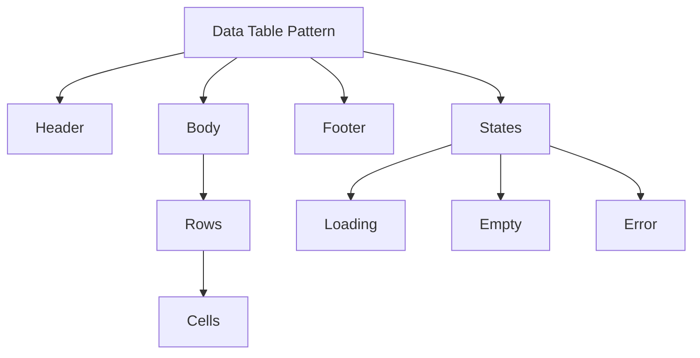
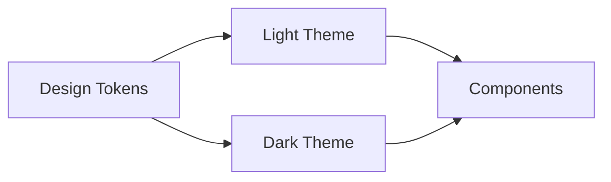
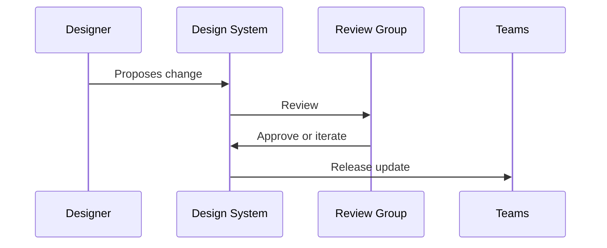
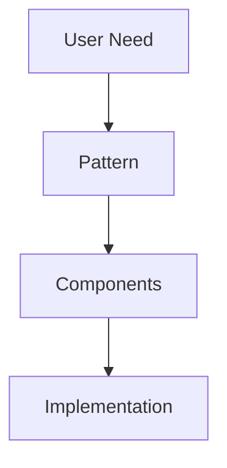

# Scalability, Patterns, and Theming

As digital products grow, they rarely fail because of a lack of features. Instead, they fail because complexity becomes unmanageable. What once felt like a clean and intuitive interface slowly turns into a patchwork of inconsistent components, duplicated styles, conflicting behaviors, and slow collaboration between teams. This is where **scalable design systems** become essential—not as a static library of UI elements, but as a living, evolving foundation that supports growth, collaboration, and long-term product quality.

In early-stage products, design decisions are often made quickly and locally. A button is designed for one screen, a modal for another, and responsiveness or theming is handled as an afterthought. As teams scale, products expand across platforms, and user expectations increase, these ad-hoc decisions start to break down. Designers and developers struggle to keep consistency, accessibility issues multiply, and every new feature feels harder to build than the last.

This chapter focuses on **advanced design system strategies** that address these challenges head-on. We explore how to design complex UI patterns, how responsiveness and adaptivity should be handled at the system level (not screen by screen), how theming—including dark mode—can be built into the core of a system, and how organizations maintain consistency across dozens of teams. Finally, we examine pattern libraries and reuse as a way to encode knowledge and scale collaboration.

Rather than treating design systems as a collection of components, this chapter treats them as **organizational infrastructure**—similar to roads, electrical grids, or operating systems. When designed well, they are mostly invisible, but they enable speed, quality, and innovation at scale.

By the end of this chapter, you will be able to:

- Identify and design complex UI patterns that scale across products and teams  
- Apply responsive and adaptive principles at the **system level**, not just individual screens  
- Design, implement, and manage themes, including dark mode, in a sustainable way  
- Maintain visual, behavioral, and interaction consistency across large organizations  
- Evaluate scalability risks and trade-offs in design systems and pattern libraries  

---

## Complex Components and Design Patterns

Complex components and design patterns emerge when simple UI elements are no longer sufficient to support real-world user tasks. Early design systems often focus on atomic components—buttons, inputs, icons, and text styles. While these are essential, they only represent the surface layer of a system. As products mature, users interact with **flows**, **states**, **data-heavy interfaces**, and **multi-step interactions** that cannot be captured by isolated components alone.

Historically, the idea of design patterns in interfaces borrows from architecture and software engineering. Just as architects reuse patterns like courtyards or atriums, and engineers reuse patterns like MVC or observer, designers reuse proven solutions to recurring interaction problems. Examples include navigation drawers, data tables with sorting and filtering, multi-step forms, and notification systems. These patterns encapsulate not only visuals, but also behavior, accessibility, and edge cases.

Complex components differ from simple ones in several important ways:

- They are **composed** of multiple smaller components  
- They manage **state**, such as loading, error, empty, or success  
- They often involve **business logic**, not just presentation  
- They must work consistently across contexts, screen sizes, and data volumes  

For example, a “Data Table” is not just rows and columns. It may include pagination, column resizing, sorting, filtering, selection, bulk actions, inline editing, and empty states. Designing this as a one-off for each product area leads to fragmentation. Designing it as a **system-level pattern** enables reuse and consistency.

### Why Complex Patterns Matter

The importance of complex patterns becomes clear when teams scale. Without shared patterns:

- Designers reinvent solutions, leading to inconsistent experiences  
- Developers reimplement similar logic, increasing bugs and maintenance cost  
- Users must relearn interactions in different parts of the same product  

By contrast, well-designed patterns act as **shared language**. When a designer says “use the standard bulk action pattern,” everyone understands what that means—visually, behaviorally, and technically.

A helpful analogy is city planning. A single house can be designed freely, but a city requires zoning laws, traffic patterns, and infrastructure standards. Complex UI patterns are the “traffic systems” of digital products—they coordinate movement and behavior at scale.

### How Complex Components Are Designed

Designing complex components requires a deliberate, layered approach:

1. **Identify the recurring problem**  
   Look for interaction challenges that appear in multiple places, such as managing large datasets or guiding users through decisions.

2. **Decompose the pattern**  
   Break the pattern into subcomponents and states. For a modal flow, this might include header, content, footer, primary actions, and error handling.

3. **Define behavior, not just visuals**  
   Specify how the component behaves in edge cases: slow networks, invalid input, keyboard navigation, screen readers.

4. **Document constraints and flexibility**  
   Clarify what teams can customize (labels, columns) and what must remain consistent (spacing, interaction logic).

5. **Validate across contexts**  
   Test the pattern in different products, data sizes, and devices to ensure it scales.

### Common Mistakes and Trade-offs

A frequent mistake is over-engineering patterns too early. Not every component needs to be generalized immediately. Another risk is creating patterns that are too rigid, forcing teams into awkward solutions. Scalability requires balance: patterns should be **opinionated enough to ensure consistency**, but **flexible enough to handle real-world variation**.

---

### Example Comparison: Simple vs Complex Components

| Aspect | Simple Component (Button) | Complex Component (Data Table) |
|---|---|---|
| Composition | Single element | Multiple nested components |
| State | Hover, active, disabled | Loading, empty, error, partial data |
| Logic | Minimal | Significant business logic |
| Reuse Scope | Everywhere | Specific recurring scenarios |
| Documentation | Visual specs | Behavior, rules, edge cases |

---

### Visualizing a Complex Component Structure

---

## Responsive and Adaptive Design Systems

Responsive design began as a solution to a specific problem: how to make websites usable on screens of different sizes. Early approaches focused on fluid grids and media queries, treating responsiveness as a layout concern. Over time, it became clear that true scalability requires responsiveness to be **systemic**, not ad-hoc.

A responsive design system encodes rules about spacing, typography, layout, and behavior that automatically adapt across breakpoints. An adaptive system goes further by adjusting not just layout, but also **interaction patterns** based on device capabilities, input methods, and context.

### From Screens to Systems

One of the most important mindset shifts is moving from “designing screens” to “designing behaviors.” In a scalable system:

- Components know how they resize and reflow  
- Spacing and typography are driven by tokens, not manual overrides  
- Layout decisions are consistent across products  

Historically, teams would design desktop screens first and then “fix” mobile later. This leads to brittle solutions and inconsistent experiences. Modern systems instead define **responsive primitives**—such as spacing scales and breakpoint-based typography—that everything else builds upon.

### System-Level Responsive Principles

At the system level, responsiveness involves several coordinated layers:

- **Layout systems** (grids, containers, columns)  
- **Component responsiveness** (how individual components adapt)  
- **Content prioritization** (what is shown or hidden at different sizes)  
- **Interaction changes** (hover vs tap, keyboard vs touch)  

For example, a navigation system might appear as a horizontal bar on desktop, a collapsible drawer on tablet, and a bottom navigation on mobile. These are not separate designs, but expressions of the same pattern adapted to context.

### Adaptive Design in Practice

Adaptive design is often misunderstood as device-specific design. In reality, it responds to **capabilities and constraints**. A large touchscreen kiosk, a phone, and a laptop may all have different needs even if screen sizes overlap.

Practical adaptive strategies include:

- Switching interaction density based on input method  
- Adjusting animation complexity based on performance constraints  
- Providing alternative navigation models for accessibility  

### Common Pitfalls

A common error is defining too many breakpoints, making the system hard to maintain. Another is allowing components to override system rules “just this once,” which quickly erodes consistency. Scalability depends on **discipline** as much as flexibility.

---

### Responsive Strategy Comparison

| Strategy | Focus | Strengths | Limitations |
|---|---|---|---|
| Fixed Layouts | Pixel-perfect control | Simple to design | Breaks on new devices |
| Responsive Layouts | Screen size | Broad device support | Can ignore context |
| Adaptive Systems | Context & capability | Best UX at scale | Higher upfront effort |

---

### Responsive System Flow

---

## Theming and Dark Mode Strategies

Theming is the ability to change the visual appearance of a product without changing its underlying structure or behavior. While early theming focused on branding (logos and colors), modern theming encompasses **accessibility, user preference, environment, and platform conventions**. Dark mode, in particular, has shifted theming from a “nice-to-have” to a core requirement.

### The Evolution of Theming

Initially, products hard-coded colors directly into components. This made branding changes expensive and risky. The introduction of **design tokens**—named, abstracted values for color, spacing, typography—was a turning point. Tokens decouple design decisions from implementation details, enabling scalable theming.

Dark mode emerged due to a combination of factors:

- OLED screens benefiting from darker pixels  
- User preference for reduced eye strain  
- Operating systems offering system-wide themes  

### Designing Themes Systematically

A scalable theming strategy starts with abstraction:

1. **Semantic tokens**  
   Instead of “blue-500,” use tokens like “color-primary” or “surface-background.”

2. **Theme layers**  
   Define base themes (light, dark) and brand variants that override specific tokens.

3. **Component neutrality**  
   Components should reference tokens, never raw values.

This allows a button to automatically adapt to dark mode without redesign.

### Dark Mode: More Than Inverted Colors

A common misconception is that dark mode is simply light mode with inverted colors. In reality, dark mode requires careful consideration of:

- Contrast ratios for accessibility  
- Elevation and depth without shadows  
- Emotional tone and brand perception  

For example, pure black backgrounds can feel harsh, while dark grays often provide better readability and comfort.

### Trade-offs and Challenges

Theming increases complexity. Every component must be tested in every theme. Documentation must clearly explain token usage. However, the payoff is significant: faster branding changes, better accessibility, and happier users.

---

### Light vs Dark Mode Comparison

| Aspect | Light Mode | Dark Mode |
|---|---|---|
| Background | Light surfaces | Dark surfaces |
| Contrast Strategy | Dark text on light | Light text on dark |
| Eye Comfort | Bright environments | Low-light environments |
| Common Pitfall | Glare | Low contrast |

---

### Theme Architecture Diagram

---

## Managing Consistency at Scale

Consistency is often misunderstood as visual sameness. In scalable systems, consistency means **predictability**—users can anticipate how the interface behaves, and teams can anticipate how to build features. As organizations grow, maintaining this predictability becomes increasingly difficult.

### Why Consistency Breaks Down

Consistency erodes due to:

- Multiple teams solving similar problems independently  
- Pressure to ship quickly, bypassing system guidelines  
- Incomplete or outdated documentation  

Historically, design systems were treated as “design team artifacts.” Modern systems require **shared ownership** across design, engineering, and product.

### Governance Models

There is no single correct governance model, but common approaches include:

- **Centralized**: One team controls the system  
- **Federated**: Multiple teams contribute under shared rules  
- **Hybrid**: Core team with distributed contributors  

Each model has trade-offs between speed and control.

### Processes and Tooling

Consistency at scale depends on more than rules—it requires tooling and process:

- Automated linting for design tokens  
- Shared component libraries with versioning  
- Clear contribution workflows  

### Cultural Factors

Perhaps the most overlooked aspect is culture. Teams must see the design system as an enabler, not a constraint. This requires education, advocacy, and visible leadership support.

---

### Governance Model Comparison

| Model | Control | Speed | Risk |
|---|---|---|---|
| Centralized | High | Low | Bottlenecks |
| Federated | Medium | High | Inconsistency |
| Hybrid | Balanced | Balanced | Coordination overhead |

---

### Consistency Feedback Loop

---

## Pattern Libraries and Reuse

Pattern libraries sit above component libraries. While components define “what things look like,” patterns define **how things work together**. They capture user flows, interaction logic, and best practices in a reusable format.

### Why Pattern Libraries Matter

Without pattern libraries, teams may use the same components in wildly different ways. This leads to inconsistent experiences even when the visual language is shared. Pattern libraries encode **experience-level decisions**, reducing cognitive load for both users and teams.

### Types of Patterns

Common pattern categories include:

- Navigation patterns  
- Data entry patterns  
- Feedback and notification patterns  
- Empty and error state patterns  

Each pattern should include context, rationale, do’s and don’ts, and examples.

### Reuse vs Rigidity

A pattern library should guide, not dictate. Teams need to understand **why** a pattern exists so they can adapt it responsibly. Overly rigid patterns lead to workarounds; overly vague patterns lead to inconsistency.

### Measuring Success

The success of a pattern library is measured not by completeness, but by adoption. Patterns that are easy to find, understand, and implement will naturally spread.

---

### Component vs Pattern Library

| Aspect | Component Library | Pattern Library |
|---|---|---|
| Focus | UI elements | User flows |
| Granularity | Low-level | High-level |
| Audience | Designers & developers | Product teams |
| Value | Visual consistency | Experience consistency |

---

### Pattern Reuse Structure

---

## Case Study: Scaling a Design System for a Global SaaS Platform

### Context

In 2019, a mid-sized SaaS company offering workflow automation tools began expanding rapidly into international markets. The product had grown organically over five years, with multiple teams shipping features independently. While the user base grew, so did complaints about inconsistency, usability issues, and slow feature delivery.

The design team consisted of eight designers spread across three regions, while engineering teams operated semi-autonomously. Each team maintained its own UI variations, and dark mode requests from enterprise clients added pressure.

### Problem

The core problem was not lack of talent, but lack of shared structure. Components existed, but complex patterns like onboarding flows and data tables were implemented differently across products. Responsiveness varied widely, and attempts to introduce dark mode resulted in duplicated styles and accessibility issues.

Traditional fixes—design reviews and documentation—failed because they did not scale with the organization’s growth. The company needed a systemic solution.

### Solution

The company invested in a year-long design system overhaul. A core team was formed to define design tokens, responsive rules, and theming architecture. Complex patterns were identified through audits and documented in a new pattern library.

Dark mode was implemented using semantic tokens, with components refactored to remove hard-coded values. Governance shifted to a hybrid model, allowing teams to contribute patterns through a structured review process.

### Results

Within six months, feature delivery speed increased by 30%. User satisfaction scores improved, particularly around navigation and readability. Dark mode adoption exceeded expectations, with positive accessibility feedback.

Long-term, the system enabled faster onboarding of new designers and engineers, reducing ramp-up time significantly.

### Lessons Learned

The most important lesson was that scalability is as much about people as it is about technology. Clear ownership, shared language, and education were critical. The team also learned to prioritize patterns that solved real problems, rather than aiming for theoretical completeness.

---

## Summary

Scalable design systems are not static artifacts—they are evolving frameworks that support growth, collaboration, and quality. By designing complex components and patterns, embedding responsiveness and adaptivity at the system level, implementing robust theming strategies, and managing consistency through governance and culture, organizations can scale without losing coherence.

Pattern libraries and reuse further amplify these benefits by encoding experience-level knowledge. Together, these practices transform design systems from collections of components into strategic assets.

---

## Reflection Questions

1. Which parts of your current design system would break first as your product scales, and why?  
2. How could complex patterns in your product be better documented and reused?  
3. What trade-offs would you face when introducing dark mode into an existing system?  
4. Which governance model would best fit your organization’s culture and size?  
5. How can pattern libraries help reduce cognitive load for both users and teams?