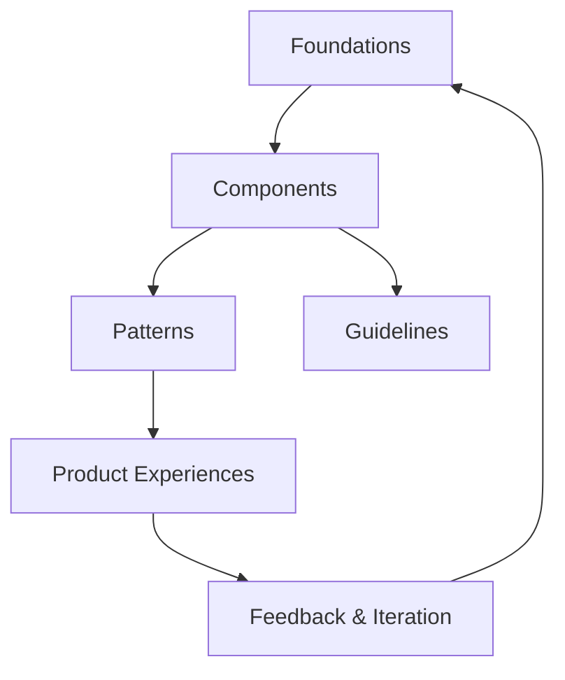
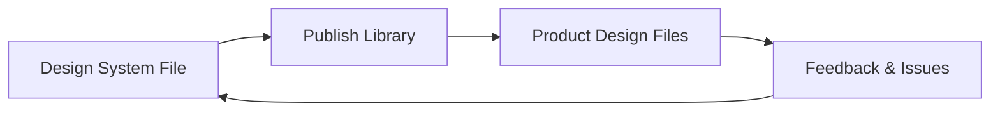
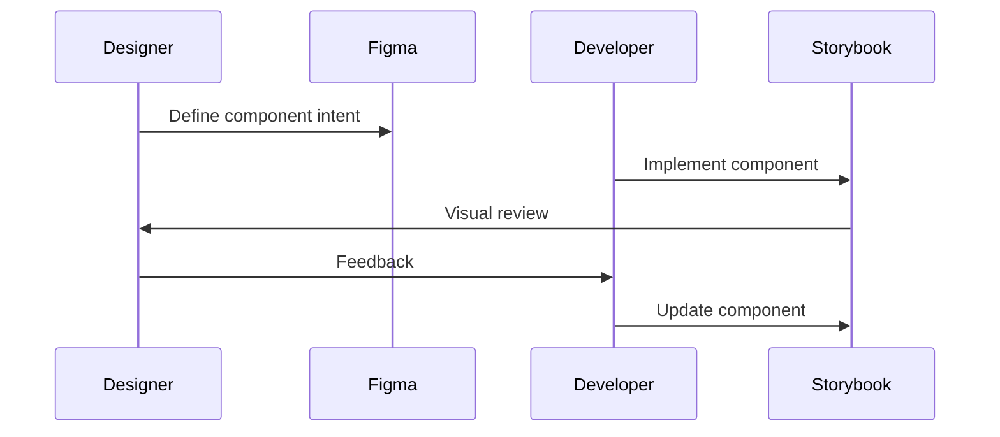
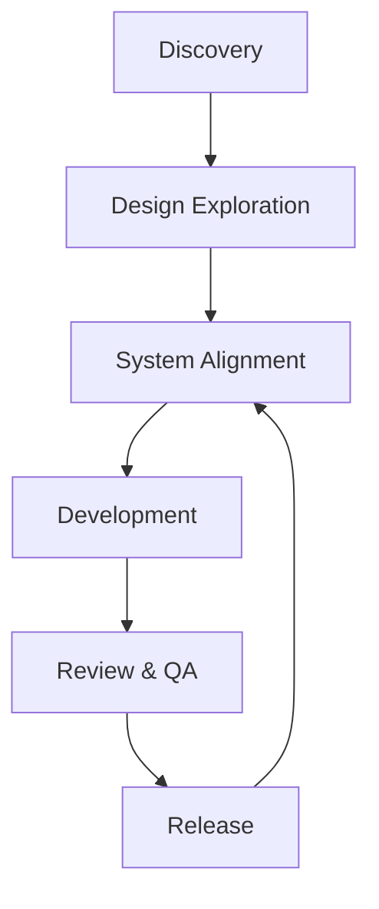
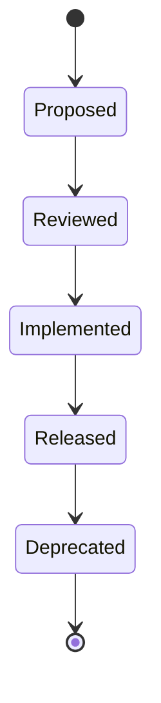
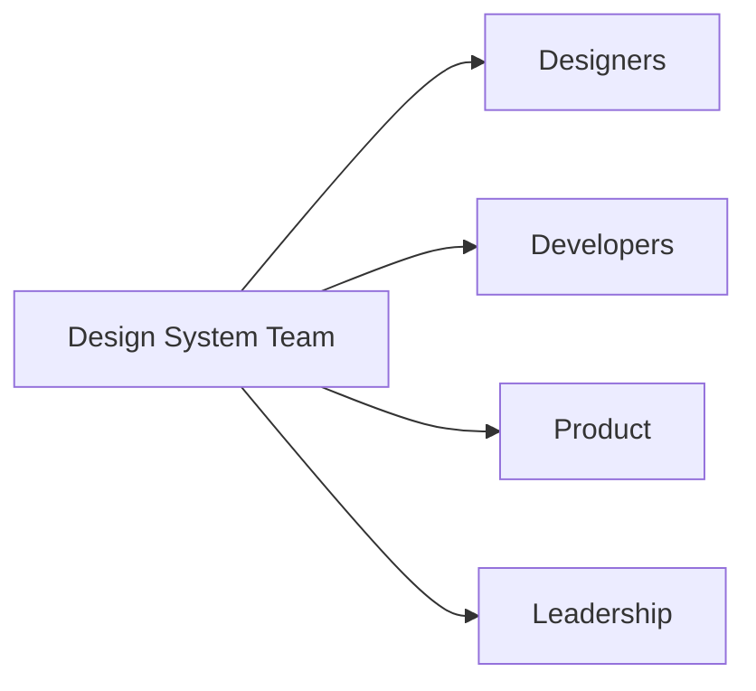

# Scalable Design Systems and Collaboration: Documentation, Tools, and Collaboration

## Learning Objectives

- Structure clear and usable design system documentation
- Use Figma features to manage design systems
- Explain the role of Storybook in development
- Collaborate effectively with developers
- Manage and communicate system changes

---

## Introduction

This chapter focuses on documenting design systems and collaborating effectively with developers using modern tools and workflows.

---

---

As digital products grow in size, complexity, and team count, design can no longer be managed as a collection of isolated screens or one-off decisions. What once worked for a small team—sharing static mockups, informal conversations, and ad-hoc handoffs—quickly breaks down when products scale across platforms, teams, and time. This is where **scalable design systems** and **strong collaboration practices** become essential.

A design system is more than a style guide. It is a **shared language** between designers, developers, product managers, and stakeholders. Documentation explains that language, tools like Figma and Storybook operationalize it, and collaboration workflows ensure it evolves without chaos. Without proper documentation and collaboration, even the most well-crafted design systems become unused, misunderstood, or actively resisted.

This chapter focuses on the **practical reality of making design systems usable at scale**. We will explore how to structure documentation so it supports learning and daily work, how to use Figma as a system management tool (not just a design canvas), how Storybook bridges the gap between design and code, and how teams collaborate, version, and communicate changes effectively. Throughout the chapter, you will see concrete examples, detailed explanations, visual diagrams, and a comprehensive case study that brings these ideas to life.

---

By the end of this chapter, you will be able to:

- Structure clear, scalable, and usable design system documentation
- Use Figma features effectively to manage and maintain design systems
- Explain the role of Storybook in modern design–development workflows
- Design effective collaboration workflows between designers and developers
- Manage versioning and change in evolving design systems
- Communicate system updates clearly to stakeholders with different needs

---

## Design System Documentation Structures

Documentation is the backbone of any scalable design system. Without it, components become ambiguous, rules are forgotten, and teams revert to personal interpretation. At scale, undocumented systems are indistinguishable from no system at all.

### What Design System Documentation Really Is

Design system documentation is often misunderstood as a static website listing colors, fonts, and components. In reality, it is a **living knowledge base** that explains not just *what* exists, but *why it exists, how it should be used, and when it should not be used*.

Historically, early style guides focused on visual consistency—logos, typography, spacing. As digital products became interactive and component-based, documentation evolved to include behavior, accessibility, content guidelines, and development details. Modern documentation reflects this shift by addressing multiple audiences simultaneously: designers, developers, QA, product managers, and even marketing teams.

Well-structured documentation answers questions before they are asked. For example:
- Why does this button have three variants instead of five?
- When should a modal be used instead of a drawer?
- How does this component behave on mobile versus desktop?
- What accessibility requirements must be met?

### Core Documentation Layers

Effective documentation is typically organized into **layers**, each serving a different purpose:

- **Foundations**
  - Colors, typography, spacing, grids, motion, and accessibility principles
  - These define the “physics” of the system
- **Components**
  - Reusable UI elements with usage guidelines, variants, states, and examples
- **Patterns**
  - Combinations of components solving recurring user problems (forms, navigation, onboarding)
- **Guidelines**
  - Content tone, accessibility rules, responsive behavior, and interaction principles
- **Contribution & Governance**
  - How to propose changes, review updates, and maintain consistency

This layered approach mirrors how people learn: from basic building blocks to complex assemblies.

### Documentation Structure Example

| Layer | Purpose | Typical Audience |
|---|---|---|
| Foundations | Establish core rules and constraints | Designers, Developers |
| Components | Enable reuse and consistency | Designers, Developers |
| Patterns | Solve recurring UX problems | Designers, Product |
| Guidelines | Ensure quality and coherence | All roles |
| Governance | Manage evolution and ownership | Leads, Maintainers |

### Why Structure Matters

Poorly structured documentation creates friction. Teams waste time searching, misapply components, or create duplicates. Good structure reduces cognitive load by making information predictable. When users know where to look, they trust the system more.

Think of documentation like a **well-organized city**:
- Foundations are zoning laws
- Components are buildings
- Patterns are neighborhoods
- Governance is city planning

Without clear organization, chaos follows.

### Common Documentation Mistakes

- Writing documentation only for designers, ignoring developers
- Describing *what* without explaining *why*
- Treating documentation as a one-time project
- Hiding governance rules in obscure locations

### Documentation Flow Diagram

This loop shows documentation as a continuous cycle, not a linear artifact.

---

## Using Figma for System Management

Figma has evolved from a collaborative design tool into a **central nervous system for design systems**. When used intentionally, it becomes a powerful platform for managing consistency, enabling collaboration, and supporting scale.

### From Canvas to System Manager

Originally, designers used tools like Sketch and Photoshop to create static designs. Figma changed this paradigm by introducing real-time collaboration, cloud-based files, and shared libraries. These features made it possible to treat design assets as **shared infrastructure**, not personal files.

Today, Figma supports:
- Component libraries with variants
- Design tokens via styles
- Team-wide publishing and permissions
- Version history and branching (in enterprise contexts)

### Core Figma Features for Design Systems

### # Components and Variants

Components are the atomic units of design systems in Figma. Variants allow multiple states (size, type, state) to be grouped logically.

Benefits:
- Reduced duplication
- Clear constraints
- Easier updates across files

Example:
A button component might have:
- Type: Primary, Secondary, Tertiary
- Size: Small, Medium, Large
- State: Default, Hover, Disabled

This creates a structured matrix instead of dozens of separate components.

### # Styles and Tokens

Color, text, and effect styles act as design tokens. They bridge the gap between design and code by naming decisions explicitly.

| Token Type | Example | Purpose |
|---|---|---|
| Color | color.primary.500 | Brand consistency |
| Text | text.heading.large | Typographic hierarchy |
| Effect | shadow.elevation.2 | Depth and layering |

Using tokens ensures that changes (like rebranding) can be applied systematically.

### Libraries and Publishing

Figma libraries allow teams to publish components and styles for reuse across files. This creates a **single source of truth**.

Key considerations:
- Who can publish updates?
- How are breaking changes communicated?
- How often are libraries updated?

### Figma System Workflow Diagram

### Common Pitfalls in Figma System Management

- Overloading components with too many variants
- Naming inconsistently across styles and components
- Treating Figma as documentation instead of supporting it
- Allowing unrestricted edits to system files

### Practical Tip

Use Figma pages intentionally:
- Overview (how to use the system)
- Foundations
- Components
- Deprecated elements

This mirrors documentation structure and reduces confusion.

---

While Figma serves designers, **Storybook serves developers**—and increasingly, the space between them. Storybook is a tool for building, testing, and documenting UI components in isolation.

### Why Storybook Emerged

As frontend frameworks like React, Vue, and Angular popularized component-based development, teams needed a way to:
- View components outside full applications
- Test states and edge cases
- Document behavior and API usage

Storybook emerged as a response, acting as a **workbench for UI components**.

### What Storybook Is (and Isn’t)

Storybook is:
- A development environment
- A documentation platform
- A testing surface

Storybook is not:
- A replacement for design tools
- A full application framework

It complements design systems by making components tangible and testable.

### How Storybook Works

Each component has:
- Stories (examples of states and variants)
- Controls (interactive props)
- Documentation (usage, accessibility, notes)

This allows designers and developers to discuss the *same component* with shared context.

### Design–Development Bridge

| Aspect | Figma | Storybook |
|---|---|---|
| Primary User | Designers | Developers |
| Focus | Visual intent | Functional behavior |
| States | Conceptual | Executable |
| Output | Design specs | Running components |

### Storybook Interaction Diagram

### Benefits and Limitations

**Benefits**
- Faster feedback loops
- Better alignment on behavior
- Living documentation tied to code

**Limitations**
- Requires developer effort to maintain
- Can drift from design if not reviewed
- Not always accessible to non-technical stakeholders

---

## Designer–Developer Collaboration Workflows

Strong tools mean little without strong workflows. Collaboration defines how decisions are made, communicated, and validated across roles.

### The Evolution of Collaboration Models

Traditional handoff models treated design as a finished artifact passed to development. This created:
- Misinterpretation
- Late-stage rework
- Us-vs-them mentalities

Modern workflows emphasize **continuous collaboration**.

### Core Collaboration Principles

- Shared ownership of quality
- Early and frequent feedback
- Clear roles, not rigid silos
- Mutual respect for constraints

### Typical Workflow Stages

### Practical Collaboration Practices

- Design reviews with developers present
- Component kickoff sessions
- Shared backlog for system improvements
- Regular syncs between design and frontend leads

### Common Friction Points

- Ambiguous specifications
- Over-designed components
- Under-communicated constraints
- Misaligned timelines

Addressing these requires intentional process design, not just better tools.

---

## Versioning and Change Management

Change is inevitable in design systems. Without structured versioning, change becomes disruptive instead of empowering.

### Why Versioning Matters

At scale, a small change can impact dozens of products. Versioning provides:
- Predictability
- Accountability
- Rollback capability

### Types of Changes

| Change Type | Example | Impact |
|---|---|---|
| Patch | Fix spacing bug | Low |
| Minor | Add new variant | Medium |
| Major | Redesign component API | High |

### Semantic Versioning Applied to Design

Borrowed from software engineering, semantic versioning helps teams communicate impact clearly:
- MAJOR.MINOR.PATCH (e.g., 2.3.1)

### Change Management Lifecycle

### Governance Models

- Centralized (core team owns system)
- Federated (domain teams contribute)
- Hybrid (core standards + distributed contributions)

Each has trade-offs in speed and consistency.

---

## Communicating Updates to Stakeholders

Even well-managed changes fail if they are poorly communicated. Stakeholders vary widely in needs, context, and attention.

### Understanding Your Audiences

| Audience | Needs |
|---|---|
| Designers | Visual and usage changes |
| Developers | Breaking changes, migration paths |
| Product Managers | Impact on timelines |
| Leadership | Strategic value |

### Communication Channels

- Release notes
- Change logs
- Demos and walkthroughs
- Office hours
- Slack or Teams announcements

### Effective Update Messages

Good communication answers:
- What changed?
- Why did it change?
- Who is affected?
- What action is required?

### Stakeholder Communication Flow

---

## Case Study: Scaling a Design System Across a Global Product Team

### Context

In 2021, a global SaaS company with over 20 product teams faced growing inconsistency across its web and mobile products. Each team operated semi-independently, using shared branding but divergent components and patterns. Designers used Figma extensively, while developers relied on a growing React codebase with minimal shared UI infrastructure.

The company had recently expanded into new markets, increasing pressure to deliver features faster without sacrificing quality. Leadership recognized that the lack of a cohesive design system was slowing development and increasing maintenance costs.

### Problem

The existing “design system” was a static PDF and a loosely maintained Figma file. Components were duplicated, undocumented, and often out of sync with production code. Developers frequently reimplemented components, leading to visual drift and accessibility issues.

Communication between designers and developers was reactive. Changes were announced late, often after implementation had already begun. Teams lacked clarity on which components were approved or deprecated.

### Solution

The company formed a cross-functional design system team, including designers, frontend engineers, and a product manager. They began by restructuring documentation into clear layers: foundations, components, patterns, and governance.

Figma libraries were rebuilt using consistent naming, variants, and tokens. A dedicated “Design System Overview” page explained how to use and contribute to the system. On the development side, Storybook was introduced as the single source of truth for coded components.

Versioning rules were established using semantic versioning. Each release included detailed change logs and migration guidance. Monthly demos showcased updates and allowed teams to ask questions.

### Results

Within six months, component reuse increased by over 40%. Design review cycles shortened, and developers reported fewer ambiguities in implementation. Accessibility compliance improved as rules were documented and enforced consistently.

While initial setup required significant effort, long-term maintenance costs decreased. Teams felt more confident shipping features, knowing they were aligned with shared standards.

### Lessons Learned

The team learned that tools alone are insufficient without clear ownership and communication. Documentation had to be treated as a product, not an afterthought. Regular collaboration rituals were essential to maintain trust.

They also discovered that transparency about changes—even small ones—built credibility. By explaining *why* decisions were made, the system gained adoption rather than resistance.

---

## Summary

Scalable design systems depend on more than visual consistency. They require thoughtful documentation, intentional use of tools like Figma and Storybook, and strong collaboration workflows. Versioning and communication transform change from a source of friction into a source of growth.

By structuring documentation clearly, managing systems effectively in Figma, bridging design and code with Storybook, and communicating changes transparently, teams can scale with confidence and clarity.

---

## Reflection Questions

1. Which part of design system documentation is most often overlooked in your organization, and why?
2. How could your current use of Figma be improved to better support system management?
3. What barriers exist between designers and developers on your team, and how could workflows reduce them?
4. How do you currently communicate system changes, and who might be left out?
5. What governance model would best fit your team’s size and culture—and why?