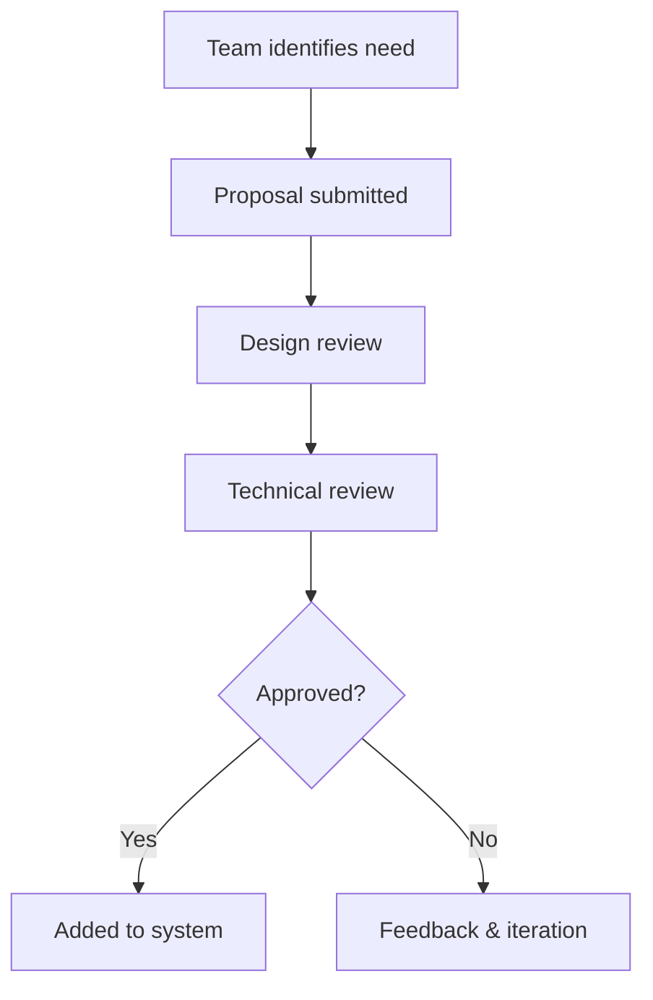
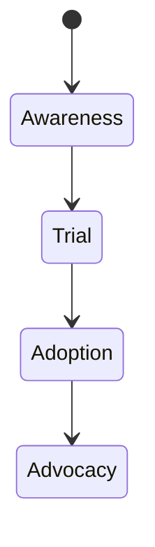
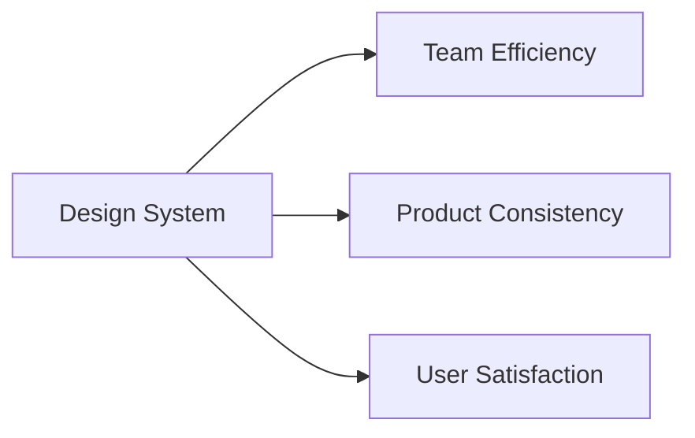
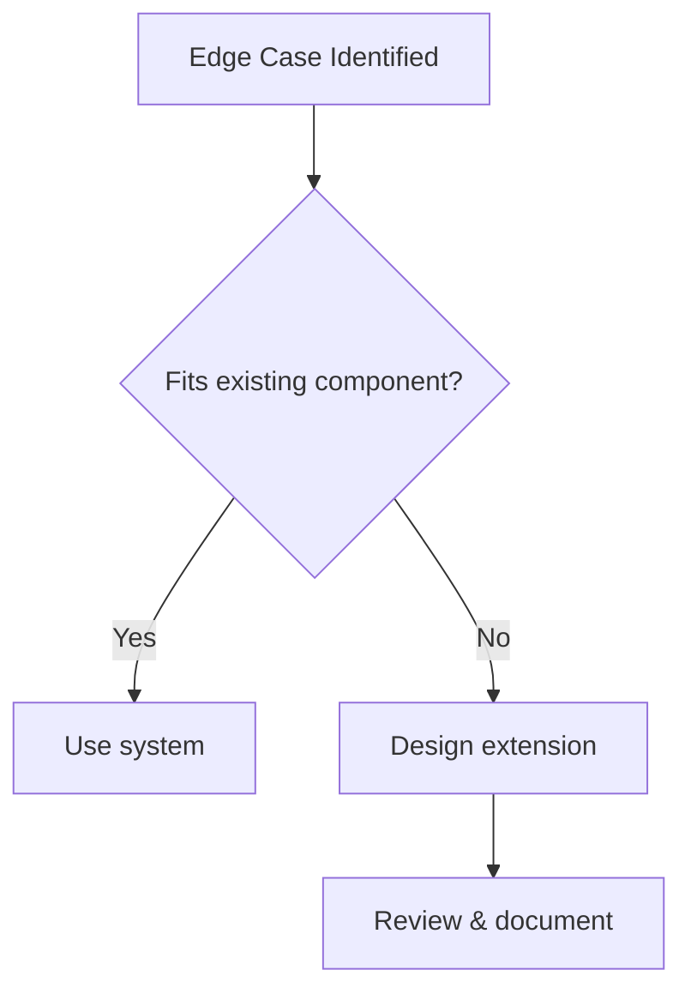
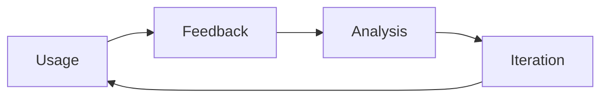

# Maintaining, Evolving, and Applying Design Systems: Governance and Continuous Evolution

## Learning Objectives

- Describe different governance models for design systems
- Develop strategies to drive system adoption
- Define metrics to measure system impact
- Handle exceptions without breaking consistency
- Implement feedback-driven improvements

---

## Introduction

This chapter explores how design systems are maintained, adopted, and improved over time in real organizations.

---

---

Design systems are often introduced with great enthusiasm: a shared component library, unified design principles, and the promise of consistency and efficiency across products. However, the real challenge does not begin with creating a design system—it begins **after launch**. In real organizations, design systems live in complex environments shaped by evolving business goals, growing teams, legacy products, technical constraints, and human behaviors. Without thoughtful governance, adoption strategies, and continuous improvement mechanisms, even the most well-crafted design system can stagnate, fragment, or be ignored entirely.

This chapter focuses on the *long-term reality* of design systems: how they are **maintained, governed, adopted, measured, and evolved over time**. Instead of treating design systems as static artifacts, we will approach them as **living socio-technical systems** that require stewardship, negotiation, and learning. You will explore different governance models, practical strategies for driving adoption across teams, ways to measure success beyond vanity metrics, methods for handling inevitable edge cases, and the critical role of feedback loops in continuous evolution.

By the end of this chapter, you should not only understand *what* these practices are, but *why* they matter, *how* they work in practice, and *when* to apply them in real organizational contexts.

---

By completing this chapter, you will be able to:

- Describe and compare different governance models for design systems  
- Develop realistic and effective strategies to drive adoption across teams  
- Define meaningful metrics to measure design system impact  
- Handle exceptions and edge cases without breaking consistency  
- Implement feedback-driven processes for continuous improvement  

---

## Design System Governance Models

Governance is one of the most misunderstood aspects of design systems. Many teams associate governance with rigid rules, bureaucracy, or top-down control. In reality, governance is simply about **how decisions are made, who makes them, and how those decisions are enforced or evolved over time**. Without clear governance, design systems often drift into chaos—multiple versions of components appear, teams fork the system to meet their needs, and trust in the system erodes.

Historically, governance became a major topic as organizations scaled their design systems beyond a single team. Early design systems were often maintained informally by a small group of designers. As adoption grew, conflicts emerged: engineers needed flexibility, product teams had deadlines, and leadership wanted consistency. Governance models emerged as a way to balance **autonomy and alignment**.

### Centralized, Federated, and Distributed Governance

The most common way to understand governance is through three high-level models. Each reflects a different philosophy about control and collaboration.

| Governance Model | Decision Authority | Best For | Key Risks |
|------------------|-------------------|----------|-----------|
| Centralized | Core design system team | Small to mid-size orgs | Bottlenecks, slow change |
| Federated | Core team + representatives | Growing organizations | Coordination overhead |
| Distributed | Individual product teams | Large, mature ecosystems | Inconsistency, duplication |

In a **centralized model**, a dedicated design system team owns all decisions. They define standards, approve changes, and release updates. This model works well when the system is young or when consistency is a top priority. However, it can become a bottleneck as demand grows.

A **federated model** introduces shared ownership. A central team maintains the core system, while representatives from product teams contribute changes and advocate for local needs. This model reflects how many large tech companies operate, balancing scale with collaboration.

A **distributed model** pushes ownership to individual teams. Teams can extend or modify the system independently, often guided by shared principles rather than strict rules. This approach offers maximum flexibility but requires strong design maturity and trust.

### Governance as a Decision-Making System

Governance is not just about structure—it is about **decision flow**. Consider how a new component proposal moves through the system.

This flow highlights an important principle: governance should be **transparent and predictable**. Teams should know how to propose changes, what criteria are used, and how long decisions typically take.

### Case Study: Governance at a Global SaaS Company

## Case Study: Scaling Governance at Nimbus Cloud

### Context

Nimbus Cloud is a global SaaS provider with over 50 product teams distributed across North America, Europe, and Asia. In its early years, Nimbus relied on a small design team that manually reviewed designs for consistency. As the company grew, teams began building their own UI solutions to meet deadlines, leading to fragmentation.

### Problem

The lack of formal governance resulted in duplicated components, inconsistent user experiences, and growing tension between teams. Designers felt the system was being ignored, while engineers felt blocked by slow reviews. Leadership demanded faster delivery without sacrificing brand consistency.

### Solution

Nimbus adopted a **federated governance model**. A core design system team defined foundational components and principles. Each product group appointed a “design system ambassador” who participated in bi-weekly governance meetings. Proposals were documented in a shared repository with clear acceptance criteria.

### Results

Within six months, component reuse increased by 40%, and the average time to approve changes dropped by half. Teams reported higher trust in the system, and leadership saw more consistent user experiences across products.

### Lessons Learned

Nimbus learned that governance is less about control and more about **shared ownership**. By giving teams a voice, the system became more resilient and adaptable.

---

## Adoption Strategies Across Teams

Even the best-designed system fails if teams do not use it. Adoption is a **behavioral challenge**, not just a technical one. Teams adopt tools and systems when they perceive value, trust the system, and feel supported—not when they are forced.

Historically, many design systems failed because they were “launched” like products and then abandoned. Successful organizations treat adoption as an ongoing process that combines **education, incentives, and empathy**.

### Understanding Barriers to Adoption

Before designing adoption strategies, it is critical to understand why teams resist using design systems:

- Fear of losing autonomy or creativity  
- Perceived mismatch between system components and real product needs  
- Lack of documentation or onboarding  
- Technical friction or poor tooling integration  

These barriers are often emotional as much as rational. Adoption strategies must address both.

### Practical Adoption Tactics

| Strategy | Description | Why It Works |
|--------|-------------|--------------|
| Progressive adoption | Start with basic components | Lowers entry barrier |
| Embedded advocates | System champions in teams | Builds trust locally |
| Education & onboarding | Workshops, docs, examples | Reduces cognitive load |

A powerful analogy is learning a new language. You do not start by memorizing grammar rules—you start by using simple phrases. Similarly, teams should be able to adopt a design system incrementally.

### Adoption Lifecycle Visualization

Teams move from awareness to advocacy at different speeds. Governance and support should adapt accordingly.

---

## Measuring Design System Success

Measurement is where many design systems struggle. Teams often track surface-level metrics—number of components, downloads, or contributors—without understanding real impact. True success metrics connect the system to **business outcomes, team efficiency, and user experience quality**.

### Categories of Metrics

| Metric Category | Examples | Insight Provided |
|----------------|----------|------------------|
| Adoption | Component usage | System relevance |
| Efficiency | Time to build UI | Productivity gains |
| Quality | UX consistency | User experience health |

Quantitative metrics should be complemented by qualitative insights such as surveys and interviews.

### Example Measurement Framework

### Case Study: Measuring Impact at FinTech Startup

## Case Study: Measuring Design System ROI at PayNest

### Context

PayNest, a fast-growing fintech startup, invested heavily in a design system but struggled to justify its cost to leadership.

### Problem

Leadership questioned whether the system delivered tangible value. Metrics focused on component counts rather than outcomes.

### Solution

The team introduced a balanced scorecard: time-to-market, bug reduction, and user satisfaction scores. They also conducted interviews with engineers and designers.

### Results

The data showed a 30% reduction in UI-related bugs and faster onboarding for new hires. Leadership renewed investment.

### Lessons Learned

Measurement must tell a **story of value**, not just activity.

---

## Handling Edge Cases and Exceptions

No design system can anticipate every scenario. Edge cases are inevitable, especially in complex products. The challenge is handling them **without undermining consistency**.

### Principles for Managing Exceptions

- Treat exceptions as learning opportunities  
- Document decisions and rationale  
- Prefer extensions over overrides  

| Approach | Pros | Cons |
|--------|------|------|
| One-off hacks | Fast | Long-term debt |
| System extensions | Scalable | Initial effort |

### Exception Decision Flow

---

## Feedback Loops and Continuous Improvement

A design system without feedback is like a product without users. Feedback loops ensure the system evolves with real needs.

### Types of Feedback

- Passive: analytics, usage data  
- Active: surveys, interviews  
- Embedded: contribution workflows  

| Feedback Source | Strength | Limitation |
|----------------|----------|------------|
| Surveys | Broad insight | Shallow |
| Interviews | Deep insight | Time-intensive |

### Continuous Improvement Cycle

---

## Summary

Maintaining and evolving a design system is a long-term commitment that blends governance, empathy, measurement, and learning. Governance models define how decisions are made, adoption strategies shape behavior, metrics reveal impact, exception handling preserves integrity, and feedback loops drive continuous improvement. Together, these practices transform a design system from a static artifact into a living organizational asset.

---

## Reflection Questions

1. Which governance model best fits your organization’s culture and scale, and why?  
2. What emotional or practical barriers might teams face when adopting your design system?  
3. Which metrics would best demonstrate the value of your design system to leadership?  
4. How can your team turn edge cases into opportunities for system evolution?  
5. What feedback mechanisms are currently missing from your design system process?