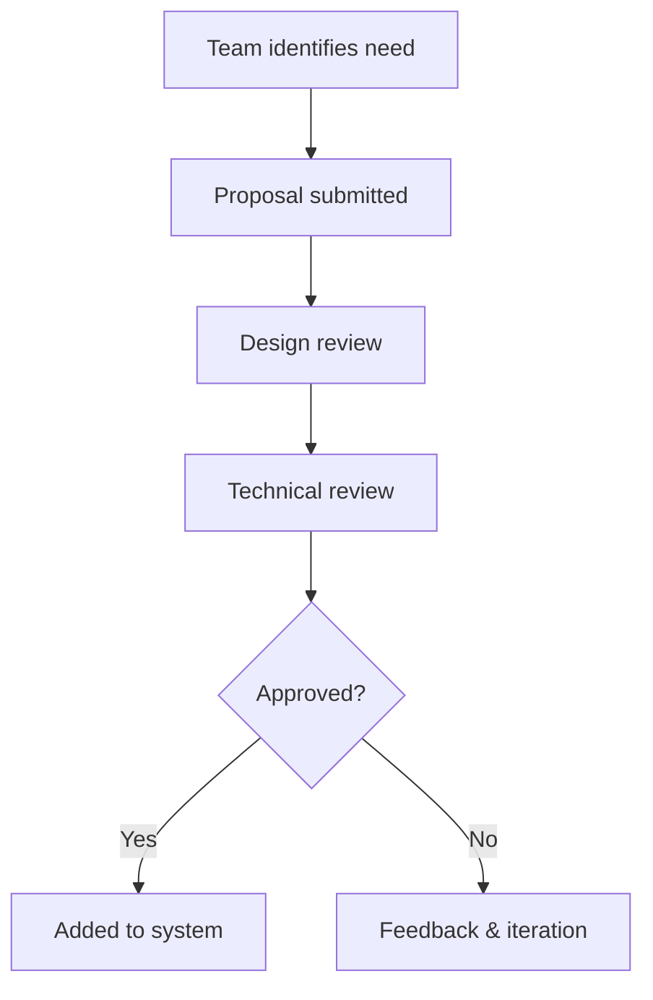
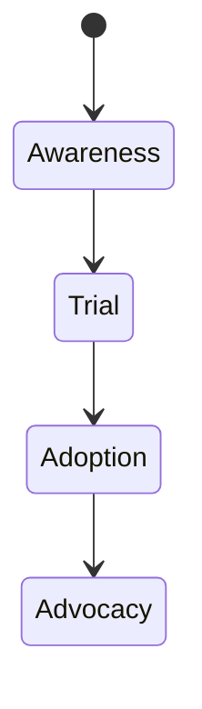
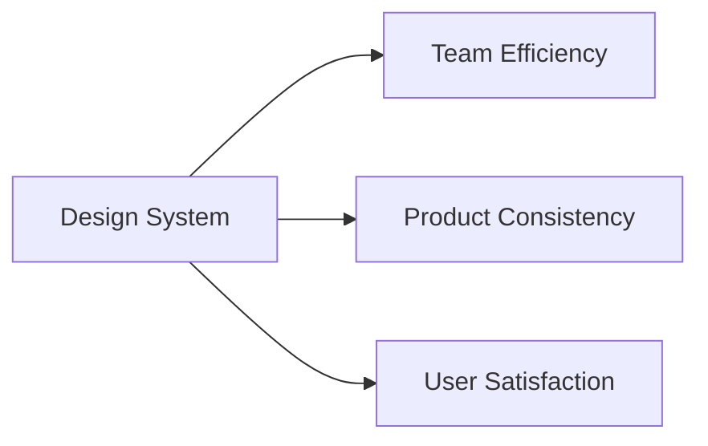
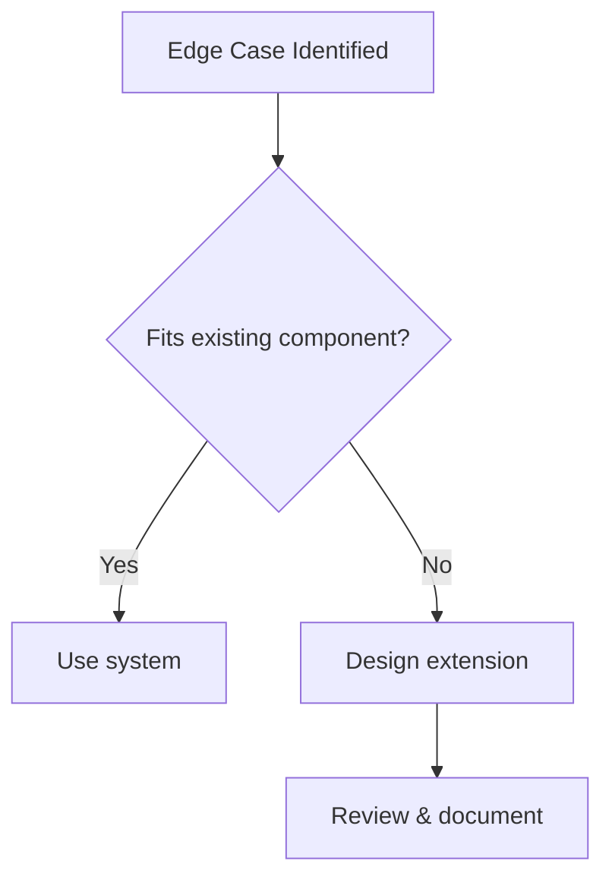
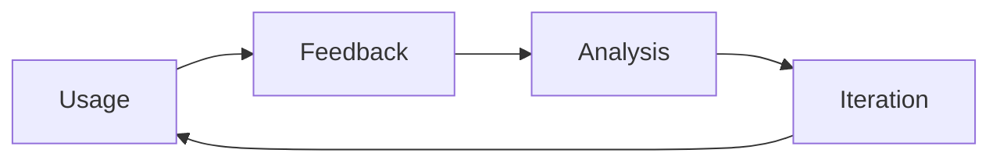

# Governance and Continuous Evolution

Design systems are often introduced with great enthusiasm: a shared component library, unified design principles, and the promise of consistency and efficiency across products. However, the real challenge does not begin with creating a design system—it begins **after launch**. In real organizations, design systems live in complex environments shaped by evolving business goals, growing teams, legacy products, technical constraints, and human behaviors. Without thoughtful governance, adoption strategies, and continuous improvement mechanisms, even the most well-crafted design system can stagnate, fragment, or be ignored entirely.

This chapter focuses on the *long-term reality* of design systems: how they are **maintained, governed, adopted, measured, and evolved over time**. Instead of treating design systems as static artifacts, we will approach them as **living socio-technical systems** that require stewardship, negotiation, and learning. You will explore different governance models, practical strategies for driving adoption across teams, ways to measure success beyond vanity metrics, methods for handling inevitable edge cases, and the critical role of feedback loops in continuous evolution.

By the end of this chapter, you should not only understand *what* these practices are, but *why* they matter, *how* they work in practice, and *when* to apply them in real organizational contexts.

By completing this chapter, you will be able to:

- Describe and compare different governance models for design systems  
- Develop realistic and effective strategies to drive adoption across teams  
- Define meaningful metrics to measure design system impact  
- Handle exceptions and edge cases without breaking consistency  
- Implement feedback-driven processes for continuous improvement  

---

## Design System Governance Models

Governance is one of the most misunderstood aspects of design systems. Many teams associate governance with rigid rules, bureaucracy, or top-down control. In reality, governance is simply about **how decisions are made, who makes them, and how those decisions are enforced or evolved over time**. Without clear governance, design systems often drift into chaos—multiple versions of components appear, teams fork the system to meet their needs, and trust in the system erodes.

Historically, governance became a major topic as organizations scaled their design systems beyond a single team. Early design systems were often maintained informally by a small group of designers. As adoption grew, conflicts emerged: engineers needed flexibility, product teams had deadlines, and leadership wanted consistency. Governance models emerged as a way to balance **autonomy and alignment**.

### Centralized, Federated, and Distributed Governance

The most common way to understand governance is through three high-level models. Each reflects a different philosophy about control and collaboration.

| Governance Model | Decision Authority | Best For | Key Risks |
|------------------|-------------------|----------|-----------|
| Centralized | Core design system team | Small to mid-size orgs | Bottlenecks, slow change |
| Federated | Core team + representatives | Growing organizations | Coordination overhead |
| Distributed | Individual product teams | Large, mature ecosystems | Inconsistency, duplication |

In a **centralized model**, a dedicated design system team owns all decisions. They define standards, approve changes, and release updates. This model works well when the system is young or when consistency is a top priority. However, it can become a bottleneck as demand grows.

A **federated model** introduces shared ownership. A central team maintains the core system, while representatives from product teams contribute changes and advocate for local needs. This model reflects how many large tech companies operate, balancing scale with collaboration.

A **distributed model** pushes ownership to individual teams. Teams can extend or modify the system independently, often guided by shared principles rather than strict rules. This approach offers maximum flexibility but requires strong design maturity and trust.

### Governance as a Decision-Making System

Governance is not just about structure—it is about **decision flow**. Consider how a new component proposal moves through the system.

This flow highlights an important principle: governance should be **transparent and predictable**. Teams should know how to propose changes, what criteria are used, and how long decisions typically take.

## Case Study: Scaling Governance at Nimbus Cloud

### Context

Nimbus Cloud is a global SaaS provider with over 50 product teams distributed across North America, Europe, and Asia. In its early years, Nimbus relied on a small design team that manually reviewed designs for consistency. As the company grew, teams began building their own UI solutions to meet deadlines, leading to fragmentation.

### Problem

The lack of formal governance resulted in duplicated components, inconsistent user experiences, and growing tension between teams. Designers felt the system was being ignored, while engineers felt blocked by slow reviews. Leadership demanded faster delivery without sacrificing brand consistency.

### Solution

Nimbus adopted a **federated governance model**. A core design system team defined foundational components and principles. Each product group appointed a “design system ambassador” who participated in bi-weekly governance meetings. Proposals were documented in a shared repository with clear acceptance criteria.

### Results

Within six months, component reuse increased by 40%, and the average time to approve changes dropped by half. Teams reported higher trust in the system, and leadership saw more consistent user experiences across products.

### Lessons Learned

Nimbus learned that governance is less about control and more about **shared ownership**. By giving teams a voice, the system became more resilient and adaptable.

---

## Adoption Strategies Across Teams

Even the best-designed system fails if teams do not use it. Adoption is a **behavioral challenge**, not just a technical one. Teams adopt tools and systems when they perceive value, trust the system, and feel supported—not when they are forced.

Historically, many design systems failed because they were “launched” like products and then abandoned. Successful organizations treat adoption as an ongoing process that combines **education, incentives, and empathy**.

### Understanding Barriers to Adoption

Before designing adoption strategies, it is critical to understand why teams resist using design systems:

- Fear of losing autonomy or creativity  
- Perceived mismatch between system components and real product needs  
- Lack of documentation or onboarding  
- Technical friction or poor tooling integration  

These barriers are often emotional as much as rational. Adoption strategies must address both.

### Practical Adoption Tactics

| Strategy | Description | Why It Works |
|--------|-------------|--------------|
| Progressive adoption | Start with basic components | Lowers entry barrier |
| Embedded advocates | System champions in teams | Builds trust locally |
| Education & onboarding | Workshops, docs, examples | Reduces cognitive load |

A powerful analogy is learning a new language. You do not start by memorizing grammar rules—you start by using simple phrases. Similarly, teams should be able to adopt a design system incrementally.

### Adoption Lifecycle Visualization

Teams move from awareness to advocacy at different speeds. Governance and support should adapt accordingly.

---

## Measuring Design System Success

Measurement is where many design systems struggle. Teams often track surface-level metrics—number of components, downloads, or contributors—without understanding real impact. True success metrics connect the system to **business outcomes, team efficiency, and user experience quality**.

### Categories of Metrics

| Metric Category | Examples | Insight Provided |
|----------------|----------|------------------|
| Adoption | Component usage | System relevance |
| Efficiency | Time to build UI | Productivity gains |
| Quality | UX consistency | User experience health |

Quantitative metrics should be complemented by qualitative insights such as surveys and interviews.

### Example Measurement Framework

## Case Study: Measuring Design System ROI at PayNest

### Context

PayNest, a fast-growing fintech startup with 80+ employees, invested heavily in building a comprehensive design system over 18 months. The system included 50+ components, design tokens, documentation, and tooling integration. The design system team consisted of 4 full-time designers and 3 engineers, representing a significant portion of the company's product development budget. Initially, leadership supported the investment based on industry best practices and the promise of long-term efficiency gains.

However, as the company entered a critical growth phase, leadership began questioning whether the design system was delivering measurable value. The design system team found themselves in a difficult position: they had invested substantial resources, but lacked concrete evidence to demonstrate impact beyond anecdotal feedback from a few enthusiastic early adopters.

### Problem

Leadership questioned whether the system delivered tangible value. The metrics the design system team initially tracked were primarily activity-based rather than outcome-focused:

- **Component count**: 50+ components created
- **Documentation pages**: 200+ pages written
- **GitHub stars**: Repository popularity metrics
- **Download statistics**: npm package downloads

These metrics told a story of *activity* but not *value*. Leadership's concerns were valid: they saw the costs (team salaries, infrastructure, maintenance) but could not see clear returns. Key questions emerged:

- Were teams actually using the system, or just downloading it?
- Did the system reduce development time, or add overhead?
- Were user experiences more consistent, or were teams still building custom solutions?
- Was the investment paying off in terms of quality, speed, or user satisfaction?

The design system team realized they needed to shift from measuring *output* to measuring *outcome*. They needed metrics that connected the design system to business results that leadership cared about: faster time-to-market, reduced bugs, improved user satisfaction, and team efficiency.

### Solution

The team introduced a **balanced scorecard approach** that measured impact across four key dimensions: efficiency, quality, consistency, and team satisfaction. They moved beyond vanity metrics to track outcomes that directly tied to business value.

**1. Time-to-Market Metrics**
- Measured the time from design handoff to production deployment for features using design system components versus custom-built UI
- Tracked average development time per feature across teams
- Compared sprint velocity before and after design system adoption

**2. Quality and Bug Reduction**
- Categorized bugs as "UI-related" (styling, component behavior, accessibility) versus "logic-related"
- Tracked UI-related bug reports in production over 6 months
- Measured bug fix time for issues related to design system components versus custom code

**3. User Experience Consistency**
- Conducted design audits across products to measure visual consistency scores
- Tracked user satisfaction scores (NPS) for products using the design system
- Analyzed user feedback for UI-related complaints or confusion

**4. Team Efficiency and Satisfaction**
- Conducted structured interviews with 15 engineers and 10 designers across different product teams
- Surveyed teams on perceived productivity gains, onboarding time, and confidence in building UI
- Measured onboarding time for new engineers joining teams using the design system

The team also implemented **qualitative research** to complement quantitative data:
- Monthly interviews with engineers and designers to understand pain points and successes
- Retrospectives focused specifically on design system usage
- Case studies documenting specific features built with and without the design system

### Results

The data revealed compelling evidence of the design system's impact:

**Quantitative Outcomes:**
- **30% reduction in UI-related bugs** over 6 months, translating to approximately 40 fewer production bugs and 120+ hours of engineering time saved
- **25% faster feature development** for teams using design system components consistently
- **50% reduction in onboarding time** for new engineers joining teams with established design system usage
- **15% improvement in design consistency scores** across products, measured through automated design audits

**Qualitative Insights:**
- Engineers reported feeling more confident building UI and spending less time on styling decisions
- Designers noted faster iteration cycles and better collaboration with engineering teams
- Product managers observed fewer design reviews and faster approval processes
- New hires expressed appreciation for the comprehensive documentation and component library

**Business Impact:**
- Leadership renewed investment in the design system team and approved additional resources
- The company established the design system as a core infrastructure investment, similar to other foundational tools
- Other departments began requesting design system support, recognizing its value

### Lessons Learned

Measurement must tell a **story of value**, not just activity. The PayNest team learned several critical lessons:

**1. Start with business outcomes, not system metrics.** Instead of asking "How many components do we have?", ask "How much time are we saving teams?" or "How many bugs are we preventing?"

**2. Combine quantitative and qualitative data.** Numbers tell part of the story, but interviews and case studies provide context that makes metrics meaningful. The 30% bug reduction became more compelling when paired with engineer testimonials about reduced stress and faster debugging.

**3. Measure continuously, not just at launch.** The team established quarterly measurement cycles, allowing them to track trends over time and adjust their approach based on data.

**4. Make metrics accessible and visual.** The team created dashboards that leadership could understand at a glance, using clear visualizations that connected design system activities to business outcomes.

**5. Use metrics to drive improvement, not just justification.** When the data revealed that certain components were rarely used, the team deprioritized maintenance on those components and focused on high-impact areas.

The most important lesson: **measurement is not about proving the design system is perfect—it is about understanding its real impact and continuously improving it.** By shifting from activity metrics to outcome metrics, the PayNest team transformed their design system from a cost center into a recognized value driver.

---

## Handling Edge Cases and Exceptions

No design system can anticipate every scenario. Edge cases are inevitable, especially in complex products. The challenge is handling them **without undermining consistency**.

### Principles for Managing Exceptions

- Treat exceptions as learning opportunities  
- Document decisions and rationale  
- Prefer extensions over overrides  

| Approach | Pros | Cons |
|--------|------|------|
| One-off hacks | Fast | Long-term debt |
| System extensions | Scalable | Initial effort |

### Exception Decision Flow

---

## Feedback Loops and Continuous Improvement

A design system without feedback is like a product without users. Feedback loops ensure the system evolves with real needs.

### Types of Feedback

- Passive: analytics, usage data  
- Active: surveys, interviews  
- Embedded: contribution workflows  

| Feedback Source | Strength | Limitation |
|----------------|----------|------------|
| Surveys | Broad insight | Shallow |
| Interviews | Deep insight | Time-intensive |

### Continuous Improvement Cycle

---

## Summary

Maintaining and evolving a design system is a long-term commitment that blends governance, empathy, measurement, and learning. Governance models define how decisions are made, adoption strategies shape behavior, metrics reveal impact, exception handling preserves integrity, and feedback loops drive continuous improvement. Together, these practices transform a design system from a static artifact into a living organizational asset.

---

## Reflection Questions

1. Which governance model best fits your organization’s culture and scale, and why?  
2. What emotional or practical barriers might teams face when adopting your design system?  
3. Which metrics would best demonstrate the value of your design system to leadership?  
4. How can your team turn edge cases into opportunities for system evolution?  
5. What feedback mechanisms are currently missing from your design system process?