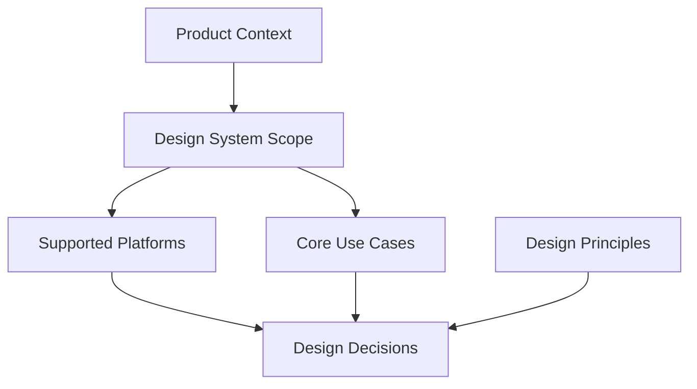
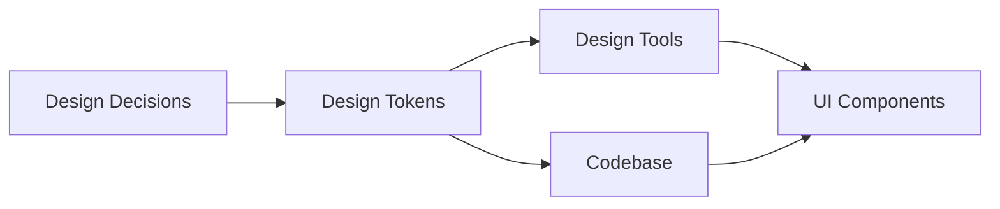
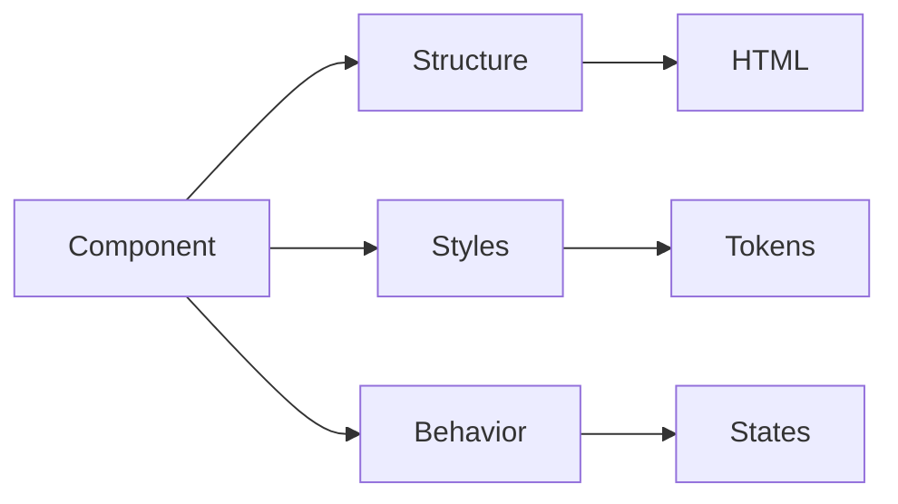
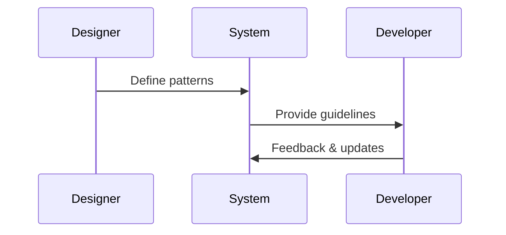
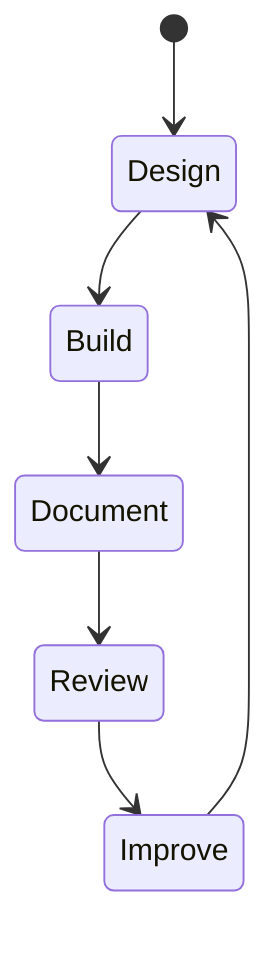

# Maintaining, Evolving, and Applying Design Systems: Hands-on Mini Project: Building a Design System

## Learning Objectives

- Define a clear scope and principles for a design system
- Create and apply design tokens consistently
- Design and document core UI components
- Evaluate the quality and completeness of a system
- Identify areas for future enhancement

---

## Introduction

In this capstone chapter, learners apply all acquired knowledge to design a small but complete design system, reinforcing practical skills and critical thinking.

---

# Maintaining, Evolving, and Applying Design Systems  

---

## Hands-on Mini Project: Building a Design System

---

Design systems are no longer static libraries of colors and buttons. In modern product organizations, they are living ecosystems that evolve alongside business goals, technology, and user needs. This capstone chapter brings together everything you have learned so far and turns theory into practice through a hands-on mini project: **designing a small but complete design system from scratch**.

The purpose of this chapter is not just to “build components,” but to **think like a design system owner**. That means making intentional decisions about scope, principles, consistency, documentation, and long-term sustainability. You will experience firsthand how design systems balance creativity and constraints, speed and quality, flexibility and governance.

By the end of this chapter, you will understand not only *how* to build a design system, but also *why* certain decisions matter, *when* to evolve the system, and *how* to critically evaluate its effectiveness. This is the bridge between learning design systems and **applying them confidently in real-world projects**.

---

By completing this chapter, you will be able to:

- Define a clear and realistic scope for a design system
- Establish and articulate design principles that guide decisions
- Create and apply design tokens consistently across a system
- Design reusable, scalable core UI components
- Document a design system for designers and developers
- Evaluate the quality, consistency, and completeness of a system
- Identify future improvement areas and evolution strategies

---

## Defining Scope and Design Principles

Design systems fail most often not because of poor visuals or weak components, but because they lack **clarity of purpose**. Defining scope and design principles is the foundation upon which everything else is built. This step determines what your system *is*, what it *is not*, and how decisions should be made when trade-offs arise.

### Understanding Scope: Setting Boundaries Intentionally

Scope defines **how big and how ambitious** your design system will be. In a mini project, the goal is not to cover every possible use case, but to create a coherent and functional system that solves a specific problem well.

Historically, early design systems like Bootstrap were broad and opinionated, aiming to serve many products at once. Modern systems such as Polaris (Shopify) or Carbon (IBM) are more tailored, deeply aligned with their product ecosystems. This evolution teaches an important lesson: **scope must reflect context**.

When defining scope, consider:

- **Product type** (marketing site, SaaS dashboard, mobile app)
- **Platform** (web only, mobile only, cross-platform)
- **Audience** (internal teams, external users, accessibility needs)
- **Maturity level** (prototype vs production-ready)

For this mini project, imagine you are designing a system for a **small SaaS dashboard**. That immediately narrows scope: forms, tables, navigation, and data visualization matter more than marketing animations.

**Common mistake:** Trying to design everything upfront. This leads to bloated systems that are hard to maintain and rarely used.

---

### Design Principles: The System’s North Star

Design principles are **decision-making tools**, not slogans. They help teams choose between alternatives when constraints arise. Historically, principles emerged as design teams scaled and needed shared values beyond individual taste.

Strong principles are:

- **Clear** – easy to understand and remember
- **Actionable** – guide real decisions
- **Relevant** – tied to user and business needs

Example principles for our mini project:

- **Clarity over cleverness** – dashboards must prioritize readability
- **Consistency builds trust** – patterns should feel familiar
- **Accessibility by default** – inclusive design is non-negotiable
- **Scalable simplicity** – components should grow without breaking

These principles influence everything: spacing choices, color contrast, component behavior, and documentation tone.

---

### How Scope and Principles Work Together

Scope answers *what* you build. Principles answer *how* and *why* you build it that way. Together, they act like a **constitution** for your design system.

For example:
- Scope says: “We support desktop web dashboards.”
- Principle says: “Optimize for data density without overwhelming users.”

When conflicts arise—such as adding a flashy animation—principles help resolve them objectively.

---

### Visualizing Scope and Principles Alignment

---

### Table: Narrow vs Broad Design System Scope

| Aspect | Narrow Scope System | Broad Scope System |
|------|--------------------|------------------|
| Speed to build | Fast | Slow |
| Maintenance | Easier | Complex |
| Reusability | Limited | High |
| Risk of inconsistency | Low | High |
| Best for | Small teams | Large organizations |

---

## Creating Tokens and Visual Foundations

Design tokens are the **DNA of a design system**. They encode visual decisions into reusable, platform-agnostic values. Without tokens, consistency is accidental. With tokens, consistency is intentional and scalable.

### What Are Design Tokens and Why They Exist

Design tokens originated from the need to synchronize design decisions across tools and codebases. Instead of saying “use blue #005FCC,” teams say “use `color-primary`.”

Tokens represent:

- Colors
- Typography
- Spacing
- Border radius
- Shadows
- Motion values

This abstraction allows change at scale. Update a token once, and the entire system adapts.

---

### Building Visual Foundations Step by Step

Start with **foundations**, not components. Foundations define the visual language that components inherit.

### # Color Tokens

Rather than naming colors by appearance, name them by **purpose**.

- `color-background-default`
- `color-text-primary`
- `color-action-primary`

This prevents misuse and supports theming (e.g., dark mode).

### # Typography Tokens

Typography tokens define hierarchy and rhythm:

- Font families
- Font sizes
- Line heights
- Font weights

Avoid arbitrary sizes. Use a **type scale** to ensure harmony.

### # Spacing Tokens

Spacing tokens enforce consistency and reduce cognitive load:

- `space-2xs`, `space-xs`, `space-sm`, `space-md`, `space-lg`

This mirrors how people think in relative spacing, not pixels.

---

### Table: Raw Values vs Tokenized Values

| Category | Raw Value | Tokenized Value |
|--------|-----------|----------------|
| Color | #005FCC | color-action-primary |
| Font size | 16px | font-size-body |
| Spacing | 8px | space-sm |

---

### Token Flow Across Design and Code

---

### Common Pitfalls with Tokens

- Over-tokenizing too early
- Naming tokens by color instead of intent
- Creating one-off values “just this once”

Tokens should evolve, but always intentionally.

---

## Designing Core Components

Components are where tokens and principles become **tangible user interfaces**. Core components are the most frequently used building blocks and deserve the most attention.

### What Makes a Component “Core”

Core components are:

- Highly reusable
- Found across multiple screens
- Foundational to user interaction

Examples:
- Buttons
- Inputs
- Text fields
- Cards
- Navigation elements

Historically, component-based design gained momentum with frameworks like React, reinforcing modular thinking in UI design.

---

### Designing Components Systematically

Each component should be designed with:

1. **Purpose** – What problem does it solve?
2. **Variants** – Primary, secondary, disabled, etc.
3. **States** – Hover, focus, active, error
4. **Accessibility** – Keyboard, contrast, screen readers

For example, a button is not “just a rectangle.” It communicates hierarchy, affordance, and feedback.

---

### Component Anatomy Diagram

---

### Table: Button Variants and Use Cases

| Variant | Use Case | Visual Priority |
|-------|----------|----------------|
| Primary | Main action | High |
| Secondary | Supporting action | Medium |
| Tertiary | Optional action | Low |
| Destructive | Dangerous action | High (warning) |

---

### Case Study: Building Core Components for a SaaS Dashboard

## Case Study: Designing the “Atlas” Dashboard Design System

### Context

In early 2024, a small product team working on a B2B analytics platform—internally called *Atlas*—faced growing inconsistency across their dashboard UI. The product had evolved rapidly, with new features added every sprint. Designers and developers worked efficiently, but without a shared system, visual drift became noticeable.

Buttons looked different across pages, spacing felt inconsistent, and form behaviors varied depending on who built them. New team members struggled to understand which patterns were “correct.” Leadership wanted faster development without sacrificing quality.

### Problem

The core problem was not lack of talent, but lack of **shared structure**. Each feature team solved UI problems locally. Over time, this created fragmentation. Fixing one inconsistency often introduced another.

Attempts to create ad-hoc guidelines failed because they were too vague and poorly documented. The team needed a **small but robust design system** focused on core components that powered 80% of the UI.

### Solution

The team started by defining a narrow scope: desktop web dashboard only. They articulated principles emphasizing clarity, accessibility, and scalability. From there, they created design tokens for color, typography, and spacing, aligning designers and developers around shared values.

Next, they designed five core components: Button, Input, Select, Card, and Table. Each component included variants, states, and accessibility considerations. Designers worked in Figma, while developers mirrored tokens in code using JSON.

Documentation was created alongside components, explaining usage, do’s and don’ts, and real examples.

### Results

Within two months, UI consistency improved dramatically. Development speed increased because teams reused components instead of reinventing them. Onboarding time for new designers dropped by 40%.

However, the team also discovered limitations: edge cases still required new patterns, and documentation needed constant updates. The system was not “done,” but it was **alive and useful**.

### Lessons Learned

The biggest insight was that **small systems can have big impact**. By focusing on core components, the team avoided overwhelm. They also learned that documentation is not optional—it is what turns assets into a system.

Most importantly, they realized that iteration is inevitable. A design system is never finished; it evolves with the product.

---

## Documenting the Design System

Documentation is the **bridge between intention and adoption**. Without it, even the best-designed system fails.

### Why Documentation Matters

Documentation answers:
- What is this component?
- When should I use it?
- When should I not use it?
- How do I implement it?

Historically, design systems gained traction when documentation became centralized and searchable (e.g., Storybook).

---

### What to Document

Effective documentation includes:

- Design principles
- Tokens and foundations
- Component usage guidelines
- Accessibility notes
- Code examples (if applicable)

---

### Documentation Flow

---

### Table: Good vs Poor Documentation

| Aspect | Good Documentation | Poor Documentation |
|------|------------------|-------------------|
| Clarity | Clear examples | Vague descriptions |
| Structure | Logical hierarchy | Random pages |
| Updates | Maintained | Outdated |
| Adoption | High | Low |

---

## Reviewing and Iterating on the System

Evaluation ensures the system remains **relevant and reliable**.

### How to Review a Design System

Review across multiple dimensions:

- Visual consistency
- Accessibility compliance
- Component reuse
- Developer feedback
- User impact

Iteration should be continuous, not reactive.

---

### System Lifecycle Diagram

---

## Reflection and Future Improvement Areas

Reflection transforms a project into learning.

### Key Reflection Questions

- What decisions had the biggest impact?
- Where did assumptions break down?
- Which parts of the system feel fragile?
- What would you automate next?
- How would this system scale to multiple teams?

Future improvements might include:
- Theming support
- Motion tokens
- Governance models
- Contribution workflows

---

## Summary

In this capstone chapter, you applied theory to practice by designing a complete, small-scale design system. You defined scope and principles, built tokens and foundations, designed core components, documented the system, and evaluated its effectiveness.

More importantly, you learned that design systems are **living products**, shaped by people, processes, and context. Mastery comes not from perfection, but from thoughtful iteration.

---

## Reflection Questions

1. How did defining scope influence your design decisions?
2. Which design principles were hardest to apply consistently?
3. Where did tokens simplify decisions—and where did they feel restrictive?
4. How would your system change if the product doubled in size?
5. What would you prioritize if you had one more month to improve the system?

---